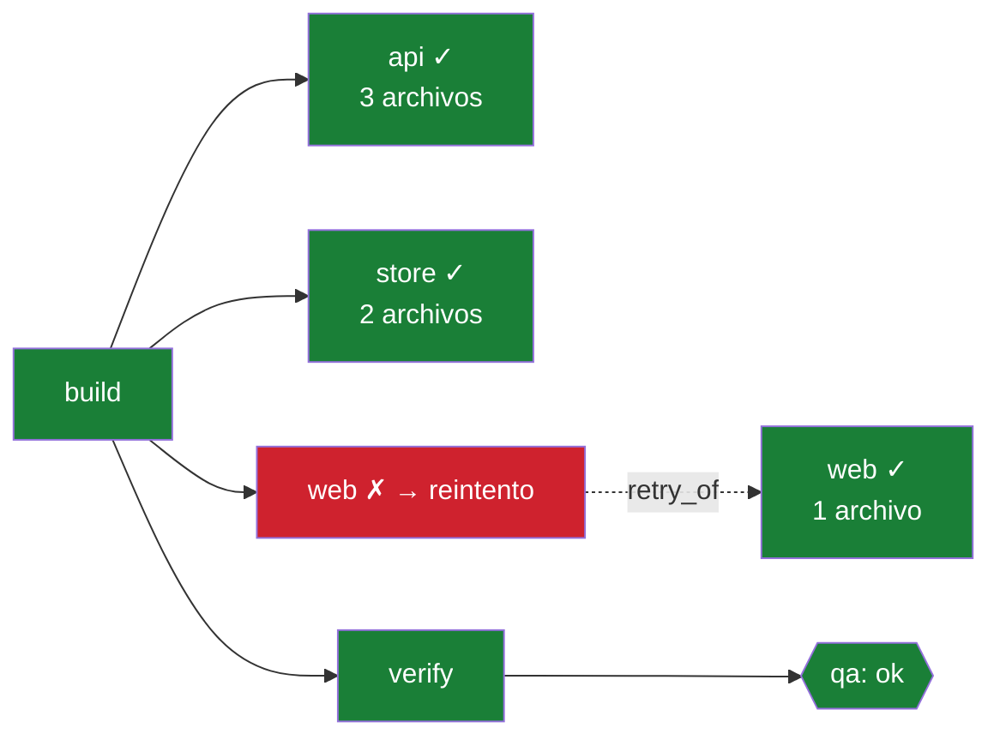

# Plan de mejora — v2

> **v2 reemplaza a v1.** v1 era el plan técnico salido del field test. v2 lo fusiona con el
> trabajo de adopción, después de auditar un estudio de mercado externo y contrastarlo con la
> literatura de junio–julio de 2026 y con los tres proyectos de referencia del ecosistema.
>
> Estado base: commit `61264e3`, versión `0.1.0`, suite verde en 13 paquetes, sin release
> taggeado, sin usuarios externos.
>
> **Regla de este documento:** cada afirmación dice de dónde sale — una medición propia, un
> hallazgo verificado del field test, o una fuente citada. Donde el estudio externo se equivoca,
> lo digo.
>
> Contexto: [`plugin_al_momento.md`](plugin_al_momento.md) · [`plan_publicacion.md`](plan_publicacion.md) ·
> [`../FIELD-TEST.md`](../FIELD-TEST.md) · [`../QUICKSTART.md`](../QUICKSTART.md)
>
> **Este plan está cerrado.** Sus cuatro bloques se cumplieron; lo que quedó vivo de
> `adopcion_y_esencia.md` y de `gentle_ai.md` —los dos borrados— está en
> [`plan_publicacion.md`](plan_publicacion.md), que es el plan vigente.

---

## 0. La tesis de este plan, en un párrafo

batten funciona y su premisa está **medida por terceros**: el 78 % de las fallas de agentes son
silenciosas, y las compuertas deterministas triplican la fiabilidad
([arXiv:2607.07405](https://arxiv.org/html/2607.07405v1)). Lo que no funciona es el **camino hasta
verlo**: hoy son ~8 pasos de configuración y la primera cosa que el plugin hace por vos es
negarte un commit. Los tres proyectos grandes del ecosistema —superpowers 224.700 ★, graphify
97.500 ★, caveman 54.000 ★— también restringen, también son rigurosos, y también son honestos
sobre lo que no saben. La diferencia no es la esencia: es que **dan algo antes de pedir algo**.

Y hay un segundo problema, más incómodo, que solo se ve juntando las rondas: **batten declara
nueve capacidades de gobierno que no impone** — el modo de falla exacto que existe para eliminar en
el flujo de otra gente. Eso es §2.1, y tiene un arreglo sistémico además de nueve individuales.

Este plan tiene dos vías que corren en paralelo y no se estorban:

| vía | qué arregla | toca el motor |
|---|---|---|
| **A — Correcciones** | los defectos confirmados, las brechas de confianza, y lo declarado-no-impuesto | sí |
| **B — Adopción** | tiempo hasta el primer valor, artefactos mostrables, distribución | **no** |

**Ningún ítem de la vía B cambia un principio.** Se pueden hacer por otra persona, en paralelo.

> **Qué cambió en esta revisión.** Se agregó §2.1 (el patrón transversal y su guard), §4.5
> (inyección de contexto por fase), §5.4 (worktrees), §5.5 (`doctor` clínico), §5.6 (el bucle
> desatendido, que **ya existe** como `/batten-night` — lo que falta es volver mecánicas sus
> cuatro reglas) y §6.7 (contadores de impacto, con dos de sus tres partes rechazadas).

---

## 1. Auditoría del estudio externo

Califica a batten **8.5/10 — "Innovación de Integración de Alta Viabilidad"**, y proyecta
**100–300 estrellas**. El juicio cualitativo lo comparto. El cuantitativo no se sostiene.

### 1.1 — Lo que acierta (confirmado contra el código)

| afirmación | verificación |
|---|---|
| Evasión del write-set guard por `Bash` (`sed -i`, `cat >>`, heredocs) | **CONFIRMADO** — hallazgo #6, reproducido. `preToolUse` rutea `Bash` solo a `verdictGate` |
| Un claim de directorio no ofrece control recursivo | **CONFIRMADO** — hallazgo #7 |
| Fail-open silencioso ante panic / DB corrupta / JSON malformado | **CONFIRMADO** — [`main.go:168`](../../cmd/batten/main.go#L168) recupera el panic y pone `retErr = nil` |
| Incoherencia entre spec declarado e implementación | **CONFIRMADO** — 5 campos con cero consumidores |
| Obsidian es exportación pasiva, solo en `Stop` | **CONFIRMADO** |
| Alta fricción de configuración inicial | **CONFIRMADO, y es el problema principal** — ver §4 |

### 1.2 — Lo que se equivoca

**(a) CRLF en `bootstrap.sh`: ya resuelto.** [`.gitattributes`](../../.gitattributes) fija
`*.sh text eol=lf` con un comentario que describe ese modo exacto de falla, y CI verifica el
contrato del artefacto. El estudio analizó una instantánea previa a `8e038b5`.

**(b) El tamaño del mercado, errado por 20×.** Su fórmula usa `A_act ≈ 50.000` justificado con
"56.498 plugins indexados". Eso es **oferta, no demanda**. Y su propio conjunto de comparación lo
refuta: caveman tiene 54.000 ★, que bajo su `R_conv = 0,05` implica **~1,08 millones de usuarios**.
Corrigiendo solo ese parámetro, con todo lo demás igual de pesimista: ~500, no 25.

**(c) "A los desarrolladores no les gusta que los restrinjan": refutado por el #1 del
ecosistema.** [superpowers](https://github.com/obra/superpowers) tiene 224.700 ★ y **es** un
imponedor de metodología: su skill de TDD impone RED-GREEN-REFACTOR, la de brainstorming exige
refinar antes de escribir código. Y [graphify](https://github.com/Graphify-Labs/graphify) (97.500 ★)
vende como punto central *decir lo que no sabe* — `EXTRACTED` vs `INFERRED`, "no es un índice
vectorial". Eso es el principio #1 de batten, y le dio adopción en vez de quitársela.

**(d) Fail-closed como remedio.** Ver §3.2 — la recomendación rompería el principio #2 de forma
concreta.

---

## 2. Resumen de decisiones

| tema | decisión | evidencia |
|---|---|---|
| **TOON** en vez de JSON | **descartado** | medición propia +5,7 % tokens; la literatura añade hasta −9 pp de exactitud |
| **Payload MCP duplicado** | **rediseñar — prioridad máxima** | batten usa el patrón al revés; 70–90 % de ahorro |
| **Fail-open en hooks** | **arreglar como fail-open RUIDOSO**, no fail-closed | `SQLITE_BUSY` brickearía la sesión |
| **Bypass por Bash** | **arreglar** | hallazgo #6 + los control planes de la literatura filtran cada llamada Bash |
| **PR que se escribe solo, con DAG Mermaid** | **hacer — es la mejor idea del estudio** | renderiza nativo en GitHub; 0 costo de esencia |
| **`batten report` antes que la negación** | **hacer** | es el patrón de graphify: nudge por default, strict opt-in |
| **Canvas HTML autocontenido** | **hacer** | el `graph.html` de graphify es lo que la gente comparte |
| **Cero configuración / `batten demo`** | **hacer** | ~8 pasos hasta el primer valor es el techo real |
| **Validar contra proyecto_ui** | **hacer, va primero** | los 8 fixes nunca se revalidaron contra la forma difícil |
| **Cadena graphify → engram** | **hacer** | el subagente del fan-out no consulta nada |
| **Migrar a OCC** | **no todavía — adoptar su principio** | falta medir el bloqueo real |
| **Autorreparación de conflictos por LLM** | **rechazado** | reintroduce el fallo del 78 % en la otra mitad del producto |
| **Obsidian bidireccional en vivo** | **no en este ciclo** | alto costo, valor no demostrado |
| **Git worktrees por unit** | **hacer** | batten ya lo prescribe en 3 mensajes y no lo hace; resuelve el hallazgo #4 estructuralmente |
| **`doctor` clínico** | **hacer, va temprano** | es lo primero que corre alguien cuando algo falla; absorbe los hallazgos #58 y #60 |
| **Contadores de impacto en `report`** | **hacer — pero falta el dato** | `LogEvent` guarda el payload, no la decisión: hoy no se puede contar una denegación |
| **Dólares "ahorrados" estimados** | **rechazado** | es un número inventado presentado como medido, en el comando donde batten dice `NO MEDIDO` |
| **Telemetría por red** | **rechazado** | tráfico saliente en una herramienta de auditoría cuesta más de lo que devuelve |
| **Bucle autónomo (`batten loop`)** | **ya existe como `/batten-night`** — falta volver mecánicas sus 4 reglas | `max_iterations` nunca se incrementa ni se verifica: el freno de una corrida sin supervisión es una frase en markdown |
| **Inyección de contexto por fase** | **hacer** — converge con §4.4 | hoy el agente recibe el spec entero de una vez; `phases[].reads` tiene 1 consumidor |

---

## 2.1 — El patrón que atraviesa un tercio del plan

Trabajando las rondas de este plan por separado apareció **un solo modo de falla, siete veces**.
Vale nombrarlo, porque cambia la respuesta: no son siete arreglos, es uno sistémico más siete
instancias.

**batten declara una capacidad de gobierno que no impone.**

| instancia | declara | impone | § |
|---|---|---|---|
| `query_before_read`, `graph_query` | consultar el grafo antes de leer | nada | 5.3 · 8 |
| `diff_from: anchor` | operar solo sobre el diff del unit | nada | 8 |
| `models.tiers` | *"routes subagents and verifies it from the ledger"* | nada | 8 |
| `provenance.format` | metadatos de procedencia para auditoría | nada | 8 |
| `retry_of` | reintentos visibles en el grafo | 4 lectores, **0 escritores** | 8 |
| `budget.max_iterations` | el techo de un bucle sin supervisión | se **muestra**, no se cuenta | 5.6 |
| las 4 reglas de `/batten-night` | no borrar, no override, no commitear, honrar el techo | 112 líneas de markdown | 5.6 |
| un claim de directorio | *"any other agent writing them is now denied"* | no cerca nada | 5.2 |
| el write-set guard frente a `Bash` | un dueño por archivo | se rodea con `sed -i` | 5.1 |

**Y es exactamente el modo de falla que batten existe para eliminar en el flujo de otra gente.**
La primera línea del README dice que una regla que un documento solo puede *pedir*, un hook puede
*imponer*. Nueve veces, batten pidió.

Eso no es una ironía cómoda: es la explicación de por qué el field test encontró 52 defectos en un
proyecto con la suite verde. Los tests verificaban que el código hiciera lo que hace. Nadie
verificaba que el spec prometiera solo lo que el código hace.

### El arreglo sistémico

Las nueve instancias tienen su ítem en el plan. Pero lo que impide la décima es un test, y batten
tiene el material para escribirlo:

```
Para cada campo del schema del spec, exigir que exista al menos un consumidor
en producción, o que esté en una lista explícita de "declarado como futuro".
```

Es un test de paquete que recorre `batten.schema.json` / `internal/spec` y grepea los consumidores,
igual que hice a mano en §8. Cuando alguien agrega un campo, o lo cablea, o lo declara futuro
conscientemente. Lo que deja de poder hacer es agregarlo y olvidarse.

**Y hay un segundo test, del mismo espíritu, para la otra mitad:** que cada regla del prompt de
`/batten-night` que sea mecanizable tenga su denegación. Ese no se puede automatizar del todo, pero
sí se puede dejar la lista de las cuatro en un test que falle mientras alguna siga siendo solo
prosa.

**Costo: ~1 día los dos.** **Prioridad: alta**, y va *antes* de las nueve instancias — porque si
no, la décima entra mientras se arreglan las nueve.

Es, además, el único ítem del plan que hace lo que batten predica: convierte una regla que hoy es
disciplina ("no declares lo que no implementás") en un mecanismo que la impone.

---

## 3. Lo que la literatura obliga a cambiar

Diez trabajos de la ventana junio–julio de 2026. Lo relevante no es que existan, sino qué cambian.

### 3.1 — La tesis está validada, y con ella el titular

**[Reason Less, Verify More](https://arxiv.org/html/2607.07405v1)** — arXiv:2607.07405, 8 jul 2026
(Reddy, Challaram, Basu; KDD Workshop on Evaluation and Trustworthiness of Agentic AI).

- En τ²-bench, **el 78 % de las fallas son silenciosas** — estado incorrecto, sin error de herramienta
- Compuertas deterministas: éxito **29,6 % → 42,0 %** (+12,4 pp), replicado con **P = 0,0008**
- Donde la compuerta disparó (26/50): **+19,2 pp**
- Fiabilidad pass₅: **8,0 % → 26,0 %** — más del triple
- El agente *"puede reportar con confianza que la tarea está completa"* con el estado corrupto

**Consecuencia práctica:** batten tiene un número de terceros para el titular. No autorreportado.
Ver §6.6.

### 3.2 — El fail-open es la brecha de confianza, pero fail-closed no es el remedio

**[A Deterministic Control Plane for LLM Coding Agents](https://arxiv.org/html/2606.26924v1)**
(arXiv:2606.26924) filtra **cada llamada Bash**, no solo las herramientas de escritura declaradas,
y añade un `scan-diff` post-delegación sobre **solo las líneas añadidas** del diff. Enfatiza
fail-closed.

**[Reframing LLM Agent Security](https://arxiv.org/pdf/2605.24309)** (arXiv:2605.24309) ordena los
mecanismos: los ganchos de framework están *un escalón arriba en facilidad de despliegue y uno
abajo en determinismo* frente a la aplicación a nivel de SO.

**Dos consecuencias:**

1. **El bypass por Bash no es un detalle.** Los dos control planes de la literatura filtran cada
   llamada Bash. batten es el incompleto acá.
2. **Fail-closed no se puede adoptar tal cual.** SQLite bajo contención de dos sesiones devuelve
   `SQLITE_BUSY`; con fail-closed eso deniega **cada llamada a herramienta** hasta que se libere.
   Un gate que inutiliza la sesión el día que la base está ocupada se desinstala esa tarde — y
   alimenta exactamente los issues negativos que el estudio teme.

   **La tercera opción es la correcta:** *fail-open ruidoso*. El commit pasa, y batten dice que
   **no evaluó nada**. Es el principio #3 aplicado a los fallos internos, no solo a la atribución.

### 3.3 — Concurrencia: adoptar el principio, no la migración

**[CoAgent](https://arxiv.org/abs/2606.15376)** — arXiv:2606.15376, 13 jun 2026. Su diagnóstico
aplica: las transacciones de agentes *"abarcan minutos de inferencia"*, los bloqueos bloquean esos
minutos, y el OCC clásico descarta el trabajo en cada conflicto. Su protocolo MTPO fija un orden
al lanzar, aplica escrituras especulativamente, y notifica al lector afectado para que **re-juzgue
y parche su plan**.

La frase que importa:

> el control se vuelve **advisory** — el runtime informa y el agente repara

batten ya tiene ese vocabulario: distingue `deny()` de `advise()`. Extender `advise()` a
colisiones de baja severidad es barato y está alineado.

**Lo que NO hay que hacer** —y el estudio lo propone— es que el modelo decida si su propio
conflicto de escritura "importa". Eso reintroduce el fallo del 78 % de §3.1 en la otra mitad del
producto.

**Y falta el dato previo.** batten no tiene **ninguna medición** de cuánto se bloquean los
subagentes. **[S-Bus](https://arxiv.org/pdf/2605.17076)** (arXiv:2605.17076) aporta el número que
decide si el problema existe: los agentes **sobre-declaran su uso de recursos entre 32 % y 49 %**.
batten confía enteramente en que el subagente declare honestamente vía `batten claim`. Medir
primero (§6.1 punto 4 produce ese dato gratis), rediseñar después.

### 3.4 — La memoria procedimental como categoría está respaldada

**[Managing Procedural Memory in LLM Agents](https://arxiv.org/abs/2606.23127)** (arXiv:2606.23127,
22 jun 2026) introduce el benchmark **AFTER**: 382 tareas empresariales, 6 roles, 22 skills. Una
ronda de refinamiento mejora **3,7–6,7 puntos**; las skills evolucionadas desde trazas multi-modelo
alcanzan **73,1 % cross-model**.

**Consecuencia:** batten hoy **impone** proceso pero no **aprende** de las corridas cuál funciona.
Eso es un horizonte, no este ciclo — pero el prerrequisito de datos es la fase B de §7.

También: **[Neural Procedural Memory](https://arxiv.org/abs/2606.29824)** y
**[Autoformalization of Agent Instructions into Policy-as-Code](https://arxiv.org/pdf/2606.26649)**,
que es literalmente la generalización de `batten init --from` cuando llegue a funcionar.

### 3.5 — TOON: descarte confirmado, por una razón peor que la mía

**[Notation Matters](https://arxiv.org/html/2605.29676v1)** — arXiv:2605.29676, 28 may 2026.

| hallazgo | número |
|---|---|
| TOON reduce tokens | hasta −18 % |
| TOON **pierde exactitud** | hasta **−9 pp** |
| sensibilidad **dependiente del modelo** | Mistral-Small-24B: **+13 pp** en un benchmark, **−36 pp** en otro |
| penalización multi-turno | fallos de parseo → Qwen3-32B terminó en **+8–11 % tokens totales** |

Coincide con mi medición: el formato tabular solo paga con patrones estructurales repetidos, y
**cuesta más** cuando cada payload referencia pocos esquemas únicos — la forma de `batten_spec` y
`batten_run_graph`.

**Un plugin cuyo propósito es no mentir sobre lo que sabe no puede adoptar un formato que degrada
la comprensión del modelo de forma impredecible.**

---

# VÍA A — Correcciones

## 4. Prioridad máxima

### 4.1 — Deuda propia: el tercer sitio del un-solo-veredicto

`internal/export/export.go:58` usa `LatestVerdict`. Ya arreglé `batten show` (`92ae1cb`) y la TUI
(`24d7cd2`); el que escribe la nota de Obsidian y el canvas quedó leyendo solo el último — así que
la nota tapa la evidencia del revisor con la salida de checks.

**Arreglo:** `LatestVerdictBySource(...,"batten")` + `LatestVerdictNotBySource(...,"batten")`, y
que `canvas.Render` reciba ambos. **~30 min con test.** Hacerlo primero por higiene.

### 4.2 — Validar los 8 fixes contra la réplica de proyecto_ui

**No se hizo.** Los 63 hallazgos se verificaron y los 8 fixes se validaron sobre sandboxes
sintéticos y sobre `taskly`. La réplica de proyecto_ui se usó en la corrida original y ese sandbox
ya no existe.

| | `taskly` | réplica de proyecto_ui |
|---|---|---|
| repo git | sí | **no lo es** |
| código | Go con tests | **ninguno**: 4 dominios con solo su `AGENTS.md` |
| backlog | 5 items | 40+ `US-0NN` |
| build files | `Makefile` | ninguno → **`gates.checks` vacío** |

La última fila es la que muerde: **un repo sin build files cae en la rama del gate sin checks**,
exactamente donde vivía la regresión de `on_exceed: block`.

**Matriz mínima** (sandbox, `BATTEN_DB` exportado siempre, nunca el original):

1. `init` sobre 4 dominios sin código y 40+ items → ¿unit `US-\d{3}`, dominios completos, `gates.checks` vacío reportado como vacío?
2. Gate **sin checks** + presupuesto excedido → debe DENEGAR
3. Dos units en la misma fase → los dos canvas intactos
4. `git -c user.name=... commit` → debe entrar al gate
5. Primer commit tras adoptar → debe **avisar**, no callar
6. Commit cuyo mensaje nombra otro unit → debe denegar
7. `ingest` con transcript previo al run → debe reportar lo descartado
8. **Repo sin `git init`** → ¿degrada con aviso o revienta? *Ningún test cubre esto, y es el estado literal de proyecto_ui*

**~medio día. Es lo único que puede invalidar trabajo ya hecho.**

### 4.3 — Fail-open ruidoso

**El defecto**, en [`cmd/batten/main.go:163-197`](../../cmd/batten/main.go#L163):

```go
defer func() {
    if r := recover(); r != nil { retErr = nil }   // panic → silencio
}()
sp, st, err := loadForHook(raw)
if err != nil { return nil }                        // sin spec / DB rota → silencio
out, err := h.Dispatch(event, raw)
if err != nil || out == nil { return nil }          // error de dispatch → silencio
```

**El arreglo:**

```
batten (advertencia — no bloqueando): la compuerta NO se ejecutó para este commit.
  causa: no se pudo abrir el store (database is locked)
  este commit NO fue verificado. Reintentá, o corré `batten doctor`.
```

**Detalle:** distinguir "acá no hay `batten.yaml`" (silencio correcto: no gobernamos donde no nos
invitaron) de "hay `batten.yaml` y algo se rompió" (aviso obligatorio). Hoy ambos caen en el mismo
`return nil`. **~medio día.**

### 4.4 — Rediseñar el payload MCP

**Medición propia:** cada respuesta lleva el payload **dos veces**, byte por byte idéntico
(`batten_runs` 932/932, `run_graph` 1176/1176, `verdict_status` 885/885, `spec` 1466/1466).

**Lo que la investigación corrigió de mi diagnóstico:** no es "se cobra dos veces".
`structuredContent` está pensado para el **cliente** —renderiza un widget— y **nunca entra al
contexto del modelo, cuesta cero tokens**. El patrón correcto es `content` con un **resumen
compacto** (modelo) y `structuredContent` con los datos ricos (cliente)
([futuresearch.ai](https://futuresearch.ai/blog/mcp-results-widget/),
[MCP spec RC 2026-07-28](https://blog.modelcontextprotocol.io/posts/2026-07-28-release-candidate/)).

**batten lo hace al revés.** `batten_verdict_status` pasaría de ~885 caracteres de JSON a:

```
US-034 · gate qa · BLOQUEADO
Falta el pase batten-verificado: los checks no se corrieron.
Corré: batten check US-034
```

~25 tokens en vez de ~260. **Y resuelve la pregunta de TOON sin adoptar TOON:** el ahorro viene de
mandar menos, no de codificar distinto.

### ✅ Hecho — y la causa raíz resultó ser más simple de lo diagnosticado

**La duplicación no la escribía batten: la escribía el SDK, porque batten no escribía nada.** Cada
handler devolvía un `*sdk.CallToolResult` **nil**, y el go-sdk rellena lo que el handler deja
vacío ([`mcp/server.go:386`](https://github.com/modelcontextprotocol/go-sdk)):

```go
res.StructuredContent = outJSON
if res.Content == nil {
    res.Content = []Content{&TextContent{Text: string(outJSON)}}
}
```

De ahí los 932/932, 1176/1176, 1466/1466 bytes idénticos. Y de ahí también el arreglo: **el SDK
deja `Content` en paz si el handler lo pone.** No hay que pelearse con nada.

**Validación empírica, en lugar de `/context`:** llamar a `batten_spec` desde una sesión real
devuelve el payload **una sola vez**. Así que la duplicación es real *en el cable* y **no**
duplica lo que llega al contexto del modelo — que es exactamente la corrección que la
investigación ya había hecho al diagnóstico original. Cuál de las dos mitades renderiza el
harness no se pudo determinar desde adentro de la sesión, y **no cambia nada**: el arreglo es
correcto en los dos casos, y si resulta ser `content`, el ahorro es inmediato.

**Ahorro medido** (no estimado), sobre el fixture del paquete:

| herramienta | `content` antes | ahora | |
|---|---|---|---|
| `batten_spec` | 1205 B | 227 | **−81 %** |
| `batten_spec` con fase | 881 B | 138 | **−84 %** |
| `batten_budget` | 589 B | 237 | −60 % |
| `batten_verdict_status` | 665 B | 304 | −54 % |
| `batten_runs` | 279 B | 131 | −53 % |
| `batten_writeset_owner` | 262 B | 146 | −44 % |

Los porcentajes bajos son de payloads chicos del fixture: `batten_runs` con veinte corridas
reales comprime muchísimo más, porque el resumen crece por línea y el JSON por campo. La
estimación de 70–90 % era optimista para las herramientas chicas y **conservadora para `spec`**,
que es la más grande y la que más se llama.

### 4.5 — Inyección de contexto por fase

Converge con §4.4: las dos son "mandar menos, más preciso".

**Lo que ya existe:** `batten_spec` expone el spec por MCP · el skill `batten-engine` le dice al
agente que lo lea · el hook `SessionStart` ya devuelve `additionalContext` con el estado del run ·
`domains[].invariants` viaja verbatim al prompt de cada agente del fan-out.

**Lo que falta:** que algo de eso **cambie según la fase activa**. Hoy el agente recibe el spec
entero de una vez y se orienta solo. `phases[].reads` —el campo que declara *qué artefactos son las
entradas de esta fase*— tiene **un solo consumidor**: el eco de MCP.

**La propuesta:** que `batten_spec` acepte un parámetro de fase y devuelva solo lo que esa fase
necesita — sus `reads`, su gate, los invariantes de sus dominios — en vez del documento completo.
Y que `SessionStart` inyecte la fase activa, no solo el estado del run.

**Dos límites que conviene fijar antes de construirlo:**

- **batten no reescribe el system prompt.** No puede y no debería: eso es del harness. Lo que puede
  es responder menos y mejor cuando le preguntan, que es donde el ahorro real está.
- **No inventar metodología.** La propuesta sugiere inyectar "pautas de brainstorming" o "TDD
  estricto". Eso es lo que hace superpowers, y hacerlo sería inventar un workflow — justo lo que el
  skill `batten-engine` prohíbe explícitamente: *"nunca asumas un workflow que no esté declarado
  ahí"*. Lo que batten inyecta debe salir del `batten.yaml` del usuario, no de la opinión de batten.

**Costo:** ~1 día, y se hace junto con §4.4 porque tocan el mismo código.

### ✅ Hecho — las dos mitades

- **`batten_spec` acepta `phase`** y devuelve solo lo de esa fase: su `reads`, su gate, y —solo si
  la fase hace fan-out— los invariantes de sus dominios. Una fase que no fanea no recibe
  dominios: los invariantes existen para viajar al prompt de un agente del fan-out, y sin fan-out
  no hay a quién dárselos. Una fase que el spec no declara **lo dice** en vez de devolver el
  documento entero en silencio, que dejaría que un typo pareciera una respuesta.
- **`SessionStart` inyecta la fase activa**, no solo el estado del run. En `build` dice sobre
  cuántos dominios se fanea y cómo reclamar el write-set; en `close` dice que el commit se deniega
  sin veredicto con evidencia. **`phases[].reads` pasó de un consumidor —el eco de MCP— a dos**, y
  el segundo llega al agente sin que tenga que preguntar.

Los dos límites se respetaron: batten no reescribe el system prompt, y **lo que inyecta sale del
`batten.yaml` del usuario**. No hay una sola línea de metodología propia.

---

## 5. Prioridad alta — vía A

### 5.1 — Cerrar el bypass por Bash

Evidencia convergente: hallazgo #6 reproducido (`Edit` denegado, la misma escritura por `Bash`
pasa en silencio y el archivo se sobrescribe de verdad), el estudio externo, y los dos control
planes de la literatura.

**Lo que lo hace peor que un fail-open deliberado:** ahí batten **sí** atribuye —nombra al dueño
una llamada antes— y aun así no dice nada. No es "no puedo determinar culpa", es "no miré".

**Por etapas, de menor a mayor riesgo de falsos positivos:**

1. Detección de redirecciones y utilidades (`>`, `>>`, `tee`, `sed -i`, `mv`, `cp`, `patch`, `dd of=`) — ~1 día
2. Resolver rutas relativas contra el `cwd` del payload — ~medio día
3. **Advisory primero, deny después.** Un ciclo avisando, medir falsos positivos, endurecer — 1 ciclo
4. **`scan-diff` post-fan-out** siguiendo a [arXiv:2606.26924](https://arxiv.org/html/2606.26924v1): contrastar el diff de git contra los write-sets declarados — ~1 día

> **El punto 4 debería ir primero.** Es determinista, sin falsos positivos, atrapa incluso los
> scripts de terceros que el punto 1 nunca verá, y produce gratis el dato que §3.3 necesita:
> cuánto sobre-declaran los agentes de batten frente al 32–49 % de S-Bus.

### 5.2 — Claim de directorio y colisión entre runs

- **#7** — un claim de directorio se acepta, se reporta como protector y no cerca nada. O rechazarlo con la forma de lista, o soportar `dir/**` de verdad.
- **#4** — `claim` no mira otros runs abiertos: dos sesiones creen poseer el mismo archivo y el guard las deniega a **ambas**. `store.WriteSetOwnerAcrossOpenRuns` ya existe; falta llamarla al reclamar.

**~1 día los dos.**

### 5.3 — La cadena graphify → engram para el subagente

| dónde | qué hace |
|---|---|
| `/batten-plan` | `graphify god-nodes --json`, `graphify affected "X"`, `mem_search` |
| `/batten-verify` | `mem_search "<el bug>"` |
| `/batten-close` | escribe la decisión a engram |
| **`/batten-build`** | **nada** |

**El subagente del fan-out —el que escribe código— no consulta nada.** Arranca directo a leer
archivos, el paso más caro de los tres. Y los dos campos que pedirían esa cadena
(`capabilities.graph.query_before_read`, `phases[].graph_query`) tienen **cero consumidores**.

**El orden correcto son las tres memorias:** graphify (*qué es* el código) → engram (*qué
decidimos*) → grep (fallback, el más caro).

- **Paso 1 (~2 h, es prompt):** que `/batten-build` inyecte la instrucción cuando `query_before_read: true`, **y exija declarar en el retorno si ninguno estaba disponible** en vez de simular que consultó. Principio #3 aplicado a la orientación.
- **Paso 2 (~2 h):** que `doctor` cruce declaración con realidad — `query_before_read: true` sin graphify en PATH debe avisar.
- **Paso 3 (~medio día):** medirlo. `SetCodeGraph` ya marca cada run; `measure` puede comparar el costo de orientación con y sin grafo. Mismo trato que headroom: *admitido, pero medido*.

### 5.4 — ⭐ Git worktrees: cerrar el bucle que batten ya abrió

**El argumento más fuerte a favor no es la literatura: es que batten ya lo prescribe y no lo hace.**
Tres mensajes distintos del binario le dicen al usuario que use un worktree:

| dónde | qué dice |
|---|---|
| [`hooks.go:376`](../../internal/hooks/hooks.go#L376) | "Bind it with `batten phase <unit> <phase>`, **or use a worktree per unit**" |
| [`hooks.go:589`](../../internal/hooks/hooks.go#L589) | "Editing it now races that work. Coordinate, **or use a worktree per unit so each has its own branch**" |
| [`hooks.go:744`](../../internal/hooks/hooks.go#L744) | "For parallel work, **a worktree per unit keeps each on its own branch**" |

batten diagnostica el problema, nombra la solución, y deja que el usuario la ejecute a mano. Eso
es exactamente el tipo de brecha entre lo declarado y lo hecho que §8 trata en otro contexto.

**Y resuelve estructuralmente un defecto confirmado.** El hallazgo #4: dos sesiones reclaman el
mismo archivo, ambas reciben "sos el dueño", y después el guard **las deniega a las dos**. Con un
worktree por unit el conflicto no existe: cada unit tiene su propio árbol y su propia rama.

#### Dos correcciones de alcance respecto a la propuesta

**(a) Por unit, no por subagente.** La propuesta dice "cuando se lance un subagente paralelo,
batten le asigna un worktree". Eso rompe el fan-out: los subagentes de un mismo unit trabajan
sobre **write-sets disjuntos del mismo árbol** —esa es la premisa del diseño— y aislarlos entre sí
significa que ninguno ve el trabajo del otro, más N fusiones para un solo unit. El aislamiento
que hace falta es entre **units concurrentes**, que es donde el conflicto es real y es lo que los
tres mensajes de arriba ya dicen.

**Excepción que sí justifica aislar por subagente, y no es la de las colisiones.** Cuatro agentes
compartiendo un árbol mientras uno corre `go test ./...` producen un resultado de test que **no
significa nada**: la suite leyó un árbol que otro agente estaba escribiendo a mitad de camino. Eso
es aislamiento de **lectura durante la verificación**, no de escritura, y es una razón distinta y
legítima. Aplica a la fase de verify, no a la de build — y es más barata de resolver serializando
los checks que dando un árbol a cada agente.

**(b) batten no orquesta, así que no puede "asignar" nada.** No lanza subagentes —eso son los
Dynamic Workflows de Claude Code— y ese límite es deliberado (README: *"los rieles, no el
motor"*). Lo que sí puede:

- `batten worktree <unit>` — crea el worktree, lo registra en el run, y devuelve la ruta
- el write-set guard se vuelve **consciente del worktree**: normaliza rutas contra la raíz del
  árbol del run, no contra la del repo, para no denegar cruces que son en árboles distintos
- la **fusión se gatea**: `batten close` rechaza integrar un worktree cuyo unit no tiene los dos
  veredictos. Ahí sí batten es el que decide, y es la extensión natural del gate
- `/batten-build` instruye al orquestador, que ya tiene `isolation: "worktree"` en su herramienta
  de agentes — **integrar con eso, no reimplementarlo**

#### Dos advertencias que hay que anotar antes de empezar

- **Multiplica el conflicto de `graph.json`.** graphify commitea un `graph.json` de ~1 MB; dos
  ramas que toquen código dan conflicto garantizado sin el merge driver de unión. Con worktrees,
  "dos ramas tocando código" pasa de ser el caso raro al caso normal. `doctor` **ya** detecta si
  el driver está registrado — con esto ese chequeo deja de ser una cortesía y pasa a ser un
  requisito de instalación.
- **El ancla cambia de significado.** Cada worktree tiene su propio `HEAD`. `diff_from: anchor`
  —que hoy tiene cero consumidores (§8)— se vuelve *más* correcto en este modelo, no menos: el
  ancla del unit es el punto donde su worktree se separó.

**Costo:** `worktree` + registro ~1 día · guard consciente del árbol ~1 día · fusión gateada
~1 día. **Prioridad: alta**, y sube si el trabajo con dos units concurrentes es habitual.

### 5.5 — `batten doctor` clínico

Hoy `doctor` valida el spec, el close gate, que el store abra, el proveedor de memoria, el vault y
los archivos de reglas de cada dominio. **Le faltan los diagnósticos que corresponden al motor
transaccional**, que es donde vive la causa de desinstalación silenciosa.

Tres de los faltantes ya son hallazgos confirmados del field test, así que esto no es una
funcionalidad nueva sino un paquete coherente:

| chequeo | estado hoy |
|---|---|
| ¿los comandos de `check:` / `gates.checks` **existen y se pueden correr**? | **falta** — hallazgo #58 |
| ¿el reporte llega a las advertencias cuando hay un error fatal? | **falta** — hallazgo #60: corta en el primer fatal, así que arreglás uno y aparece otro, de a uno |
| ¿hay bloqueos activos en SQLite / procesos huérfanos sosteniendo la DB? | **falta** — y es exactamente lo que hace que el hook falle en silencio (§4.3) |
| ¿el binario instalado corre? ¿el bootstrap del plugin tiene finales de línea LF? | **falta en runtime** |
| ¿graphify en PATH? ¿merge driver registrado? ¿skills instaladas? | **ya está** |

**Sobre los finales de línea:** en el repo ya está resuelto por
[`.gitattributes`](../../.gitattributes) y CI lo verifica (§1.2a). Pero **la copia instalada es
otra cosa**: un usuario puede instalar por una ruta que la mangle, y el modo de falla es
`#!/usr/bin/env bash\r` → *bad interpreter* → el binario nunca se descarga → **los hooks no-opean
en silencio**. Chequearlo en `doctor` cuesta tres líneas y cierra el único camino por el que ese
bug puede volver.

**Y una regla de presentación:** `doctor` debe emitir **todo lo que sabe en una sola pasada**, con
la corrección concreta al lado de cada problema. Hoy corta en el primer fatal — arreglás uno,
volvés a correr, aparece el siguiente. Un diagnóstico de a uno es lo que hace que la gente se
rinda a la tercera iteración.

**Costo:** ~1 día. **Prioridad: alta** — es barato, y es la primera cosa que corre alguien cuando
algo no funciona.

### 5.6 — ⭐ El bucle desatendido ya existe: hacer mecánicas sus reglas

**`/batten-night` ya es el bucle de autocorrección autónomo**, y es más maduro que la propuesta
que lo pediría: 112 líneas que corren build → verify → **fix** → re-verify, con los techos de
presupuesto como disparador, un tope de iteraciones, y un reporte de la mañana. Tiene además
cuatro reglas que la propuesta no contempla y que son las que hacen que una corrida sin supervisión
sea aceptable:

1. **Nunca borrar nada.** Ni un archivo, ni una rama, ni un commit, ni con `git reset --hard`, ni
   "limpiando". Lo que quiso borrar va a una sección del reporte. *"La asimetría es todo el punto:
   dejar un archivo obsoleto le cuesta diez segundos a alguien mañana. Borrar el equivocado cuesta
   trabajo que nadie recupera, en una corrida que nadie miraba."*
2. **Nunca hacer override del gate.** `batten override` exige una razón humana, y a las 3am no hay
   humano. *Un veredicto bloqueado al final de una corrida desatendida es un resultado exitoso.*
3. **No commitear.** Para antes de la fase de cierre, a propósito.
4. **Honrar `budget.max_iterations`.** *"Un bucle que falló el mismo check tres veces no va a
   pasarlo en la cuarta; va a gastarse la ventana."*

#### Y acá está el problema, que es el mejor ejemplo posible de la tesis de batten aplicada a sí misma

**Las cuatro son prosa.** Son 112 líneas de markdown pidiéndole al modelo que se comporte — que es
exactamente la categoría de regla que batten existe para convertir en mecanismo. El README lo dice
en su primera línea: *"una regla que un documento solo puede pedir, un hook puede imponer"*. El
comando más peligroso del plugin es el único donde eso no se hizo.

Y la cuarta no es teórica. **`max_iterations` nunca se impone, y el contador nunca se incrementa:**

| dónde aparece | qué hace |
|---|---|
| `internal/spec/spec.go:138` | se declara |
| `internal/mcp/mcp.go:559,763` | se devuelve por MCP |
| `internal/tui/tui.go:418` | se muestra: `iters %d / %d` |
| **ninguna parte** | **lo incrementa** |
| **ninguna parte** | **lo verifica** |

`runs.iterations` está en 0 para siempre. La TUI dice `iters 0 / 3` toda la noche. El único freno
que una corrida sin supervisión tiene contra gastarse la ventana entera es una frase en un archivo
markdown.

#### La propuesta correcta no es agregar un orquestador

No hace falta `batten loop --max-turns 30`: el bucle ya está escrito y batten no orquesta a
propósito. Lo que hace falta es **un flag de modo desatendido en el run, que vuelva mecánicas las
cuatro reglas**:

```
runs.mode = 'unattended'    ← lo pone /batten-night al arrancar
```

Con eso, cada regla deja de ser un pedido:

| regla | hoy | mecanismo |
|---|---|---|
| honrar `max_iterations` | prosa, contador en 0 | `batten iterate <unit>` incrementa y devuelve si se alcanzó el techo; `phase` se niega a avanzar por encima de él |
| nunca borrar | prosa | matcher `PreToolUse`/`Bash` que **deniega** `rm`, `git reset --hard`, `git checkout --`, `> archivo` truncante mientras `mode='unattended'` — es el patrón del write-set guard, aplicado a la destrucción |
| nunca hacer override | prosa | `batten override` **rechaza** con `mode='unattended'`: la razón humana requiere un humano |
| no commitear | prosa | el gate **deniega** la fase de cierre mientras el modo esté activo |

Cuatro reglas, cuatro denegaciones, cero orquestación nueva. Y el modo se apaga solo cuando un
humano lee el reporte y cierra.

**Además hace que §6.7a valga el doble:** un run desatendido que dice *"12 iteraciones, techo 15,
3 borrados denegados, 1 override rechazado"* es una estadística de impacto que nadie más del
ecosistema puede producir.

**Costo:** flag de modo + `iterate` ~1 día · guard de destrucción ~1 día · las otras dos ~medio día.
**Prioridad: alta.** Es el comando más peligroso del plugin y el único gobernado solo por prosa.

---

# VÍA B — Adopción

> **Ningún ítem de esta vía toca el motor.** Todos leen del mismo SQLite canónico o son
> presentación. Se pueden hacer en paralelo con la vía A, por otra persona.

## 6. Lo visual: qué renderiza de verdad y dónde

Antes de proponer, verifiqué qué superficies renderizan sin infraestructura:

| superficie | ¿renderiza? | verificado |
|---|---|---|
| **Mermaid en descripción de PR, issues, comentarios, wikis de GitHub** | **sí, nativo desde feb 2022** | sin plugin, sin hospedar imágenes, sin sanitización de SVG |
| HTML autocontenido abierto en el navegador | sí | es lo que hace `graph.html` de graphify |
| GIF de terminal en el README | sí | [VHS](https://github.com/charmbracelet/vhs) genera GIF/MP4/WebM desde un `.tape` |
| SVG embebido en markdown de GitHub | **parcial** | GitHub sanitiza SVG inline; hay que commitearlo como archivo |
| Canvas de Obsidian | solo con Obsidian instalado | es la limitación actual |

**El hallazgo que cambia el plan:** Mermaid renderiza nativo en descripciones de PR. batten **ya
tiene el DAG de la corrida en SQLite con aristas tipadas**. Emitirlo como Mermaid dentro del cuerpo
del PR es visual, es gratis, y **se distribuye solo** — cada PR que pasa por batten es un anuncio
de batten que otras personas ven.

## 6.1 — ⭐ El PR que se escribe solo

**La mejor idea del estudio, y no cuesta nada de esencia.** El gate sigue denegando igual, sigue
exigiendo dos veredictos, sigue citando evidencia. Cambia **qué recibís cuando pasás**.

`batten pr <unit>` emite un cuerpo de PR en markdown, listo para `gh pr create --body-file`:

````markdown
## US-034 — límite de tasa en órdenes

**batten-verified** · 2 veredictos · 3 checks corridos · 4 subagentes



### Verificación

| productor | resultado | evidencia |
|---|---|---|
| batten (mecánico) | ✅ ok | `go build ./...` PASS (0, 585 ms) · `go vet ./...` PASS (0, 686 ms) · `go test ./...` PASS (0, 637 ms) |
| revisor (criterios) | ✅ ok | AC-1 cubierto por `TestRateLimit` · AC-2 por `TestRateLimitBurst` · invariante de `store` intacta |

### Qué costó

| | |
|---|---|
| tokens | 1,24 M en 4 subagentes |
| imputado | $18,60 *(no es una factura: es el valor extraído del plan)* |
| ventana de 5 h | 18 % de un techo de 40 % |
| ancla | `44630cd` · 11 archivos, +284 −37 |

<sub>Generado por [batten](https://github.com/ArthurZizumbo/batten). El DAG y la evidencia salen
del registro de la corrida, no de un resumen del modelo.</sub>
````

**Por qué esto es la palanca principal:**

- **La distribución está construida en el artefacto.** Un PR lo ven revisores, y cada uno ve el pie.
- **Renderiza nativo.** Cero infraestructura, cero imágenes hospedadas.
- **Invierte la valencia emocional** sin tocar un mecanismo: la disciplina deja de ser un peaje y pasa a ser lo que hace posible el reporte.
- **Refuerza el principio #2**, no lo debilita: el PR es el lugar natural para mostrar `tokens: NO MEDIDO` con honestidad.

**Costo: ~2 días.** Los datos ya están todos en SQLite; es renderizado.

**Detalle no negociable:** si el usage no fue medido, la tabla dice **NO MEDIDO**, no `$0.00`. Si
falta el veredicto del revisor, la tabla lo dice. Un PR generado que miente es peor que no
generarlo.

## 6.2 — `batten report`: valor antes que fricción

**El problema, medido contra los tres proyectos de referencia:**

| proyecto | pasos al primer valor | qué ves |
|---|---|---|
| caveman | 1 comando | 65 % menos tokens |
| graphify | 3 comandos | grafo interactivo en el navegador |
| superpowers | 2 comandos | metodología activa |
| **batten hoy** | **~8 pasos** | **un commit denegado** |

En modo `report` —el default de `init`— batten **no bloquea nada: observa**. Ese modo hoy no tiene
salida propia. `batten report` la da:

```
taskly · sesión de hoy

  US-002  ok        3 fases · 2 subagentes · ancla ca015de
          api       3 archivos    412k tokens
          store     1 archivo      98k tokens
          verificado: 3 checks corridos + criterios juzgados

  US-003  bloqueado 2 fases
          go test ./... falló: TestAMissingTaskIs404NotA500
          el gate habría denegado este commit

  gastado hoy   1,4 M tokens · 22 % de la ventana de 5 h
```

**Eso es valor puro, sin fricción, sin bloquear nada.** La compuerta pasa a ser algo que **elegís
encender** cuando ya confiás en lo que ves — que es exactamente el patrón de graphify: empujón
suave por default, `GRAPHIFY_HOOK_STRICT=1` opt-in.

**Costo: ~1 día.** Es una vista sobre datos que ya existen.

## 6.3 — Canvas HTML autocontenido

`batten canvas --html` emite un archivo único que se abre en cualquier navegador: nodos por fase,
subagentes coloreados por estado, write-sets al pasar el mouse, tokens por nodo. Sin Obsidian, sin
servidor, sin dependencias.

Es lo que hace `graph.html` de graphify, y es lo que la gente captura y postea.

**Dos condiciones para que sirva:**

- **Generable durante la corrida**, no solo en `Stop`. Un artefacto que solo existe al final no se comparte en el momento en que la persona está entusiasmada.
- **Un solo archivo.** Nada de assets externos.

**Costo: ~2 días.** El `canvas.Render` ya produce la geometría; falta un template HTML con el JSON
embebido.

## 6.4 — `batten demo`: probar sin configurar

El obstáculo de §6.2 es que aun con `report` hay que instalar y configurar antes de ver nada.

`batten demo` crea un sandbox temporal, arma un repo mínimo, corre el flujo completo —fan-out,
denegación, `check`, aprobación, PR— e imprime el recorrido. **No toca tu repo, no toca tu DB, se
borra al terminar.**

Es el "probalo antes de configurarlo" que hoy no existe. Y de paso es un test de integración
end-to-end que hoy tampoco existe.

**Costo: ~1 día.** El recorrido ya está escrito y capturado en
[`../QUICKSTART.md`](../QUICKSTART.md); esto lo automatiza.

## 6.5 — El GIF del README

[VHS](https://github.com/charmbracelet/vhs) graba GIFs de terminal desde un archivo `.tape` — y
batten ya usa bubbletea/lipgloss de charm, así que es el mismo ecosistema.

**Qué mostrar, en ~20 segundos:** el agente intenta commitear → **DENY con la razón** → `batten
check` corre los tests de verdad → uno falla → el diff se arregla → el check pasa → el commit
entra. La negación en vivo es genuinamente dramática, y es la única forma de transmitir en un
README que *esto no es un lint, esto realmente te para*.

Y un segundo `.tape` para la TUI.

**Costo: ~medio día.** Y el `.tape` es código: se regenera cuando cambia la salida, no envejece.

## 6.6 — El README que lidera con lo correcto

Cambios de posicionamiento, cero código:

| hoy | debería |
|---|---|
| abre con "El producto son dos negaciones" | abre con el número de terceros: **"El 78 % de las fallas de agentes son silenciosas. Las compuertas deterministas triplican la fiabilidad. batten es una."** ([fuente](https://arxiv.org/html/2607.07405v1)) |
| el write-set guard se describe como bloqueo | describirlo como lo que es: **el motor que hace seguro el fan-out en paralelo** |
| no menciona que el default no bloquea | decir en la primera pantalla: **`report` es el default — batten observa y no te frena hasta que vos lo decidas** |
| el quickstart empieza con `batten init` | empezar con `batten demo`, luego `batten report`, y el gate al final |
| sin GIF | el GIF de §6.5 arriba de todo |
| sin PR de ejemplo | link a un PR real generado por §6.1 |

**Y un diferenciador que no se está contando.** Existe un ecosistema de observabilidad de costo
(Langfuse, OpenTelemetry, ccusage, CloudZero) pero **todos miden dólares de API**. batten es el
único que mide **porcentaje de la ventana rodante de suscripción** — la métrica correcta cuando el
costo marginal de un token es cero. Un usuario de plan Max no quiere saber cuántos dólares "habría
costado": quiere saber si le alcanza hasta las 5 de la tarde. Ya está construido
(`batten statusline` es el único sensor local de cuota que existe) y no aparece en el README.

**Costo: ~1 día.**

## 6.7 — Estadísticas de impacto: contadas, no estimadas, y locales

La idea es correcta: los desarrolladores comparten estadísticas de impacto, y batten está sentado
sobre los datos. Pero hay que separarla en tres, porque dos partes se hacen y una no.

### ✅ (a) El contador — pero primero falta el dato

`batten report` debería cerrar con lo que batten efectivamente evitó:

```
esta semana
  3 commits denegados     (2 sin veredicto · 1 con checks en rojo)
  2 colisiones de write-set frenadas
  1 run detenido por presupuesto
  0 overrides
```

**Prerrequisito que no es obvio: hoy ese dato no existe.**
[`LogEvent`](../../internal/store/store.go#L1048) registra **el payload entrante, no la decisión**
— `hooks.go:177` lo llama una sola vez, antes de despachar. Así que batten no puede contar cuántos
commits denegó: nunca lo anotó.

Arreglo: una columna `decision` en `events` (`allow` | `deny` | `advise`) más el motivo, escrita
después del dispatch. **~medio día**, y de paso vuelve el log de eventos genuinamente reproducible
— que es lo que ya prometía llamarse "replay log".

### ❌ (b) El dólar estimado — no

La propuesta sugiere: *"batten te ahorró aproximadamente $15 USD en tokens de reintento"*.

**Eso viola el principio #1 en la superficie más visible del producto.** Nadie sabe qué habría
costado el reintento que no ocurrió: depende de cuántas vueltas habría dado el agente, con qué
modelo, con cuánto contexto. Es un número inventado, presentado como medido, en el mismo comando
donde batten se toma el trabajo de decir `NO MEDIDO` en vez de `$0.00`.

Y el costo no es solo filosófico: es exactamente el tipo de afirmación que un revisor escéptico
desarma en un comentario de Hacker News, y ahí se lleva puesta la credibilidad de las cifras que
**sí** son reales.

**La versión honesta es más fuerte:** *"3 commits denegados esta semana"* es verificable, cae bien
en una captura, y no se puede refutar. Que el lector saque su propia conclusión sobre cuánto vale.

### ❌ (c) Telemetría por red — no, y no es una decisión difícil

Enviar métricas anónimas a un servidor es un problema de confianza para una herramienta cuyo
trabajo es **auditar**. Los dos referentes del ecosistema no lo hacen: el punto de venta de
graphify es *local determinista, sin vector store*, y superpowers no tiene telemetría alguna. Un
plugin de gobernanza que hace tráfico saliente da un titular de issue —"¿por qué mi herramienta de
seguridad llama a casa?"— que cuesta más de lo que cualquier dashboard agregado devuelve.

**La alternativa que consigue lo mismo:** que el reporte local sea trivial de compartir. Una
bandera `batten report --share` que emita un bloque markdown listo para pegar, con los números
contados y sin nada identificable. Si es lindo y es honesto, la gente lo postea sola — que es
exactamente el mecanismo por el que §6.1 funciona.

**Costo:** (a) ~medio día de esquema + ~medio día de vista. (b) y (c) no se hacen.

---

## 7. La TUI y el seguimiento de cumplimiento

**Ya corregido (`24d7cd2`):** cargaba solo `LatestVerdict`, así que `batten check` tapaba la
evidencia del revisor. Ahora muestra los dos y **nombra la mitad ausente**.

**Estructural, pendiente:** no existe modelo de criterios de aceptación. `evidence` es un
`[]string` plano; "criterios" aparece 10 veces en prosa del código y **cero como dato**. Y
`unit.plan` / `unit.locator` —el backlog que `init` se esfuerza en encontrar— tienen **un solo
consumidor**: `internal/mcp/mcp.go:794`, que los copia de vuelta en `batten_spec`.

- **Fase A (~1 día)** — leer el backlog. Un `internal/plan` que resuelva `unit.plan` + `unit.locator` a units con su bloque. Es parseo de markdown por encabezado.
- **Fase B (~2 días)** — criterios como dato. Tabla `criteria(run_id, unit_id, idx, text, status)`, y `evidence` que pueda citar un criterio por índice **sin romper el formato actual**. *Cuidado:* el hallazgo #27 mostró que pasar objetos donde se esperan strings escupe un error de Go crudo.
- **Fase C (~1 día)** — la vista: `US-001 ✓ · US-002 ✓ · US-003 ◐ · US-004 ·` en la TUI, y `batten status` en el CLI.

**La fase B además desbloquea §6.1**: un PR que dice *"AC-1 cubierto por X, AC-2 por Y"* es mucho
más impresionante que uno que lista evidencia suelta. Y es el prerrequisito de datos para el
horizonte de §3.4 — aprender qué proceso produjo qué resultado.

---

## 8. Declarado y no leído — la decisión de fondo

Cinco campos con **cero consumidores**, medido grepeando:

| campo | promete | consumidores | decisión |
|---|---|---|---|
| `capabilities.graph.query_before_read` | preguntar al grafo antes de leer | 0 | **implementar** (§5.3) |
| `phases[].graph_query` | consultar el grafo en vez de grepear | 0 | **implementar** (§5.3) |
| `phases[].diff_from: anchor` | operar solo sobre el diff del unit | 0 | **implementar** — el ancla ya se graba |
| `edges.rel = retry_of` | reintentos visibles en el grafo | 4 consumidores, **0 productores** | **implementar** — barato, y §6.1 lo necesita para dibujar el reintento |
| `budget.max_iterations` | el tope de vueltas de un bucle desatendido | se declara, se muestra en la TUI, **nunca se incrementa ni se verifica** | **implementar** (§5.6) — es el peor caso de la tabla: gobierna el comando más peligroso |
| `models.tiers` / `models.phases` | *"batten routes subagents and verifies it from the ledger"* | 0 | **sacar del spec generado** |
| `provenance.format` | metadatos de procedencia | 0 | **sacar del spec generado** |
| `capabilities.obsidian.export` | **cuáles** exports escribir (`runs` \| `verdicts` \| `canvas`) | 0 | **implementar** — es una condición de tres líneas en `export.Run` |

**La décima instancia la encontró el guard, en la primera corrida que hizo.**
`capabilities.obsidian.export` no estaba en ninguna de las rondas manuales: `export.Run` escribe la
nota, los dashboards y el canvas **incondicionalmente**, así que quien pide `export: [canvas]`
recibe los tres. Y `batten init` escribe el campo en el `batten.yaml` que genera, de modo que la
promesa se publica por defecto. El argumento a favor del guard, hecho por el guard.

Un campo que el usuario escribe creyendo que gobierna, y que no gobierna, es **peor que su
ausencia**. Es el principio #1 aplicado al propio spec.

---

## 9. El resto de los hallazgos confirmados

52 confirmados, 8 corregidos. Los 44 restantes en
[`../field-test/verified.json`](../field-test/verified.json) con repro, evidencia y `fix_hint`.

**Honestidad de superficie** (la familia del principio #1, van juntos): `measure` omite los
buckets de caché y subestima hasta 21,9× (#31) · `measure` imprime `$0.00` para un modelo sin
precio (#32) · `budget`/`runs` presentan el total imputado como completo (#33) · un override es
invisible en todo el CLI (#10).

**Ciclo de vida:** `check` sobre un unit cerrado bifurca un run sin ancla (#12) · los ids de unit
nunca se validan (#21) · los runs cerrados son inalcanzables (#23) · el aviso de run rancio nunca
se limpia (#19) · `diff_from: anchor` sin ancla es silencioso (#24).

**Presentación** (una línea cada uno): exit codes de Windows como basura sin signo (#13) ·
solapamiento de tarjetas en el canvas (#45) · `tui` con stdout no-terminal (#46) · `'1 runs'`
(#48) · `%.1fM` muestra 42,6k como `0.0M` (#36) · `init --help` escribe el archivo (#54) ·
`init --from` no lee el documento (#0).

---

## 10. Lo que NO se hace en este ciclo

Decisiones negativas con su razón, para que no se reabran sin evidencia nueva.

**Migrar a OCC / MTPO.** Rediseño, no mejora: requiere inversas saga, versionado y orden
preacordado. Y **no hay ninguna medición de bloqueo real**. §6.1 punto 4 produce ese dato gratis;
si la sobre-declaración de batten se parece al 32–49 % de S-Bus y el bloqueo es medible, se
reabre con evidencia.

**Autorreparación de conflictos por LLM.** Rechazado por principio: poner al modelo a juzgar si su
propio conflicto "importa" reintroduce el fallo del 78 % en la otra mitad del producto.

**TOON.** +5,7 % de tokens medido, y hasta −9 pp de exactitud según la literatura. Reevaluar solo
con un payload genuinamente tabular y grande, **y midiendo exactitud, no solo tokens**.

**Fail-closed.** Ver §4.3 — brickearía la sesión con un `SQLITE_BUSY`.

**Obsidian bidireccional en vivo.** Valor sin demostrar (nadie pidió que batten *lea* el vault),
costo alto, y un modo de falla nuevo justo en el componente cuyo problema es fallar en silencio.
Lo barato sí: la nota con los dos veredictos (§4.1), y documentar que los `.base` no se leen por
script.

---

## 11. Orden de trabajo

### Bloque 1 — ✅ COMPLETO (2026-07-28)

| | qué | § | commit |
|---|---|---|---|
| 1 | ✅ tercer sitio del un-solo-veredicto | 4.1 | `e52d931` |
| 2 | ✅ validar los 8 fixes contra la réplica de proyecto_ui | 4.2 | `fd86cc9` |
| 3 | ✅ fail-open ruidoso | 4.3 | `5b02b0c` |
| 4 | ✅ **`doctor` clínico** | 5.5 | `d850c23` |
| 5 | ✅ **el guard de "declarado ⇒ implementado"** | 2.1 | `f1a4cae` |
| 6 | ✅ rediseñar el payload MCP **+ inyección por fase** | 4.4 · 4.5 | `8a6fab3` |

**Lo que cambió respecto de lo planeado**, todo por la réplica del ítem 2 (que era su trabajo:
*"es lo único que puede invalidar trabajo ya hecho"*). No invalidó nada — los ocho fixes previos
valen también en la forma sin código, sin git y sin build files — pero encontró tres cosas:

- **el §4.3 era más grande de lo escrito.** El fail-open silencioso no vivía solo en
  `main.go:163-197`: el `return nil, nil` de `verdictGate` dejaba mudo **el primer commit de
  alguien que acaba de instalar batten**, que es la interacción más probable de todas.
- **`doctor` daba un ✓ verde a hooks de graphify que no podían estar instalados**, por inferir
  el éxito de la *ausencia* de dos cadenas de fallo. Mismo error de razonamiento que la regla del
  silencio de `batten hook`, cometido por el comando que existe para atrapar ese error.
- **el ancla que `init` declara y el repo no puede producir** — la décima instancia del patrón de
  §2.1, y el que declaró fue init.

Y el guard del ítem 5 encontró **su propia décima instancia** en la primera corrida que hizo:
`capabilities.obsidian.export` (§8).

**Siguiente:** bloque 2, empezando por la columna `decision` en `events` (ítem 7), que es
prerrequisito de los contadores.

### Bloque 1b — lo que trajo gentle-ai ✅ (2026-07-28)

4 aceptadas, 1 rechazada quedándome con su mitad útil, 3 nuevas encontradas leyendo las notas de
release. (El documento que las evaluaba, `gentle_ai.md`, se borró al aplicarse: lo único que seguía
vivo era la verificación de firma del release, y está en
[`plan_publicacion.md`](plan_publicacion.md) §3.)

| | qué | commit |
|---|---|---|
| A | ✅ el write-set cerca **archivos**, no nombres (híbrido ruta+`os.SameFile`) | `a2ae987` |
| B | ✅ **target estancado** — "verificado" tiene que seguir siendo sobre esto | `e73a6fe` |
| C | ✅ `batten recover` — distinguir base movida de archivo editado | `7f255d8` |
| D | ✅ contención transitoria + auditoría del modo report | `f788221` |
| E | ❌ kill switch como comando — `enforcement: report` ya lo es, y un `disable` mudo sería peor |

| F | ✅ **el sobre de fallo tipado** — `batten.code` / `batten.retry` / `batten.fix` en cada denegación | `bdc36c5` |

**Bloque 2 completo, y 1b también.** Lo que queda de gentle-ai son las dos cosas que
deliberadamente no entran en este ciclo: el lock scopeado a `git-common-dir` (espera a los
worktrees, §5.4, bloque 3) y la verificación de firma del release (toca el camino de release, que
§12 admite que está verificado leyéndolo y no ejecutándolo).

### Bloque 2 — adopción (paralelizable, no toca el motor)

| | qué | § | costo |
|---|---|---|---|
| 7 | ✅ **`decision` en `events`** (`09cffe3`) | 6.7a | ½ día |
| 8 | ✅ `batten report` + contadores (`eed9c80`) | 6.2 · 6.7a | 1½ días |
| 9 | ✅ `batten demo` (`0831dfa`) | 6.4 | 1 día |
| 10 | ⚠️ los `.tape` sí (`3261ad8`); **el GIF no** — vhs/ttyd/ffmpeg no instalados | 6.5 | ½ día |
| 11 | ✅ `batten pr` con DAG Mermaid (`4c7ae0d`) | 6.1 | 2 días |
| 12 | ✅ canvas HTML autocontenido (`2c7eaf9`) | 6.3 | 2 días |
| 13 | ✅ README reposicionado (`7d5d52b`) | 6.6 | 1 día |

### Bloque 3 — ✅ COMPLETO (2026-07-29)

**El orden fue 20 → 17 → 16 → 18 → 14 → 15, no el de la tabla**, y la razón está anotada en cada
fila. El 19 quedó absorbido por el 17, como el propio §5.4 anticipaba.

| | qué | § | commit |
|---|---|---|---|
| 20 | ✅ `retry_of` + `depends_on` + `diff_from` + **el guard de valores de columna** | 8 | `160ee86` |
| 17 | ✅ **worktrees**: `batten worktree` · guard consciente del árbol · fusión gateada · lock scopeado a git-common-dir | 5.4 | `ea0c218` |
| 16 | ✅ **modo desatendido mecánico** — las 4 reglas dejan de ser prosa | 5.6 | `edf668b` |
| 18 | ✅ parseo de Bash, advisory primero | 5.1 pto. 1–3 | `06f9e82` |
| 14 | ✅ `scan-diff` post-fan-out | 5.1 pto. 4 | `06f9e82` |
| 15 | ✅ cadena graphify→engram en `/batten-build` | 5.3 | `06f9e82` |
| 19 | ⊘ **innecesario** — §5.4 lo resolvió estructuralmente para units concurrentes. El claim de directorio (#7) sigue abierto y baja a bloque 4 | 5.2 | — |

**Por qué el 20 fue primero, contra lo que decía la tabla.** El bloque 2 le agregó a `retry_of` dos
lectores más (`batten pr` en dos sitios y el canvas HTML), llevándolo de 4 lectores/0 escritores a
**5/0** — y el titular del ítem 11 es *"el DAG muestra lo que un diagrama de plan no puede"*, donde
lo único que un plan no puede mostrar ES el reintento. Dejó de ser barato y postergable para ser
**prerrequisito de una función ya publicada**.

**Tres cosas que el bloque encontró y que no estaban planeadas:**

- **El guard de §2.1 no cubre valores de columna**, solo campos del schema. Ese hueco era conocido y
  es por donde `retry_of` sobrevivió toda la vida del proyecto. Ahora hay un segundo guard, en
  `internal/store`, que exige productor para toda relación de `edges.rel` que una superficie lea. En
  su primera corrida encontró dos más: `depends_on` (arreglado en el momento — el grafo se llamaba
  DAG y no tenía una arista entre fases) y `rollback` (registrado: batten no tiene operación de
  rollback, y la descripción MCP que la prometía se sacó).
- **El guard de aristas se equivocó una vez**, y vale anotarlo: se inventó una relación llamada `.`
  a partir de `filepath.Rel(...) == "."`, cuando su propio comentario afirmaba que no podía inventar
  ninguna. La heurística se angostó y la afirmación también.
- **`Budget.MaxIterations` estaba en `declaredAsFuture` con DOS lectores.** MCP lo devolvía y la TUI
  lo dibujaba; ninguno lo honraba. Un guard que confundiera "tiene lector" con "cumple la promesa"
  habría exigido sacar de la lista al peor elemento de la lista. Esa es la razón por la que el
  chequeo inverso (*"sacá la entrada cuando el campo se cablee"*) se escribió y se borró.

**Y lo que confirmó, otra vez, la lección de todos los bloques:** de los cinco defectos reales que
salieron en este, **cinco los encontró correrlo**. El `MOVED BASE` sobre una corrida impecable
(el gate preguntaba desde el árbol equivocado). La exclusión de la base de batten mirando nombres
convencionales cuando `BATTEN_DB` apunta a donde el usuario diga. El `\b` que denegaba
`git restore-me`. `batten report` archivando la regla 4 bajo la causa incorrecta. Y un test que
escribía en el árbol de fuentes porque le faltaba `cmd.Dir`.

**12 campos siguen en `declaredAsFuture`**, contra 16 al empezar: salieron `Phase.DiffFrom`,
`Budget.MaxIterations`, `GraphCap.QueryBeforeRead` y `Phase.GraphQuery`, y no entró ninguno. De los
12, **tres tienen decisión tomada de sacarlos del spec** (`models.tiers`, `models.phases`,
`provenance.format`, ítem 23).

### Bloque 4 — ✅ COMPLETO (2026-07-29)

**El orden fue 22 → 23 → 24 → 21, no el de la tabla, y a propósito:** el 21 es el único ítem que
agrega superficie nueva, y construirla encima de superficies que mentían habría sido el orden
equivocado. La honestidad primero; los ~4 días caros al final.

| | qué | § | commit |
|---|---|---|---|
| 22 | ✅ honestidad de superficie: `measure` suma los 5 buckets (invariante bajo test contra `runs.tokens_spent`) · UNPRICED/`≥$` para lo sin precio · el imputado parcial viaja como piso EN el Run (`UnpricedTokens`) y TODAS las superficies lo dicen · `OverrideFor` y el override visible en show/runs/briefing/canvas | 9 | `951a9ef` |
| 23 | ✅ `models.tiers`/`models.phases`/`provenance.format` FUERA del spec (struct+schema+docs+entradas del guard, juntas) · `obsidian.export` cableado en `export.Run` · declaredAsFuture 12→8 | 8 | `04305e7` |
| 24a | ✅ ciclo de vida: check/verdict usan `ActiveRun` (abrir un run es trabajo de phase) · `ValidUnitID` anclado `^$` en los verbos que crean estado · los tests que le faltaban a #19 (el predicado vivo desde 09cffe3) · `show --run` real | 9 | `47f2c20` |
| 24b | ✅ presentación: `render.Tokens` único (había CINCO copias más un `%.1fM` a mano — #36) · `narrowExit` int32 (#13) · `childTop` en el canvas (#45) · `tui` rechaza stdout no-terminal (#46) · `plural` (#48) · `init --help` no escribe (#54) · `init --from` → `unit.plan` (#0) | 9 | `ee316df` |
| 21 | ✅ criterios como dato: `internal/plan` (fase A, y `unit.locator` gana su consumidor) · tabla `criteria` + `AC-<n>:` en evidencia (fase B) · `batten status` + TUI + la tabla de cobertura del PR (fase C) · declaredAsFuture 8→7 | 7 | `a5648a4` |
| 19' | ✅ el claim de `dir/**` se **rechaza** con la forma de lista — la salida de §5.2 que no mete heurísticas en el camino crítico del guard | 5.2 | `bb12c28` |

**Lo que el bloque confirmó, otra vez:** la advertencia que valía más que el resto era real. El
fallo típico de estos ítems no era el cálculo sino la presentación — un `$0.39` corregido que
siguiera pareciendo un total habría dejado el hallazgo abierto. Por eso `UnpricedTokens` viaja en
el `Run` y no en cada superficie: cuatro superficies renderizando por su cuenta es exactamente
cómo divergieron. Y la matriz de la réplica ganó el escenario 11b (35→41 pruebas), en el script.

**Camino más corto a "funcional y compartible":** bloque 1 completo, luego 7 → 8 → 9 → 10 → 11 → 13.
Eso son ~9 días y produce: un plugin que no miente cuando falla, un `doctor` que diagnostica todo
de una pasada, un comando que da valor sin configurar nada y que cuenta lo que batten evitó, un
demo de 30 segundos, un GIF, un PR que se escribe solo con un diagrama que renderiza nativo, y un
README que lidera con un número de terceros.

**Los worktrees (§5.4) son el candidato a subir de bloque.** Están en el 3 porque cuestan 3 días y
tocan el guard, pero cierran un bucle que batten ya abrió en tres mensajes distintos y resuelven
estructuralmente el hallazgo #4. Si el trabajo con dos units concurrentes es habitual en la
práctica, pasan al bloque 1.

---

## 12. Lo que este plan NO resuelve

- **batten nunca fue adoptado por un proyecto ajeno**, con gente que no lo escribió.
- **No hay release taggeado.** El camino de release está verificado leyéndolo, no ejecutándolo.
- **El formato de transcript que batten parsea no es una API pública.** Cuando se rompe, batten reporta el conteo como no disponible en vez de adivinar — correcto, pero el ledger puede quedarse ciego sin aviso.
- **La comparación competitiva no está verificada de forma independiente.** El estudio nombra plugins concretos (`rpw-published`, `grainulator`, `harness-claude`, `claude-obsidian`, `graph-context-for-claude-code`, `claude-canvas`) con descripciones funcionales detalladas que **no verifiqué contra su código**. Las tres cifras de estrellas sí las verifiqué.
- **Ningún número de estrellas es predecible.** La distribución es de ley de potencias y depende de un momento viral que no se planifica. Lo que sí es predecible es el orden relativo: el techo no lo pone la esencia, lo pone el tiempo hasta el primer "ah, mirá esto".

---

## Fuentes

**Papers** (ventana jun–jul 2026, más tres de mayo que resultaron load-bearing):

1. [Reason Less, Verify More](https://arxiv.org/html/2607.07405v1) — arXiv:2607.07405, 8 jul 2026
2. [CoAgent: Concurrency Control for Multi-Agent Systems](https://arxiv.org/abs/2606.15376) — arXiv:2606.15376, 13 jun 2026
3. [Managing Procedural Memory in LLM Agents](https://arxiv.org/abs/2606.23127) — arXiv:2606.23127, 22 jun 2026
4. [A Deterministic Control Plane for LLM Coding Agents](https://arxiv.org/html/2606.26924v1) — arXiv:2606.26924, jun 2026
5. [ActPlane: Programmable OS-Level Policy Enforcement](https://arxiv.org/html/2606.25189v2) — arXiv:2606.25189, jun 2026
6. [Autoformalization of Agent Instructions into Policy-as-Code](https://arxiv.org/pdf/2606.26649) — arXiv:2606.26649, jun 2026
7. [Neural Procedural Memory](https://arxiv.org/abs/2606.29824) — arXiv:2606.29824, jun 2026
8. [S-Bus: Automatic Read-Set Reconstruction](https://arxiv.org/pdf/2605.17076) — arXiv:2605.17076, may 2026
9. [Notation Matters: Token-Optimized Formats in Agentic AI](https://arxiv.org/html/2605.29676v1) — arXiv:2605.29676, 28 may 2026
10. [Reframing LLM Agent Security](https://arxiv.org/pdf/2605.24309) — arXiv:2605.24309, may 2026

**Proyectos de referencia** (estrellas verificadas):

11. [superpowers](https://github.com/obra/superpowers) — ~224.700 ★
12. [graphify](https://github.com/Graphify-Labs/graphify) — ~97.500 ★
13. [caveman](https://github.com/juliusbrussee/caveman) — ~54.000 ★

**Técnicas:**

14. [MCP structuredContent y el contexto](https://futuresearch.ai/blog/mcp-results-widget/)
15. [MCP Specification Release Candidate 2026-07-28](https://blog.modelcontextprotocol.io/posts/2026-07-28-release-candidate/)
16. [VHS — grabador de GIFs de terminal](https://github.com/charmbracelet/vhs)
17. [Mermaid en markdown: compatibilidad por plataforma](https://devpane.tools/mermaid/mermaid-in-markdown)
18. [8 Spend Management Tools for Claude Code](https://www.toriihq.com/articles/spend-management-tools-claude-code)
