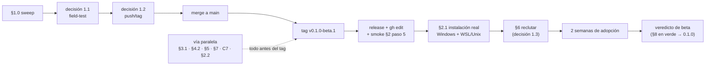

# Plan de publicación — lo que queda

> Escrito **2026-07-30** contra HEAD `2c65f72`, rama `refinamiento-plugin`, árbol limpio, suite verde
> en **17 paquetes**, matrices **41/41** y **26/26**, **68 commits adelante de `origin/main`, sin
> divergencia, sin pushear**. El commit que introduce esta revisión no se cuenta en ese número — la
> versión anterior de este encabezado nació mintiendo (decía `c47d57a`/67) porque el commit que la
> creó la desactualizó al nacer. Está catalogado en §11 para que no se repita sin nombre.
>
> Sucede a `plan_mejora.md` — el registro cerrado de los cuatro bloques, **retirado del árbol en esta
> misma revisión**; vive en el historial de git. Lo único que seguía vivo solo ahí quedó rescatado
> acá: el mecanismo a medio cablear del hallazgo #4 (§5) y una reserva metodológica (§10).
>
> **Este plan no es de motor.** El motor está. Es del camino por el que otra persona lo recibe, y de
> las **tres** decisiones que no son mías (§1).
>
> **Revisado en el lugar el 2026-07-30.** Lo que cambió: criterios de aceptación, costos y
> dependencias por ítem; §2.2 (la reversa), §7 (los campos declarados), §8 (qué cierra la beta) y §9
> (paralelismo) son nuevos; §4.2 tiene métrica y umbral pre-registrado; §5 está triado y con el
> conteo corregido (son 13, no 14 — la historia en §5); §6 pasó de enunciado a protocolo. La regla
> de entrada: **un ítem sin criterio de aceptación verificable no entra**.

---

## 0. Qué cambió desde el cierre del bloque 4, y cómo leer este plan

Una auditoría de la **distribución** —no del motor— encontró cinco blockers de instalación. Están
los cinco cerrados, cada uno con un test que falla contra el commit anterior:

| | qué estaba roto | commit |
|---|---|---|
| A1 | el binario se descargaba a `${CLAUDE_PLUGIN_DATA}/bin` y los 8 hooks, el MCP, el `batten` pelado de los comandos y `doctor` nombran `${CLAUDE_PLUGIN_ROOT}/bin/batten` | `f2f289c` |
| A2 | los seis `.sh` trackeados 100644 → `Permission denied` en macOS y Linux | `76b1e0a` |
| A3 | Windows sin Git Bash no tenía ningún camino de instalación | `60b35e7` |
| A4 | los comandos corrían `batten` pelado y seguían adelante con `command not found` | `ad56e0d` |
| A5 | el camino de release estaba verificado **leyéndolo** | `8ffc3fc` |

Y dos blockers **que la auditoría no tenía**, que salieron de ejecutar lo que ella leyó:

| | qué estaba roto | commit |
|---|---|---|
| — | **CI estaba rojo en `dc404c2`**: el schema publicado rechazaba el `batten.yaml` del propio proyecto | `786108b` |
| — | el grafo de código no conocía tres de diecisiete paquetes, con `query_before_read` activo | `2e840ab` |

El resto del contexto está en el [CHANGELOG](../../CHANGELOG.md); acá solo lo que **falta**.

### El formato de cada ítem

Todo ítem de trabajo de este plan lleva cinco campos, y el que no los puede llevar no es un ítem
sino una idea:

- **mecanismo** — qué se hace, no qué síntoma se cura
- **criterio** — qué tiene que ser cierto para llamarlo hecho, verificable por alguien que no soy yo
- **verificación** — cómo se comprueba; si es con un test, cuál **falla contra HEAD**
- **costo** — **S** ≤ 2 h · **M** ≤ 1 día · **L** > 1 día
- **depende de** — qué tiene que existir antes

Y una regla transversal que esta misma revisión estrenó: **ningún número se publica sin su regla de
conteo.** "47 comandos" vivió tres días en este documento porque nadie escribió cómo se contó (§11).

---

## 1. BLOQUE 0 — las tres decisiones que son tuyas

**Nada de la cadena de publicación avanza hasta que estén decididas.** No toqué un byte de ninguna.
Las tres necesitan **fecha**: 1.1 y 1.2 gatean todo lo serial, y sin fecha "decidir antes de
publicar" es "no publicar".

- decisión 1.1 (field-test): fecha límite ______
- decisión 1.2 (push/tag/release): fecha límite ______ (después de 1.1, mismo día está bien)
- decisión 1.3 (el adoptante, §6): nombre y fecha ______ (puede esperar al release; no más)

### 1.0 — Lo que NO espera la decisión: el sweep de tokens — **HECHO**

El hallazgo que cambió esta sección: los tokens del proyecto privado **no viven solo en
`docs/field-test/`**. **El sujeto de la réplica estaba nombrado en el código vivo y en los scripts
de matriz**, no solo en el informe del field test.

**El conteo, con su regla** (la versión anterior decía "22 archivos, 13 fuera" sin decir cómo se
contó, y las dos cifras estaban una unidad altas): la regla es **archivos trackeados con ≥1 match
de `git grep -nE` del patrón enmascarado**, medido contra el árbol de esta revisión — o sea con
`plan_mejora.md` ya retirado y con el patrón de este documento ya enmascarado. Con esa regla eran
**19 archivos, 10 fuera de `docs/field-test/`**: `ROADMAP.md` (3 líneas), `docs/FIELD-TEST.md` (2),
`docs/general/plugin_al_momento.md`, `internal/scan/scan.go` (2) y sus tests (3),
`internal/hooks/hooks_test.go`, `cmd/batten/main.go`, `cmd/batten/main_test.go`,
`scripts/replica-ui.sh` (3), `scripts/matrix-replica.sh` (2). Contra el HEAD anterior a esta
revisión eran 21 y 12 — la diferencia son los dos documentos de planificación, no código.

- **mecanismo** — renombrar el sujeto del fixture repo-wide, en código, tests, scripts y docs —
  **independiente de qué se decida sobre `docs/field-test/`**, porque ninguna de las tres opciones
  de 1.1 toca esos 10 archivos. Ejecutado con dos destinos, no uno: donde el texto habla de **la
  réplica** el sujeto pasa a `replica-ui` (el nombre que los scripts y `REPLICA-UI.md` ya usaban);
  donde habla del **repo real** —`ROADMAP.md`, `docs/FIELD-TEST.md:39`— se describe sin nombrarlo,
  porque "la réplica real" habría sido prosa falsa.
- **criterio** — `git grep -nE '[p]royecto[_]ui|\bM[N]A\b'` devuelve cero fuera de
  `docs/field-test/` (el patrón va enmascarado a propósito: matchea el token real y los bytes del
  archivo que lo contiene no — este documento, el guard y el test pasan su propio chequeo; el `\b`
  tampoco es decorativo: sin borde de palabra, "columna" da 8+ falsos positivos hoy). Y el guard de
  rutas personales de `ci.yml` se extiende con ese mismo patrón, **sin heredar la exclusión
  `:!graphify-out`** — los tokens no son rutas, y `graph.json` fue exactamente el vector que §11
  documenta. ✅
- **la segunda cerradura, que este ítem encontró ejecutando** — quitar `:!graphify-out` **no
  alcanzó**. `.gitattributes` marca los tres artefactos generados `-diff` (para que un rebuild no
  entierre cambios reales) y **`git grep -I` saltea los archivos `-diff` como binarios**: un token
  plantado en `graph.json` pasó limpio por un guard que ya había soltado la exclusión de ruta. El
  guard va **sin `-I`**; `Binary file … matches` es la salida correcta para un JSON minificado de
  2 MB, y es la única que llega. Queda anotada en §11.
- **verificación** — `TestNoPrivateProjectTokensAreTracked` (`internal/install/package_test.go`),
  la lectura local del step de CI, probada en las cuatro direcciones sobre un clon de sandbox:
  **rojo** contra HEAD (nombra los 12 archivos), **rojo** con el token plantado en
  `graphify-out/graph.json`, **verde** sobre el árbol barrido, **verde** con el mismo token bajo
  `docs/field-test/`. (La trampa del `grep -v` de §11 dice por qué se prueba en las dos
  direcciones; la segunda cerradura dice por qué no alcanzaba con dos.)
- **costo** — S-M (mecánico; un commit).
- **depende de** — nada. Fue primero.

### 1.1 — `docs/field-test/`: tres formas, no dos

El directorio no describe la réplica sintética: describe el proyecto privado. El inventario
archivo-por-archivo está en la revisión anterior de esta sección (historial de git) y no se repite
acá **a propósito**: esta sección va a quedar en el árbol después de la decisión, y un documento que
enumera sus propias fugas con nombre y línea rompe el criterio de 1.0 para siempre. Lo que hay que
saber para decidir: **siete de nueve archivos ya son públicos desde `b38fd5a`**; los dos que no
(`verified.json`, que filtra, y `REPLICA-UI.md`, sintético legítimo) se publican con el merge a
`main`. Una corrección previa se sostiene: los SHAs de `HANDOFF.md` son commits de ESTE repo, no
del privado.

Las tres formas, con su costo real:

| | qué se hace | qué queda después | qué se pierde | costo |
|---|---|---|---|---|
| **A1 — reescribir en el lugar** | un commit reescribe los 9 archivos con la réplica como sujeto | `docs/field-test/` sigue público, consistente con el sweep de 1.0 | la procedencia real de la evidencia: los hallazgos se encontraron sobre un proyecto real y los archivos dirían que no; **el historial sigue recuperable** | M |
| **A2 — retirar y consolidar** | un commit borra el directorio del árbol; las conclusiones ya viven en `docs/FIELD-TEST.md` (227 líneas, el informe público); README:521 y :530 se re-apuntan | un solo documento de field test, sin material crudo | la reproducibilidad pública de los 52 hallazgos (los repros mueren con los archivos); §5 deja de poder citar `verified.json`; **el historial sigue recuperable** | S-M |
| **B — purgar historia** | `git filter-repo` sobre los 9 paths **más `--replace-message`** (los mensajes de commit también nombran; `git grep` no los ve), force-push | la única forma que borra de verdad | todo clon existente queda inválido; **y el costo que la versión anterior de este plan no decía: invalida TODOS los SHAs citados** — este documento, el CHANGELOG y los engrams citan `f2f289c`, `76b1e0a`, `b38fd5a`… por SHA, y una purga los renumera todos | M-L |

> **Recomendación: A2**, y B solo si el criterio es la irrecuperabilidad — en cuyo caso es AHORA:
> B se vuelve mucho más cara después de publicar (un tag firmado y assets descargados congelan el
> contenido, y GitHub cachea lo que ya sirvió). A1 y A2 aceptan explícitamente que lo ya público
> siga siendo recuperable del historial; con siete de nueve archivos públicos hace meses, lo que B
> compra de verdad es estrecho y lo que cobra es todo el sistema de referencias del proyecto.

- **criterio** — el de 1.0, más: bajo A2, ningún link del repo apunta a `docs/field-test/`
  (README:521/:530, CHANGELOG:28/:247, `scripts/matrix-replica.sh:6` y `replica-ui.sh:88` se
  re-apuntan o se reformulan); bajo B, el grep de 1.0 limpio también **en historia**
  (`git log -S`). Y en las tres: esta sección §1.1 reescrita a registro de decisión.
- **verificación** — el guard de 1.0; bajo A2, un link-check manual de los 6 referentes.
- **de paso** — muere el `35/35` de `REPLICA-UI.md` (las matrices son 41 desde `plan_mejora`
  §"bloque 3"; dos números públicos en conflicto para la misma matriz es el defecto que `AGENTS.md`
  §"One contract, one home" declara recurrente).
- **depende de** — 1.0 (el sweep primero deja esta decisión limpia de lo incondicional).

### 1.2 — El push, el tag y el release quedaron en espera a propósito

Sin cambios en la sustancia, con las razones a la vista:

1. **Publicar congela el contenido.** Después del release, purgar sigue siendo posible pero deja un
   release cuyos assets ya circularon y un `main` reescrito bajo ellos.
2. **El merge a `main` publica `verified.json` y `REPLICA-UI.md`** — el merge es *parte* de la
   decisión 1.1, no un paso independiente.
3. `marketplace.json` no fija ref: `/plugin marketplace add` clona la rama default. **Mergear a
   `main` antes de taggear**, o el usuario recibe binario nuevo con prompts viejos.

### 1.3 — Quién adopta primero (nueva)

El protocolo completo está en §6; lo que es decisión tuya es **el nombre**: qué persona, qué repo.
§6 define el perfil y las fuentes para que la decisión sea elegir, no diseñar.

---

## 2. BLOQUE 1 — la secuencia de publicación

Ejecutar en este orden, y solo después de §1.

```bash
# 0. la verificación que sí se puede hacer antes de publicar (ya corrida en verde)
scripts/release-check.sh v0.1.0-beta.1

# 0.5 el grafo, fresco de verdad: graph.json declara built_at_commit=786108b — cinco commits
#     detrás de HEAD ya ANTES de esta revisión. Regenerar y commitear antes del tag:
graphify . --code-only && graphify cluster-only --no-label

# 1. main primero, porque el marketplace clona la rama default
git checkout main && git merge --ff-only refinamiento-plugin && git push origin main

# 2. el tag. La v es obligatoria: release.yml dispara con tags: ['v*'] — y con NADA más:
#    sin workflow_dispatch, sin re-run manual. El tag ES el botón.
git tag -a v0.1.0-beta.1 -m "..." && git push origin v0.1.0-beta.1

# 3. mirar el workflow, no asumirlo
gh run watch

# 4. `prerelease: auto` marca el tag -beta como prerelease, y GitHub excluye los prereleases de
#    `latest` — que es de donde bootstrap descarga. Sin esto, 404 en las seis plataformas.
gh release edit v0.1.0-beta.1 --prerelease=false --latest --notes-file <notas>

# 5. el smoke que solo existe después de publicar: los 6 assets Y checksums.txt, con hash
for p in linux_amd64 linux_arm64 darwin_amd64 darwin_arm64 windows_amd64 windows_arm64; do
  curl -sIL -o /dev/null -w "%{http_code} $p\n" \
    "https://github.com/ArthurZizumbo/batten/releases/latest/download/batten_${p}.tar.gz"
done   # los seis en 200
curl -sfL "https://github.com/ArthurZizumbo/batten/releases/latest/download/checksums.txt" \
  # 200 — y los sha256 de los seis archives bajados coinciden con sus líneas
```

**Decisión ya tomada, respetarla:** no se toca `.goreleaser.yaml`. `prerelease: auto` se queda; el
`gh release edit` posterior es el arreglo. Anotado sin eufemismo: **ese comando es a la vez la
palanca de publicación y la de rollback, corre fuera de CI y nada registra que corrió** — por eso el
paso 5 es obligatorio y no cortesía.

### 2.1 — Y después, lo único que cierra el círculo

Instalación real de marketplace, **en Windows y en un Unix** — WSL cuenta: es `linux_amd64` de
verdad, y es el Unix que esta máquina tiene—, desde el release publicado, no desde un checkout.

Qué mirar, en este orden:

1. `${CLAUDE_PLUGIN_ROOT}/bin/batten[.exe]` existe y corre.
2. `batten doctor` dice `✓ installed binary` con la versión del tag.
3. Un `git commit` sin veredicto se **deniega** (control positivo: sin esto el PASS no prueba nada).
4. Borrar `$ROOT/bin` y abrir sesión nueva: restaura del caché **sin red**.

### 2.2 — La reversa (nueva)

Un plan de publicación sin reversa es una lista de deseos. Los datos duros primero, porque la
reversa se diseña sobre ellos: `latest` es un **puntero móvil** y el cliente no pinea nada; el caché
de `$DATA/bin` se restaura **sin comparar versión** (`bootstrap.sh:61-64`) — o sea, **el caché
derrota al rollback**: revertir el release solo alcanza a máquinas que aún no instalaron; `doctor`
detecta una versión equivocada pero como **WARN con exit 0** (`main.go:2145-2151`); y un binario
corrupto que corre y dice su versión es indetectable hasta §3.

**Política de tags, decidida acá:** un tag cuyo release **nunca sirvió assets** (workflow rojo antes
de publicar) se puede borrar y re-crear. Un tag cuyos assets **se sirvieron aunque sea una vez**
está quemado: el siguiente es `-beta.N+1`. Nunca reusar un tag servido — sin verificación de firma,
"el mismo nombre con otros bytes" es indistinguible de un ataque, y con ella es peor: es la firma la
que deja de coincidir.

| falla | reversa | notas |
|---|---|---|
| **R1** — `gh run watch` termina rojo: el tag existe, el release no | fix forward: corregir, borrar el tag remoto, re-taggear igual | es la ÚNICA falla que ensaya goreleaser y el interplay prerelease/latest de verdad — el drill de abajo no los cubre, y se estrenan acá |
| **R2** — release publicado, assets rotos (naming, binario malo) | `gh release edit <tag> --draft=true` → los assets 404an → arreglar → `-beta.N+1` → `--latest` | máquinas con caché siguen con el último bueno; instalaciones nuevas caen al no-gate **ruidoso-una-vez** del bootstrap — el mismo estado que cualquier descarga fallida |
| **R3** — una máquina instaló la versión mala | runbook de dos líneas: borrar `$ROOT/bin/batten*` y `$DATA/bin/batten*`, abrir sesión nueva (re-bootstrap del `latest` ya arreglado) | detección: `batten doctor` la nombra (warn). El candidato mecánico —que el restore del caché compare contra `plugin.json`— queda anotado en §10, S-M, **no** bloquea beta |
| **R4** — `gh run watch` se cae o flakea | `gh run list --workflow=release.yml` + `gh run view <id> --log-failed`; re-mirar | **nunca re-taggear por una falla de observación** — el workflow puede haber terminado bien |

- **mecanismo** — esta tabla, más el smoke del paso 5 como disparador (el smoke es lo que convierte
  "assets rotos" de queja de usuario en detección propia).
- **criterio** — cada falla tiene comandos escritos (esta tabla) **y el drill de R2 se ensayó una
  vez**, con evidencia guardada (los tres curls con timestamp: 200 → draft → 404 → undraft+latest →
  200 y `releases/latest/download` re-resuelve).
- **verificación** — el drill **solo funciona en un repo de prueba PÚBLICO** con un release de
  assets dummy: en este mismo repo un draft no crea el tag (el workflow no dispara) y los assets de
  un draft exigen auth — el flip a 404 no se demuestra con curl anónimo; y en un repo privado el
  curl anónimo da 404 siempre, o sea el drill "pasa" sin probar nada.
- **costo** — S (la tabla) + S (el drill).
- **depende de** — nada para escribir y ensayar; de §2 pasos 1-4 para valer en producción.

---

## 3. BLOQUE 2 — la brecha de cadena de suministro

`bootstrap.sh` y `bootstrap.ps1` descargan 14 MB y **no verifican nada** — el grep es cero fuera de
`.goreleaser.yaml:58-60`, que **produce** `checksums.txt` en cada release para que nadie lo lea. La
única "validación" post-descarga es que el binario conteste `version`, que un binario hostil
contesta encantado.

### 3.1 — Paso 1, para beta.1: el sha256 contra `checksums.txt` — **HECHO**

- **mecanismo** — los dos bootstraps descargan `checksums.txt` **del mismo release** que el asset,
  extraen **la línea de SU asset** y comparan. No `sha256sum -c` a secas: el archivo lista los seis
  assets y cinco no están en disco — `-c` pelado falla siempre. Por plataforma: `.sh` usa
  `sha256sum` o `shasum -a 256` (macOS de fábrica no trae `sha256sum`); `.ps1` usa `Get-FileHash
  -Algorithm SHA256` (PowerShell 5.1 lo tiene).
- **el modo de falla, que es el punto** — hash distinto **o `checksums.txt` inalcanzable** ⇒ **no se
  instala**: `$ROOT/bin` queda como estaba, el caché NO se siembra, stderr nombra url, esperado y
  obtenido, y el script **sigue saliendo 0** — el contrato del `||` de `hooks.json:10` es
  inviolable: exit ≠ 0 significa "no hay bash", no "falló la descarga". Es la única parte del
  bootstrap que falla cerrado, y el comentario en el código lo tiene que decir para que nadie la
  "arregle" después.
- **matiz honesto** — el 404 de `checksums.txt` es contrafáctico para releases propios: hoy hay
  **cero releases publicados** y el primero ya lo trae (goreleaser lo genera desde antes del primer
  tag). El caso alcanzable es un `BATTEN_BOOTSTRAP_BASE_URL` apuntado a un mirror incompleto — y ahí
  fail-closed es exactamente lo que se quiere.
- **criterio** — la matriz de manipulación en verde, en los DOS scripts. ✅
- **verificación** — **seis** tests sobre el seam existente (`BATTEN_BOOTSTRAP_BASE_URL` + el server
  local que `internal/install/bootstrap_test.go` ya levanta), y los seis **fallan contra el commit
  anterior** (`896c160`) con los scripts sin tocar. Son seis y no cuatro porque "en los DOS
  scripts" es el criterio y `bootstrap.ps1` no hereda ningún test de `bootstrap.sh`:
  - `TestBootstrapRefusesATamperedArchive` — checksums con hash A, archive con hash B → no instala,
    `$ROOT/bin` vacío, caché intacto, exit 0, stderr nombra url, esperado y obtenido
  - `TestBootstrapInstallsWhenChecksumMatches` — el camino feliz sigue siendo el camino feliz **y
    pidió `checksums.txt`**: sin esa aserción el test lo pasa un bootstrap que ignora el archivo, o
    sea la verificación queda al lado del camino de instalación en vez de adentro
  - `TestBootstrapFailsClosedWithoutChecksums` — 404 del txt → mismo trato que el mismatch
  - `TestCacheRestoreSurvivesABadDownload` — en tres actos, porque el acto que falla contra el
    commit anterior es el primero: (1) primera descarga manipulada ⇒ **no llega al caché**;
    (2) con el caché sembrado por un install verificado y el servidor todavía envenenado, el update
    de plugin restaura **sin red**; (3) control diferencial — el binario restaurado **deniega** un
    commit sin veredicto. "Corre `version`" y "el gate volvió" son afirmaciones distintas y el
    silencio del hook es lo que parece un ALLOW
  - `TestBootstrapPS1RefusesATamperedArchive` y `TestBootstrapPS1FailsClosedWithoutChecksums` — los
    mismos dos sobre el script que corre Windows, que es el target primario declarado
- **lo que salió de ejecutarlo** — el 404 de `checksums.txt` en `.ps1` fallaba cerrado pero el
  mensaje era el de `Invoke-WebRequest`: un `(404) No se encontró` **localizado**, que no dice cuál
  de las dos URLs falló ni lo dice en inglés. El fetch del txt lleva su propio `try` para poder
  nombrarlo. Un fail-closed que no se puede leer manda a la gente a borrar el plugin.
- **costo** — M. **depende de** — nada para código y tests; de §2 para probarlo contra el release real.

### 3.2 — El caso que rompe el diseño, decidido y dicho

**Si la verificación falla cerrado, una descarga corrupta deja la máquina SIN gate.** Decidido:
**es aceptable**, por cuatro razones que quedan escritas para no re-litigarlas:

1. La alternativa es peor en especie, no en grado: un binario no verificado que **siete hooks van a
   ejecutar** es ejecución remota de código por descarga. No hay versión de "instalalo igual y
   avisá" que no sea eso.
2. El estado sin-gate **ya es el estado actual** de toda descarga fallida (la cadena completa está
   verificada: los 7 hooks son exec-form sobre un archivo que no existe — mueren en silencio, el
   MCP no arranca, `doctor` es inalcanzable porque doctor ES el binario que falta). La verificación
   no crea ese estado: le agrega una causa más y le quita la peor.
3. La ventana es **solo el primer install**: desde la primera instalación buena, el caché de
   `$DATA/bin` restaura el último binario **verificado** sin red (`TestCacheRestoreSurvivesABadDownload`
   es exactamente esa afirmación).
4. El techo de ruido alcanzable sin binario es el mensaje del bootstrap (hoy: tres líneas a stderr,
   una vez, terminando en *"nothing is being gated"*). El banner rico de SessionStart no puede
   avisar — necesita el binario que falta. Se acepta el techo y se dice; subirlo es §10, no beta.

### 3.3 — Paso 2, para 0.1.0: minisign

- **mecanismo** — firma de assets con minisign; la pública embebida en los dos bootstraps; la
  verificación se suma al sha256 (no lo reemplaza: el sha256 sigue atajando el mirror roto sin
  clave).
- **custodia, decidida** — la clave privada es **LOCAL**: password manager del autor + backup
  offline. **Nunca un secret de CI** — un release se construye en CI, así que firmar en CI significa
  que quien compromete CI firma; el compromiso de CI es parte de lo que minisign existe para cubrir.
  El flujo es manual y post-CI a propósito: bajar los assets publicados, `minisign -Sm`, subir los
  `.minisig` — un comando más en el runbook del paso 4, que ya es manual.
- **alcance honesto** — cubre asset reemplazado y cuenta comprometida. **No cubre repo
  comprometido**: la pública viaja en el mismo repo que el marketplace clona; quien reescribe el
  repo reescribe la clave. Decirlo en el README de instalación, no dejar que se infiera de más.
- **criterio** — release 0.1.0 con los seis `.minisig` publicados y los bootstraps verificándolos
  con la matriz de manipulación extendida (firma inválida ⇒ mismo trato que hash inválido).
- **costo** — M. **depende de** — 3.1 (la maquinaria de fail-closed es la misma).

---

## 4. BLOQUE 3 — lo rescatado de `adopcion_y_esencia.md`

Ese documento evaluaba un estudio de mercado y sus cinco propuestas. **Casi todo se aplicó.**
Verificado contra el código, no contra la intención:

| propuesta | veredicto de entonces | hoy |
|---|---|---|
| #1a reposicionar como habilitador de paralelismo | adoptar | ✅ README §"The write-set guard — what makes parallel fan-out safe" |
| #1b OCC con autorreparación por LLM | **rechazar** | ✅ rechazada — ver §4.1 |
| #2 cero configuración | adoptar | ✅ `batten demo` no toca nada tuyo; `init` arranca en `report` |
| #3 visual en vivo (versión barata) | adoptar | ✅ `internal/canvas/html.go`, `batten canvas --html` |
| #4 generador de PR | la mejor | ✅ `batten pr` con DAG Mermaid, evidencia y cobertura de criterios |
| #5a activar campos declarados | obligatorio | ✅ de 16 a 7 — y §7 los lleva a **cero** |
| #5b fail-closed | **rechazar → fail-open ruidoso** | ✅ implementado con el sobre tipado |
| §6.1 el reporte antes que la negación | agregado | ✅ `batten report`, y el README lidera con `demo` |
| §4.3 un número medido de terceros en el titular | agregado | ✅ el README abre con el 78 % y arXiv:2607.07405 |

### 4.1 — Las dos decisiones que no hay que re-litigar

Se guardan acá porque el documento que las argumentaba se borró, y porque las dos van a volver a
proponerse — son ideas que suenan bien:

- **Concurrencia optimista con autorreparación por LLM: rechazada.** Poner al modelo a juzgar si su
  propio conflicto de escritura "importa" reintroduce exactamente la falla que el gate mata, en la
  otra mitad del producto. El 78 % de fallas silenciosas del paper es la medición de por qué.
  *Lo que sí es adoptable* es extender `advise()` a colisiones de baja severidad — pero que la
  severidad la decida una regla, no el modelo. Cada vez que este plan menciona esa extensión
  (§4.2, §6), la condición viaja con ella.
- **Fail-closed: rechazado** (para el gate; §3 es otra cosa y su excepción está argumentada ahí).
  SQLite bajo contención devuelve `SQLITE_BUSY`; con fail-closed eso deniega **cada** llamada a
  herramienta hasta que se libere. Una herramienta de gobierno que inutiliza la sesión el día que
  la base está ocupada se desinstala esa misma tarde. La tercera opción —fail-open **ruidoso**— es
  la que está implementada.

Y de `gentle_ai.md`, tres rechazos de la misma clase: **Receipt-Driven Development** como marco
(batten ya tiene su envelope; adoptar vocabulario ajeno sobre el mismo mecanismo agrega conceptos sin
agregar imposición), **enrutamiento de modelos por fase** (batten no orquesta, a propósito;
`models.*` se sacó del spec por eso), y **Strict TDD Mode** (lo que batten inyecta sale del
`batten.yaml` del usuario, no de su opinión).

### 4.2 — Medir antes de rediseñar: la métrica, exacta — **MAQUINARIA HECHA, MEDICIÓN ABIERTA**

> Las cuatro piezas están. Lo que sigue abierto es el **número**: hacen falta ≥10 runs escaneados y
> hoy hay los que el dogfood acumule desde acá. C5 de §8 sigue en rojo a propósito — es la única
> parte de este ítem que el tiempo tiene que pagar, y el umbral de abajo quedó escrito **antes** de
> ver el primer dato para que no se elija después.

[S-Bus](https://arxiv.org/pdf/2605.17076) reporta que los agentes sobre-declaran su uso de recursos
**entre 32 % y 49 %**. Si los write-sets declarados a mano sobre-declaran parecido, el bloqueo por
write-set es real y hay que trabajarlo; si no, cualquier rediseño de la disjunción resuelve un
problema inventado. batten hoy no puede contestar esa pregunta sobre sí mismo — y la versión
anterior de esta sección decía que los datos "ya están en la base", **que es verdad a medias**: el
denominador está (`writesets` no borra filas nunca); el numerador lo computa `contrastDiff()`
(`scandiff.go:124-163`, con su sentinel `-1` para "cero claims no es 0 %") **y se tira por stdout**
— cero INSERT en todo el archivo. Y la vía barata de reconstruirlo desde `events` no existe:
`PostToolUse` está registrado **solo para Bash**, así que un `Write` en events es intención, no
hecho.

- **mecanismo** — cuatro piezas, todas chicas:
  1. migración **v12**, aditiva (pasa `TestEveryMigrationIsAdditive` tal cual):
     `CREATE TABLE IF NOT EXISTS scans(run_id, ts, claims, owned, unused, undeclared)`
  2. un INSERT en `cmdScanDiff` después de `printScanDiff`, respetando el `-1` como "no medible"
  3. **`batten scan-diff --strict` cableado en los `gates.checks` del `batten.yaml` PROPIO** — el
     dogfood es el mecanismo de acumulación: sin él nadie corre scan-diff y los "≥10 runs" del
     umbral no llegan nunca; con él, cada `batten check` del propio flujo siembra una fila
  4. un bloque "write-sets" en `batten measure`: mediana de `unused/claims` sobre runs con claims y
     scan; los runs sin scan se reportan **NO MEDIDOS**, jamás como 0. La fricción sale de lo que ya
     existe: `report.go` ya separa `byRule`/`byRuleAdvised` — completar, no construir: `write_set`
     deny y advise **por separado** (en `report` el deny se vuelve advise, y la colisión sin
     `agent_id` es advisory SIEMPRE — mezclarlos subcuenta), `bash_write` aparte, y `FirstDecisionAt`
     como valla para que nada se lea como total histórico.
- **umbral, pre-registrado — sin esto cualquier número confirma lo que ya se creía:**
  sobre **≥10 runs reales con claims y scan**:
  - mediana `unused/claims` **≥ 32 %** (el piso de la banda S-Bus) ⇒ la sobre-declaración es real.
    Acción: extender `advise()` a colisiones de baja severidad **con la severidad decidida por
    regla, no por el modelo** (la condición de §4.1), y revisar la granularidad de claims que
    `/batten-plan` sugiere. **No** rediseño de la disjunción.
  - mediana **≤ 15 %** con **≥5 de esos runs en `enforce`** y **cero denials `write_set`** ⇒
    problema inventado; la línea se cierra. (La precondición de enforce no es burocracia: en
    `report` el deny se convierte en advise, así que "cero denials" en un historial 100 % report es
    vacuamente verdadero.)
  - banda media a los 10 ⇒ seguir midiendo; **si a los 25 runs sigue en banda, la línea se cierra
    por no-acción** — un umbral sin salida es goma.
  - y una lectura anotada de antemano: `unused` es **cota superior** de la sobre-declaración —
    mezcla "reclamé de más" con "el archivo legítimamente no necesitó cambio". El número decide
    entre las acciones de arriba; no se cita como "X % de mentira".
- **criterio** — `batten measure` muestra el bloque con mediana y N; `scans` tiene una fila por
  scan; el spec propio corre scan-diff en su gate. ✅ las tres.
- **verificación** — `TestScanDiffPersistsTheContrast` y `TestMeasureReportsWriteSetUtilization`,
  ambos **fallan contra el commit anterior** (`d6b6589`) **por comportamiento, no por símbolo**: se
  probaron sobre un árbol con la API de store entera y solo los dos call-sites revertidos (el
  `SaveScan` en scan-diff y el `printWriteSets` en measure), y ahí dicen *"the scan was printed and
  not recorded"* y *"`batten measure` has no write-set block"*. Un fallo de compilación no habría
  probado nada. Los acompaña `TestAnUnscannedRunIsNotZeroPercent`, que fija la distinción sobre la
  que se apoya todo el resto.
- **decisiones de forma, tomadas al implementar** (cada una era una manera de sacar un número
  favorable):
  - **mediana, no promedio** — un fan-out que reclamó 40 y tocó 2 arrastra un promedio hasta que
    parezca hallazgo.
  - **por run, tomando el scan más nuevo** — si no, un run escaneado seis veces cuenta seis veces, y
    los runs que se re-escanean son justamente aquellos de los que alguien ya sospechaba.
  - **el `claims = 0` se graba igual** — es un hueco de planeación y vale registrarlo, pero queda
    fuera de la mediana: dividir por cero claims no es medir. Es el `-1` de `OverDeclared()`
    llevado a la persistencia.
  - **el INSERT no puede poner el gate en rojo** — si falla, avisa por stderr y el check sigue. El
    `--strict` gatea el DIFF; que la contabilidad de la métrica pueda tumbar el gate la volvería un
    pasivo para lo que mide.
- **costo** — S-M. **depende de** — nada; corre en paralelo desde ya, y §6/M4 lo consume.

### 4.3 — El diferenciador que no está contado — RESUELTO

Estaba resuelto y este plan no lo sabía: **README §"The metric nobody else reports"**
(README.md:292-303) ya cuenta exactamente esto — Langfuse/OpenTelemetry/ccusage/CloudZero miden
dólares de API, batten mide **porcentaje de la ventana rodante**, "the only local sensor". Queda
como corrección en §11: el ítem se cerró sin que el documento que lo pedía se enterara.

---

## 5. BLOQUE 4 — las brechas del field test, triadas

> **Estado a esta altura: quedan 7 abiertos, no 13** — los 6 BLOQUEA están cerrados. Regla de
> conteo, la misma de abajo: hallazgos CONFIRMED de `verified.json` sin fix a HEAD, contados una
> vez cada uno. 7 = **6 PULIDO + 1 LÍMITE** (#6, que se documenta y no se arregla). Nada más se
> cerró de casualidad: los 6 PULIDO siguen sin tocar a propósito, porque publicar con un PULIDO
> abierto es honesto y reclutar con un BLOQUEA abierto quema al adoptante caro (§9).

**Primero, el conteo, corregido: son 13, no 14.** La lista anterior citaba "#6, #60" para el bypass
por heredoc/Makefile. Verificado contra `docs/field-test/verified.json` (63 entradas, índices 0-62,
52 CONFIRMED): **el índice 60 es otro hallazgo** — doctor cortaba en el primer error fatal — y está
**cerrado a HEAD** con test que lo cita por número (`TestDoctorReportsEverythingInOnePass`,
`main_test.go:902`). El bypass por heredoc/Makefile no es un hallazgo aparte: es la **frontera
declarada** del #6. El CHANGELOG agrupó mal la numeración y este plan la heredó; la corrección del
CHANGELOG es parte de C7 (§8). Eran 15 → el #1 se cerró con `spec.UnknownKeys` → 14 → menos el #60
fantasma → **13**.

El triaje usa un solo eje: **¿le impide a un adoptante externo llegar al final del flujo, o le rompe
la promesa central en silencio?** Eso es BLOQUEA. Lo que molesta pero no miente es PULIDO. Lo que no
se puede arreglar sin heurísticas en el camino crítico es LÍMITE, y se documenta.

### Los 6 que BLOQUEAN adopción — **LOS SEIS CERRADOS**

Se cerraban antes de reclutar porque §6 depende de esto. Cada uno con su test diferencial, probado
revirtiendo **comportamiento y no símbolos**, y cada commit nombra el suyo.

| # | qué pasaba | mecanismo del fix | test que falla contra el commit anterior | commit |
|---|---|---|---|---|
| **16** | el flujo con un gate con `checks:` termina en deny que exige `batten check` — comando que la documentación no menciona | documentar el paso en el flujo del README **y de los comandos** | `TestEveryDocumentThatDrivesAVerdictNamesBattenCheck` — regla, no lista: todo documento que nombre `batten verdict` nombra `batten check` | `9d519bc` |
| **50** | trunk-only: el commit cerraba el unit de la SESIÓN, no el que el mensaje nombra | `commitTarget` compartido por el gate y el cierre — los dos contestaban distinto la misma pregunta | `TestACommitClosesTheUnitItNAMES`, `TestACommitNamingAnUnopenedUnitClosesNothing` | `badd036` |
| **4** | `claim` solo miraba su propia corrida: el segundo run recibía *"any other agent writing them is now denied"* y después el guard denegaba a **ambos** dueños | llamar a `store.WriteSetOwnerAcrossOpenRuns`, que ya existía y nadie llamaba desde acá | `TestASecondRunCannotClaimAFileAnotherOpenRunOwns` | `f6f65f7` |
| **27** | evidencia con objetos JSON → error crudo del decoder de Go, en el primer veredicto del adoptante | error tipado que nombra el campo y la forma, y **enseña** `AC-n:` como el reemplazo del objeto | `TestEvidenceOfObjectsIsRefusedByName`, `TestAWrongFieldTypeNamesThatField` | `2e43768` |
| **59** | `batten init` no escribía `.gitignore` → el primer `git add -A` commiteaba la base | `init` agrega `/.batten/` si falta, **append y no reescritura**, y lo dice | `TestInitIgnoresBattensOwnDatabase`, `TestInitAppendsToAnExistingGitignore` | `45b332a` |
| **7** | un claim fuera de la raíz se aceptaba con la frase de éxito → cerca imaginaria | rechazar nombrando la razón; el relativo se resuelve contra la RAÍZ | `TestAClaimOutsideTheRepoIsRefused` | `f6f65f7` |

**Dos de los seis no estaban donde el informe decía, y salió de ejecutarlos:**

- **#16** ya estaba cerrado en el README (`README:88-114` muestra el deny y el `batten check` que lo
  levanta; QUICKSTART también). Lo que seguía vivo era la otra mitad del mecanismo —"y de los
  comandos"—: **ningún comando ni skill del plugin nombraba `batten check`**. `/batten-verify` decía
  correr los checks del gate a mano, que produce citas y no un pase con `source=batten`.
- **#50**: las tres sub-formas de PreToolUse del repro (B1, B3, C2 de `verified.json`) ya estaban
  cerradas — verificado contra el binario, una por una. La que seguía viva es la que el `fix_hint`
  del propio hallazgo nombraba **en segundo lugar** y nadie tocó: el close path de `postToolUse`.
  Un commit que dice `feat(TASK-002)` cerraba TASK-001 — y cerrar un run **libera sus claims de
  write-set**, así que los archivos cercados de un unit que se sigue trabajando quedan libres.

### Los 6 de PULIDO — no gatean el reclutamiento

| # | qué pasa | costo | nota de verificación |
|---|---|---|---|
| 23 | `show --run` descarta el flag (id inexistente incluido) y `runs` no imprime id/hora/edad | S-M | test CLI: `--run bogus` → error; hoy exit 0 con el run último |
| 28 | todas las superficies muestran solo el ÚLTIMO veredicto: el segundo productor borra al primero de la vista (la base guarda ambos) | M | test sobre `show`/export (superficie no-TUI): ambos veredictos visibles |
| 43 | el write-set guarda y reporta el path case-folded: `useTrace.ts` vuelve `usetrace.ts` en toda superficie | M | mecanismo a elegir: columna display aditiva en v12, o re-derivar del filesystem; test de round-trip del claim |
| 47 | la TUI rotula `113% quota` en la lista y `17.0%` en el detalle para lo MISMO | S | `bindingLine` (`tui.go:346`) es función pura → test unitario del formato; sin harness de TUI no se promete test de pantalla |
| 34 | `measure` imprime la sección de headroom en un repo que jamás declaró `capabilities.compression` | S | test: spec sin compression → sin sección |
| 24 | una fase con `diff_from: anchor` sin ancla avisa en runtime, pero `doctor` no lo menciona | S | test de doctor: spec con `diff_from` y flujo sin fase-ancla → warn |

### El LÍMITE declarado — se documenta, no se arregla

- **#6 — la escritura cruzada por heredoc de `python`, target de Makefile o herramienta de terceros
  es invisible al guard de Bash.** Ningún parser de shell llega ahí; meter heurísticas más hondas en
  el camino crítico es exactamente lo que el ciclo del bash-guard enseñó a no hacer sin medición.
  El complemento es estructural y ya existe: `batten scan-diff` (git no se puede engañar con un
  heredoc) — que con §4.2 queda además cableado en el gate propio. Costo 0 en código; el manual ya
  lo dice en voz alta.

Las reproducciones de los 13 están en `docs/field-test/verified.json` **mientras la decisión 1.1 no
se ejecute**; si gana A2, la referencia pasa al historial (y este párrafo se actualiza — está
anotado en el criterio de 1.1).

---

## 6. BLOQUE 5 — la primera adopción externa, con plan

batten nunca fue adoptado por un proyecto ajeno, con gente que no lo escribió. **Es la única brecha
que no se cierra escribiendo código, es la razón por la que la versión se llama `beta`** — y la
versión anterior de esta sección la enunciaba y cambiaba de tema. Este es el plan.

### 6.1 — Quién (perfil y fuentes; el nombre es la decisión 1.3)

**Perfil duro — los cinco son requisitos, no deseos:**

1. **No contribuyó a batten** y no vio este repo por dentro (si conoce el diseño, mide memoria, no
   docs).
2. **Usa Claude Code a diario** en trabajo real (batten gobierna un flujo que tiene que existir).
3. **Repo real con suite de tests y backlog vivo** — el gate necesita checks que correr y units que
   cerrar.
4. **macOS o Linux de preferencia** — el autor vive en Windows: la mitad del bootstrap que él no
   ejercita a diario es exactamente la que un adoptante debe estrenar.
5. **Puede dedicarle dos semanas** de su flujo normal (no un fin de semana de prueba sintética) y
   acepta compartir `batten report --share` y sus notas.

**Fuentes, en orden:** el entorno directo del autor; la comunidad de Gentleman Programming (el repo
ya dialoga con gentle-ai — es el vecino natural); usuarios visibles de graphify/engram (ya viven la
tesis de las tres memorias).

### 6.2 — Qué se le pide, exactamente (el guion)

1. **Instalar SOLO desde el marketplace público, siguiendo el README.** Sin ayuda del autor. El
   canal de soporte es **issues, y solo docs**: cada pregunta que necesite respuesta del autor para
   avanzar **es un hallazgo de documentación y se cuenta** (M2).
2. `batten init` en su repo + `batten demo` una vez.
3. **Dos work items REALES de su backlog, end-to-end** (plan → build → verify → close), el primero
   en `report`, el segundo en `enforce`; **al menos uno con fan-out de ≥2 subagentes** con
   write-sets disjuntos. Su gate declara sus checks reales (su suite), y el flujo incluye
   `batten check` — con scan-diff en el gate si acepta la sugerencia del init.
4. **Entregar:** `batten report --share` de la quincena, la salida de `batten doctor`, y cinco
   preguntas fijas — la quinta es la discriminante: *"si mañana lo desinstalás, ¿qué fue lo que no
   te pagó?"*.

### 6.3 — Qué se mide (definido antes de que empiece)

| métrica | qué es | de dónde sale |
|---|---|---|
| **M1** | llegó al final: ≥1 unit cerrado por el gate con veredicto y evidencia, **sin intervención del autor** | binaria; `report` + el verdict en su base |
| **M2** | fricción: # de issues bloqueantes hasta el primer veredicto | los issues |
| **M3** | time-to-first-verdict (sesiones, no horas de reloj) | `report` |
| **M4** | utilización de write-sets y denials de SUS corridas | la métrica §4.2, que viaja en el binario que instala |
| **M5** | retención: ¿sigue instalado a los 14 días? ¿en `enforce` o volvió a `report`? | la quinta pregunta + `doctor` |

### 6.4 — El umbral de replanteo, pre-registrado

La regla de clasificación se fija ANTES de leer las respuestas, porque el clasificador soy yo y esa
es la trampa:

- **"No entendí para qué declarar write-sets" / "no encontré el comando" / un error crudo / el gate
  no se activó** ⇒ falla de **docs o bug**. Acción: arreglar, y repetir el protocolo con el
  adoptante #2. No se replantea nada.
- **"Entendí y no me paga"** — el modelo conceptual rechazado con conocimiento de causa (declarar
  write-sets cuesta más de lo que el guard devuelve; el veredicto estorba más de lo que asegura) ⇒
  falla de **modelo**. La respuesta literal del adoptante queda archivada como evidencia — no mi
  paráfrasis.
- **Dos adoptantes consecutivos** que abandonan por modelo ⇒ **se replantea**. Y "replantear" está
  ACOTADO de antemano: ergonomía de la declaración — `advise()` por regla en colisiones de baja
  severidad (§4.1, con su condición), granularidad de claims, claims sugeridos desde `/batten-plan` —
  **OCC-por-LLM y fail-closed siguen rechazadas incluso en ese escenario**; si la respuesta a "no me
  paga" fuera re-abrirlas, §4.1 existe exactamente para ese día.

- **criterio** — el protocolo corrido entero con ≥1 adoptante: M1 respondida (sí o no), M2-M5
  registradas, y la decisión post-mortem escrita en este documento.
- **verificación** — los artefactos de 6.2.4 archivados.
- **costo** — S de escritura (issue template con las cinco preguntas + una pasada al README con ojos
  de "solo esto tengo") **+ ~2 semanas calendario** de soporte solo-docs.
- **depende de** — §2 (release publicado), §2.1 (instalación real verificada en las dos plataformas),
  y **los 6 BLOQUEA de §5 cerrados** — un adoptante quemado por un bug conocido no vuelve, y el
  primer adoptante es el caro.

---

## 7. Los 7 campos en `declaredAsFuture` — **CERRADO: la lista quedó VACÍA**

La lista vive en `internal/spec/declared_test.go:50-67` con su razón por entrada, y el guard
`TestEveryDeclaredFieldHasAConsumerOrIsDeclaredFuture` la sostiene. Bajó de 16 a 7. **Cada campo
tiene tres salidas — cablear, sacar del spec, o quedarse con razón — y este plan las decide todas**:

| campo | qué promete | salida | razón | costo |
|---|---|---|---|---|
| `phases[].when` | condición advisory para entrar a una fase | **cablear** | su contrato entero es advisory → imprimirlo en el briefing de fase de `SessionStart` es un lector real y honesto; una línea | S |
| `resources.<k>.kind` | `exclusive_pool \| mutex` | **sacar** | el schema promete literalmente *"the orchestrator runs it BEFORE launching and queues"* — **batten no orquesta**; es el mismo argumento que sacó `models.tiers`/`models.phases` del spec | S-M (los 4 juntos) |
| `resources.<k>.probe` | comando que mide capacidad libre | **sacar** | ídem — nunca se ejecuta y prometerlo es peor que no tenerlo | ↑ |
| `resources.<k>.unit` | unidad del probe | **sacar** | cae con probe | ↑ |
| `resources.<k>.priority` | orden al faltar capacidad | **sacar** | nada serializa sobre esto | ↑ |
| `domains[].coverage` | piso de cobertura citable en el gate | **cablear** | una línea advisory en el briefing del gate (*"coverage declarado: N % — citalo como AC si aplica"*); si en dos ciclos nadie lo cita, sacar | S |
| `domains[].resources` | qué recursos disputa un dominio | **sacar, en cascada** | referencia a un bloque que se va; matiz honesto: HOY tiene un lector parcial (la validación referencial del spec) que el guard no cuenta — "declaring is not consuming" | ↑ |

**Y la fila que la lista no puede ver, porque el guard es por campo y no por valor:**
`budget.on_exceed` valida tres valores (`block | warn | downgrade_effort`, `spec.go:343-348`) y
**solo `block` está cableado** (`hooks.go:711`). `warn` y `downgrade_effort` se aceptan y no hacen
nada — la misma fisura que el propio guard documenta para el viejo `MaxIterations`.

| valor | salida | razón | costo |
|---|---|---|---|
| `warn` | **cablear** | el mecanismo ya existe entero: es `advise()` en vez de `deny()` en la rama de presupuesto | S |
| `downgrade_effort` | **sacar** | bajar el esfuerzo del modelo es orquestación; batten no orquesta | S |

- **criterio de cierre de la sección** — **`declaredAsFuture` queda con CERO entradas**, y los tres
  valores de `on_exceed` o hacen algo o no existen. ✅ las dos. El verificador ya estaba escrito:
  son los guards de `declared_test.go` (para las salidas "sacar",
  `TestDeclaredAsFutureHasNoStaleEntries` obliga a limpiar la lista; para "cablear", el guard de
  consumidores exige el lector).
- **verificación** — suite; más un test por cableado, y los tres **fallan contra `235426d`**:
  `TestThePhaseBriefingCarriesTheWhenCondition`, `TestTheGateBriefingCarriesTheCoverageFloors` y
  `TestOnExceedWarnSaysSoInsteadOfPassingInSilence`. Cada uno lleva su control: `when` y `coverage`
  tienen que decir **advisory** (imprimirlos sin eso los hace parecer un chequeo que batten corrió,
  que es la promesa que esta sección existe para dejar de hacer), un dominio sin piso declarado no
  puede aparecer con `0%`, y `TestOnExceedBlockStillDenies` fija que ablandar `warn` no ablandó
  también `block`.
- **la migración, que no es opcional** — un spec que todavía traiga `resources:` **sigue cargando**
  (batten no ladrillea un repo por una clave que dejó de leer) y `UnknownKeys` lo reporta, con su
  test. `on_exceed: downgrade_effort` no carga, y el error **nombra la remoción** en vez de tratarla
  como typo — un "valor inválido" a secas mandaría al usuario a buscar el error de tipeo que no
  cometió.
- **la contención de recursos no desapareció, bajó de nivel** — donde un dominio disputa algo
  escaso, va en sus `invariants:`, que viajan verbatim al prompt del agente. Una regla que un agente
  lee vale más que un campo que nadie ejecuta; el ejemplo `agrosat` quedó reescrito así, con la nota
  al pie que dice por qué.
- **costo total** — M. **depende de** — nada; paralelo. Tocó `batten.schema.json` + los 3 examples +
  5 documentos de comandos en el mismo commit (la lección del CI rojo:
  `TestTheSpecsThisRepoShipsHaveNoDeadKeys` es el guard que lo fuerza a hacerse completo).

---

## 8. Qué cierra la beta (nueva)

**`0.1.0-beta.1 → 0.1.0` no es tiempo transcurrido: es esta lista en verde.** Sin ella "beta" es un
adjetivo indefinido.

| | qué tiene que ser cierto | de dónde sale |
|---|---|---|
| **C1** | ≥1 adopción externa completada con **M1 = sí** (protocolo §6 entero, artefactos archivados) | §6 |
| **C2** | ✅ los **6 BLOQUEA** de §5 cerrados, cada uno con su test diferencial | §5 |
| **C3** | ✅ verificación sha256 en los dos bootstraps con la matriz de manipulación en verde | §3.1 |
| **C4** | la reversa §2.2 escrita **y el drill R2 ensayado una vez** con evidencia | §2.2 |
| **C5** | la métrica §4.2 respondida: ≥10 runs, el número, y la decisión del umbral **anotada en este documento** | §4.2 |
| **C6** | ✅ `declaredAsFuture` con **cero entradas** y `on_exceed` sin valores muertos | §7 |
| **C7** | **cero documentos mintiendo a HEAD** — la lista al pie | abajo |
| **C8** | minisign publicado con custodia LOCAL decidida y verificación en los bootstraps | §3.3 |

**C7, enumerado** (cada uno S, y juntos son la credibilidad del release):
README:309-314 — el blockquote que manda a instalar desde fuente por el bug A1 **ya arreglado** (la
lección del CHANGELOG, repetida en el README); README:534 — "15 remain open" (el conteo va dos
generaciones atrás: son 13); CHANGELOG "Known gaps" — renumerar con la historia del #60 (§5) y
corregir el conteo; los comentarios del código que citan "plan §8"/"plan §10" de `plan_mejora.md`
(`declared_test.go`, `scandiff.go:18`) — re-apuntar o citar la razón inline, el documento ya no está
en el árbol; y el link a `plan_mejora.md` en `plugin_al_momento.md` si esta revisión no lo dejó ya
sin link.

**Qué NO bloquea 0.1.0, dicho para que no se cuele:** el GIF del README (los `.tape` están escritos;
es marketing), los 6 PULIDO de §5, el refactor de `main.go` (§10), la línea de transcript-parse en
`doctor` (§10), y el candidato del caché con versión (§10). Cada uno tiene su lugar; ninguno es la
beta.

---

## 9. Dependencias y paralelismo (nueva)

Lo único serial es la cadena de publicación y lo que cuelga de ella. Todo lo demás **corre en
paralelo desde hoy**:

**Vía paralela (sin dependencias entre sí, arrancables ya):**
§1.0 sweep de tokens · §3.1 checksum fail-closed · §4.2 métrica (v12 + measure + dogfood) ·
§5-BLOQUEA los 6 fixes · §7 campos declarados · C7 docs · §2.2 escribir la reversa + drill R2 en
repo de prueba.

**Cadena serial:**



La regla de tráfico: **la vía paralela entra toda antes del tag** (nada de eso quiere estrenarse en
un release ya publicado), y **los 6 BLOQUEA gatean el reclutamiento, no el tag** — publicar con un
PULIDO abierto es honesto (están listados); reclutar con un BLOQUEA abierto quema al adoptante caro.

---

## 10. Anotado, no programado

Candidatos reales que no entran en este ciclo, con el motivo:

- **`cmd/batten/main.go` tiene 2387 líneas y 28 subcomandos** (regla de conteo: 29 brazos del
  `switch` de `main()`, uno es `version` con tres grafías; sin cobra, a propósito — cero
  dependencias de CLI). Es el olor de capa horizontal que describía el documento de Gentleman
  Programming, y la lectura correcta —un archivo por comando— es válida. No es lo que se hace a
  tres commits de un release: es un cambio grande sin comportamiento observable, o sea todo el
  riesgo y ninguna evidencia.
- **`graphify-out/` es el 40 % de los bytes trackeados.** El grafo se regenera pre-tag (§2 paso
  0.5); lo que queda por decidir es si `graph.html` (805 KB, derivable de `graph.json`) merece estar
  versionado.
- **`docs/general/plan_mejora.pdf`** (813 KB) está en el árbol pero **no** trackeado: `.gitignore`
  ignora `*.pdf` a propósito. No hay nada que hacer; queda dicho para que nadie lo "arregle". (El
  `.md` del que salió ya no está en el árbol; el PDF es del usuario.)
- **El caché con versión** — que el restore de `$DATA/bin` compare contra `plugin.json` antes de
  restaurar (hoy restaura cualquier binario que corra). Cierra el agujero de R3 en §2.2. S-M con
  test en `bootstrap_test.go`; para 0.1.0, no para beta.
- **La línea de transcript-parse en `doctor`** — el formato de transcript no es API pública; cuando
  cambie, el ledger queda ciego sin aviso. Mitigación barata: `doctor` reporta cuándo fue la última
  vez que un transcript se parseó con éxito. S; para el ciclo de 0.1.0.
- **El GIF del README.** Los `.tape` están escritos y verificados en contenido
  (`docs/tape/demo.tape`, `docs/tape/tui.tape`); falta instalar vhs + ttyd + ffmpeg y grabarlos.
- **Una reserva heredada del registro cerrado, para que no muera con él:** la comparación
  competitiva del estudio de mercado (los plugins concretos que nombraba) **nunca se verificó de
  forma independiente** — solo las cifras de estrellas. Si alguna vez se cita a un competidor por
  función, verificarlo contra su código primero.

---

## 11. Correcciones a los hallazgos reportados

Tres hallazgos de la auditoría original **cambiaron de forma al verificarlos**, y quedan corregidos
para que no vuelvan a citarse como estaban:

1. **"El README enlaza DESIGN.md como documento primario" — falso.** El README no lo enlaza en
   absoluto. El único enlace entrante es de `ROADMAP.md`. (`DESIGN.md` sí decía `loom` 37 veces, y
   ahora lleva un encabezado histórico con la tabla de traducción en vez de una reescritura, porque
   es un documento fechado y reescribirlo hacia atrás lo volvería una falsificación.)
2. **"El grafo tiene el módulo pre-rename" — falso.** Se regeneró en `8e038b5`, el mismo commit que
   renombró el módulo. Lo real era peor y más concreto: 74 commits de atraso y cero nodos para
   `internal/install`, `internal/render` e `internal/plan`.
3. **"`HANDOFF.md` tiene un SHA real (del proyecto privado)" — falso.** Los SHAs son commits de este
   repo.

**Y seis más de esta revisión — encontradas verificando este mismo documento contra el código.**
La lección de todas es una: *el arreglo desactualiza la prosa que lo describía*, y un documento no
se entera solo:

4. **El encabezado de este plan mentía al nacer**: decía `c47d57a`/67 cuando el commit que lo creó
   lo dejó en `2c65f72`/68. La forma nueva ("el commit que introduce esta revisión no se cuenta")
   es el arreglo estructural, no cosmético.
5. **"47 comandos" — falso.** Son 29 brazos del switch = 28 subcomandos + `version`. El 47 vivió
   porque se publicó sin regla de conteo (el repo tiene además un 27, un 26 y un 25 para la misma
   pregunta, cada uno contando otra cosa). De acá la regla transversal de §0.
6. **"14 abiertos" y "#6, #60" — falsos.** Son 13; el índice 60 es doctor-una-pasada, cerrado con
   test; el heredoc/Makefile es la frontera del #6 (§5 tiene la historia completa).
7. **"Los datos ya están en la base" (§4.2 anterior) — verdad a medias.** El denominador sí; el
   numerador se computa y se tira. La diferencia es exactamente una migración y un INSERT.
8. **"El diferenciador no está contado en ningún lado" (§4.3 anterior) — falso a HEAD.** README
   §"The metric nobody else reports" ya existía. El ítem se había cerrado sin avisarle al plan.
9. **README:309-314 sigue mandando a instalar desde fuente por un bug arreglado** — la instancia
   nueva de esta misma lección, ahora como ítem C7 en vez de como sorpresa.

Y tres trampas que solo aparecieron **ejecutando**, anotadas porque van a volver:

- **`grep -v` en un guard de CI.** `git ls-files -s '*.sh' | grep -v '^100755' && exit 1` falla el
  step con el árbol **sano**: `grep -v` sale 1 cuando no encuentra nada y `bash -e` toma ese 1 como
  el resultado del step. Capturar primero, decidir después.
- **`tar | grep -q` bajo `set -o pipefail`.** Reporta FALLA cuando el check tiene ÉXITO: `grep -q`
  sale al primer match y cierra el pipe, `tar` recibe SIGPIPE, y `pipefail` toma el código de `tar`.
  Los seis archives del release salieron reportados como rotos por un test que estaba pasando.
- **`graphify update .` sin `--code-only`** indexa documentos y mete material privado dentro de
  `graph.json` — y el guard de rutas personales de `ci.yml` **excluye** `graphify-out`. Un JSON
  generado de 2 MB es irrevisable en un diff: es el único lugar del repo donde algo privado puede
  entrar sin que ningún humano ni ningún check lo vea. De ahí `.graphifyignore`; usar siempre
  `graphify . --code-only` + `cluster-only --no-label`. (El guard de tokens de §1.0 cierra el otro
  lado: deja de excluir por ruta lo que se busca por contenido.)
- **`git grep -I` sobre un archivo `-diff`.** La cerradura de arriba tiene **dos** llaves y la
  segunda no se ve leyendo: `.gitattributes` marca `graph.json`, `graph.html` y `manifest.json`
  como `-diff` para que un rebuild no entierre cambios reales, y `git grep -I` trata a todo archivo
  `-diff` como binario y **lo saltea**. O sea que el mismo atributo que saca al grafo de los diffs
  lo saca de los greps: el guard de §1.0 con `:!graphify-out` ya quitado **pero con `-I`** dejó
  pasar un token plantado en `graph.json`. Se descubrió plantándolo, no leyendo el flag. Cualquier
  guard de contenido que tenga que ver `graphify-out/` va sin `-I`.

---

## Fuentes

- [Reason Less, Verify More](https://arxiv.org/html/2607.07405v1) — arXiv:2607.07405, el 78 % y el triple de fiabilidad
- [S-Bus](https://arxiv.org/pdf/2605.17076) — arXiv:2605.17076, sobre-declaración de recursos del 32–49 %
- [gentle-ai](https://github.com/Gentleman-Programming/gentle-ai) — v2.2.0, verificación de firma con minisign
- [graphify](https://github.com/Graphify-Labs/graphify) — `GRAPHIFY_HOOK_STRICT` opt-in, el patrón de nudge por default
