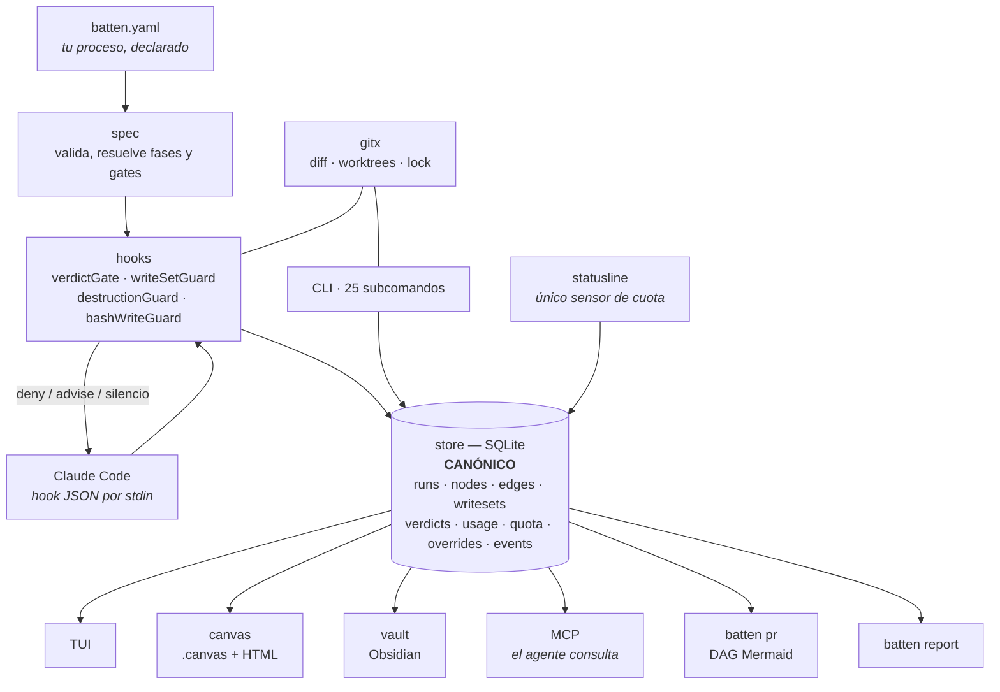
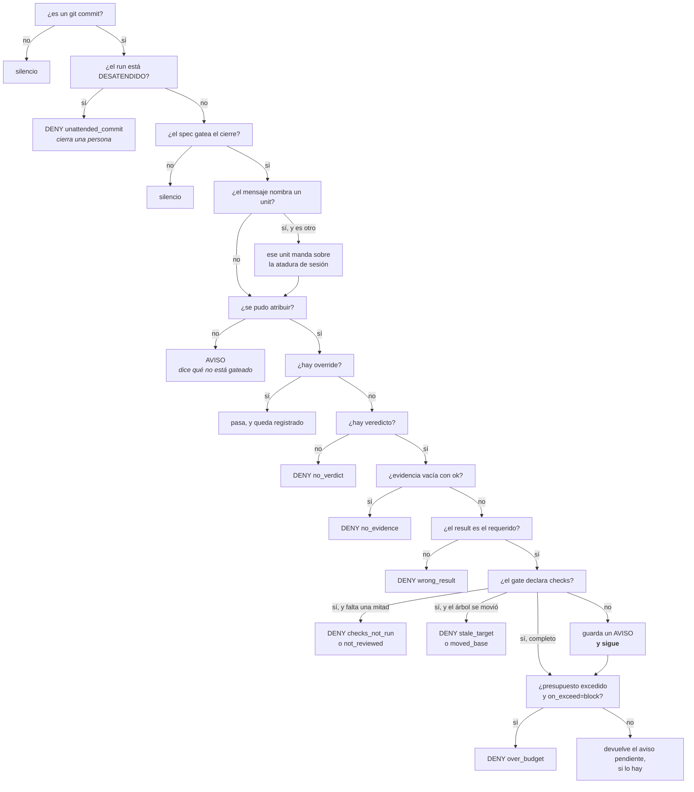
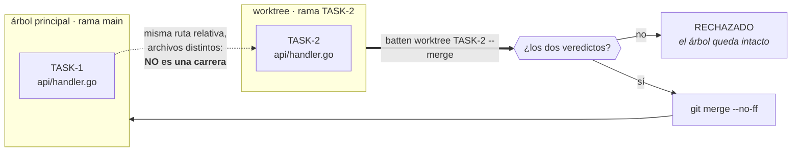
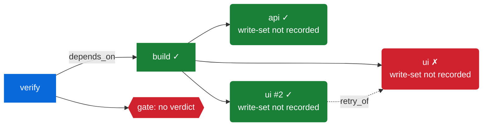

# batten — el plugin al momento

> **Manual y estado real del plugin.** Actualizado a **2026-07-30**, rama `refinamiento-plugin`,
> HEAD `c47d57a`, versión `0.1.0-beta.1` en los manifiestos, **sin release taggeado todavía**.
> Todo lo que sigue está verificado contra el código o contra salida capturada de una corrida real.
> Donde algo se declara y nadie lo lee, lo digo y lo cuento.
>
> Los cuatro bloques de `plan_mejora.md` están cerrados — el registro se retiró del árbol y vive en
> el historial de git. Lo que queda por hacer
> está en [`plan_publicacion.md`](plan_publicacion.md); este documento describe lo que **hay**.

---

## 0. Resumen ejecutivo

**Qué es.** Un plugin de Claude Code que convierte el proceso declarado de un repo —fases, gates,
dominios, write-sets— en **negaciones mecánicas**. Una regla que un `AGENTS.md` solo puede *pedir*,
un hook de `PreToolUse` puede **imponer**.

**Por qué existe.** El 78 % de las fallas de agentes son silenciosas: el agente reporta éxito y el
trabajo está mal ([arXiv:2607.07405](https://arxiv.org/html/2607.07405v1)). En las mismas
mediciones, los gates deterministas **triplicaron** la fiabilidad, y lo hicieron negando cosas, no
pidiéndole al agente que tenga cuidado.

**Qué impone hoy, mecánicamente:** siete reglas (§1), de las cuales las dos que más importan son
*no hay commit sin veredicto con evidencia citada* y *dos agentes no escriben el mismo archivo*.

**Cómo se ve desde afuera:**

| | |
|---|---|
| instalación | plugin de marketplace; el binario llega solo en el primer `SessionStart` |
| configuración | `batten init` escribe un `batten.yaml` funcional **en modo `report`**: los gates avisan, no bloquean |
| primer valor | `batten demo` corre el flujo entero en un repo desechable y lo borra; no toca nada tuyo |
| superficie | 28 subcomandos, 7 hooks, 6 slash-commands, 2 skills, 1 servidor MCP |
| estado | 17 paquetes en verde en Linux/macOS/Windows · matrices de aceptación 41/41 y 26/26 |
| honestidad | 13 hallazgos del field test siguen abiertos y están listados, no escondidos |

**Dónde vive el estado.** `~/.batten/batten.db`, siempre; `BATTEN_DB` lo sobreescribe. SQLite es
canónico y todo lo demás —canvas, PR, TUI, vault— es proyección con pérdida.

**Lo que no hace.** No orquesta al agente, no comprime contexto, no guarda memoria episódica, no
inventa tu workflow y no manda nada por red.

---

## 1. Qué es

batten es **memoria procedimental como datos**. Las otras dos memorias de un agente de código ya
estaban resueltas —la **estructural** (qué *es* el código: graphify) y la **episódica** (qué
*decidimos*: engram)—. La tercera, **cómo trabajamos**, no la tenía nadie: vivía en prosa dentro
de un `AGENTS.md` que el modelo puede leer y también ignorar.

La tesis cabe en una línea:

> Una regla que un documento solo puede *pedir*, un hook de `PreToolUse` puede **imponer**.

Hoy batten convierte **siete** reglas de proceso en negaciones mecánicas. Las dos originales:

1. **El verdict gate** — un `git commit` sin evidencia citada se deniega.
2. **El write-set guard** — un subagente que escribe el archivo de otro subagente se deniega.

Y cinco que antes eran prosa y ahora no:

3. **La fusión de un worktree** sin los dos veredictos se rechaza.
4. **Borrar cualquier cosa** durante una corrida desatendida se deniega.
5. **`batten override`** se rechaza mientras nadie mira.
6. **Commitear** durante una corrida desatendida se deniega, *con* los veredictos puestos.
7. **El techo de iteraciones** se cuenta y se impone.

Todo lo demás del plugin (el grafo de la corrida, el libro mayor de tokens, la TUI, el canvas, el
PR generado) existe para que esas negaciones sean **auditables** y no sospechosas.

### Qué NO es

- **No re-orquesta al agente.** Los Dynamic Workflows de Claude Code ya corren el fan-out.
  batten *gobierna* el fan-out: los rieles, no el motor.
- **No comprime contexto.** Si headroom ahorra tokens en tu fan-out, úsalo — y como batten cuenta
  tokens por nodo, podés *verificar* si de verdad ahorra.
- **No guarda memoria episódica.** Eso es engram. batten guarda proceso.
- **No inventa tu workflow.** Las fases, los nombres y los dominios salen de tu `batten.yaml`.
- **No manda nada por red.** `batten report --share` imprime markdown para pegar. Una herramienta
  que audita y llama a casa perdió el argumento antes de empezar.

---

## 2. Estado por bloques

| bloque | qué cerró | estado |
|---|---|---|
| **1** | el tercer sitio del un-solo-veredicto · validación contra la réplica `replica-ui` · fail-open ruidoso · `doctor` clínico · **el guard de "declarado ⇒ implementado"** · payload MCP + inyección por fase | ✅ |
| **1b** | lo que trajo gentle-ai: identidad por dispositivo+inodo (híbrida) · huella del árbol (CAS-bound) · `batten recover` · contención de Windows como transitoria · el modo vigente grabado en cada decisión | ✅ |
| **2** | `decision` en `events` · `batten report` · `batten demo` · los `.tape` · `batten pr` con DAG Mermaid · canvas HTML autocontenido · README reposicionado · **el sobre de fallo tipado** | ✅ (el GIF falta: vhs/ttyd/ffmpeg no instalados) |
| **3** | `retry_of` + `depends_on` + `diff_from` + **el guard de valores de columna** · **worktrees** · **modo desatendido** · parseo de Bash advisory · **`scan-diff`** · la cadena graphify→engram | ✅ (el ítem 19 quedó absorbido por los worktrees) |
| **4** | **honestidad de superficie** (measure con los 5 buckets · UNPRICED/≥$ · el imputado parcial como piso EN el Run · el override visible en todo el CLI) · **fuera del spec** models.tiers/models.phases/provenance.format + obsidian.export cableado · **ciclo de vida** (check/verdict no bifurcan, ids validados ^$, show --run real) · **presentación** (render.Tokens único, narrowExit, canvas sin solape, tui con isatty, init --help/--from) · **criterios como dato** (internal/plan · tabla criteria · AC-n citado en evidencia · `batten status` · el PR cuenta cobertura) · el claim de directorio se rechaza | ✅ |
| **5** | **distribución** — el camino por el que otra persona lo recibe, que es trabajo distinto del motor: el destino del binario · el bit de ejecución · Windows sin Git Bash · los comandos fallando fuerte · el camino de release ejecutado · el schema que rechazaba el propio spec · el grafo al día | ✅ |

**Suite verde en 17 paquetes** (`internal/install` es nuevo), `gofmt`/`go vet` limpios, CI en
Linux/macOS/Windows.

---

## 3. Arquitectura



**SQLite es canónico.** El `.canvas`, el HTML, la nota de Obsidian, el cuerpo del PR y cualquier
export son **proyecciones con pérdida** de lo que vive ahí. Esa decisión es la que permite que dos
sesiones y varios procesos de hook escriban el mismo archivo sin pisarse: WAL + `busy_timeout` +
una sola conexión de escritura por proceso + una clasificación explícita de qué error de SQLite es
transitorio.

**`internal/gitx` es nuevo** y tiene **una** regla: un fallo devuelve error, nunca lista vacía.
*"git no me pudo decir"* y *"no cambió nada"* son hechos opuestos, y cada consumidor de ese paquete
convierte el segundo en una decisión.

---

## 4. Instalación y componentes

| componente | ruta | qué hace |
|---|---|---|
| binario | `plugin/claude-code/bin/batten[.exe]` | todo; los hooks lo invocan en forma exec |
| bootstrap | `scripts/bootstrap.{sh,ps1,cmd}` | pone el binario donde los hooks ya lo buscan |
| hooks | `hooks/hooks.json` | registra los 7 eventos |
| comandos | `commands/*.md` | los 6 slash-commands |
| skills | `skills/*/SKILL.md` | `batten-engine`, `batten-verdict` |
| MCP | `.mcp.json` | expone el grafo de la corrida al agente |

**Los hooks son forma exec, no shell.** El binario lee el JSON del hook por stdin y escribe la
decisión por stdout. Sin `jq`, sin `curl`, sin `bash` — que es exactamente lo que hace frágiles en
Windows a los hooks que sí lo usan. La única excepción es el bootstrap, que es forma shell por
necesidad y por eso lleva el despacho de §4.2.

### 4.1 — Hay UNA ruta, y es la del plugin

**`${CLAUDE_PLUGIN_ROOT}/bin/batten[.exe]`.** No es una preferencia: es la única ruta que nombran
los siete hooks, el servidor MCP y `batten doctor`, y es el directorio que **Claude Code agrega al
PATH** — que es lo que hace resolver el `batten` pelado de los bloques bash de los `/batten-*`.

`${CLAUDE_PLUGIN_DATA}/bin` guarda una **copia, y solo eso**. `${CLAUDE_PLUGIN_ROOT}` se borra
entero en cada actualización del plugin (el `bin/` se publica vacío a propósito), así que después de
un update el bootstrap **restaura desde la copia** en vez de volver a bajar 14 MB.

> Esto estuvo al revés y fue el peor bug de distribución que tuvo el proyecto: el bootstrap
> instalaba en `$DATA/bin`, imprimía `installed`, y después ningún hook existía, el MCP no arrancaba,
> cada bloque bash era `command not found` y `doctor` decía *"the gate is not running at all"* sobre
> una máquina donde el bootstrap acababa de tener éxito. Un contrato escrito en cuatro archivos y
> nada los comparaba. Ahora `internal/install` es el único que sabe la ruta, y los tests **corren**
> el bootstrap contra un tar.gz real servido localmente.

### 4.2 — Cómo llega el binario, en las tres plataformas

El hook de `SessionStart` corre una sola línea, y el `||` es el despacho entre sistemas:

```
bash "${CLAUDE_PLUGIN_ROOT}/scripts/bootstrap.sh" || powershell -NoProfile -ExecutionPolicy Bypass -File "${CLAUDE_PLUGIN_ROOT}/scripts/bootstrap.ps1"
```

Funciona en las dos plataformas por una razón concreta: **`bootstrap.sh` sale 0 siempre**, incluso
con la descarga fallada. Así que el fallback dispara bajo exactamente una condición —*no hay bash en
esta máquina*, el caso de Windows sin Git Bash— y en Unix nunca se invoca `powershell`. Ese
invariante tiene test en las dos direcciones; si alguien lo rompe, el fallback empieza a dispararse
en Unix.

Los dos scripts hacen lo mismo en el mismo orden: **1)** ¿ya está en `$ROOT/bin`? listo, una sola
llamada a `stat` y nada más — es el camino de cada sesión; **2)** ¿hay copia en `$DATA/bin`? se
restaura y se prueba corriéndola; **3)** se descarga del release, se instala en `$ROOT/bin`, se
prueba, y se siembra la copia.

Ninguno de los dos dice `installed` sin haber corrido `batten version` primero. Un bootstrap que
imprime éxito sobre un archivo a medio escribir enseña a confiar en un gate que no está.

**`bootstrap.cmd`** es la entrada a mano para Windows (`scripts\bootstrap.cmd`), y lo que
[`INSTALL.md`](../INSTALL.md) le dice a alguien que no tiene bash.

### 4.3 — Tres cosas que solo se rompen en la máquina de otro

Las tres son invisibles para quien escribe el repo en Windows, y las tres las decide el repo y no el
entorno de cada uno:

- **Finales de línea.** `.gitattributes` no es estilo sino corrección: un `bootstrap.sh` commiteado
  con CRLF da `#!/usr/bin/env bash\r` → *bad interpreter* en todo Linux/macOS, el binario nunca se
  descarga y los hooks no-opean **en silencio**. CI lo verifica y `doctor` lo chequea también en la
  copia instalada —que es otra cosa que el repo—.
- **El bit de ejecución.** Los seis `.sh` están trackeados `100755`. Sin él, en macOS y Linux es
  `Permission denied` con la misma consecuencia total y silenciosa. Lo imponen `internal/install`
  (en los tres runners) y el job de lint.
- **Qué `tar` corre.** El `tar` del PATH suele ser el GNU tar de Git Bash, que lee `C:\Users\…` como
  un **host remoto** ("Cannot connect to C: resolve failed") y no desempaca nada. El `.ps1` invoca
  `%SystemRoot%\System32\tar.exe` por ruta completa —bsdtar, que sí acepta letras de unidad— y el
  `.sh` dejó de pasarle rutas absolutas a `tar`.

### 4.4 — Antes de taggear

`scripts/release-check.sh <tag>` es todo lo que se puede verificar **sin publicar**: que los dos
números de versión escritos a mano concuerden con el tag, que las seis plataformas cross-compilen,
que los seis archives se llamen exactamente lo que el bootstrap va a pedir, y que cada uno traiga un
binario **para esa** plataforma (por magic bytes: ELF, Mach-O, PE). Lo que no se puede verificar
antes —que `releases/latest/download` resuelva— el script lo dice en voz alta en vez de callarlo.

### Variables de entorno

| variable | qué hace |
|---|---|
| **`BATTEN_DB`** | ruta de la base. Sin ella, `dbPath()` **cae a la base real del usuario** (`~/.batten/batten.db`): cualquier prueba en sandbox debe exportarla antes de *cada* comando. Nunca apuntarla a `${CLAUDE_PLUGIN_DATA}` (los hooks tienen esa variable y tu terminal no, así que el estado se parte en dos bases) ni a `${CLAUDE_PLUGIN_ROOT}` (se borra en cada update) |
| **`BATTEN_VAULT`** | el vault de Obsidian, y gana sobre `capabilities.obsidian.vault`. Existe por lo mismo que `BATTEN_DB`: `batten.yaml` está commiteado, así que una ruta personal ahí publica la carpeta de alguien y le entrega a cada clonador un spec que escribe en un directorio que no tiene |
| `BATTEN_BOOTSTRAP_BASE_URL` | solo para los tests: apunta el bootstrap a un servidor local. Nada de una instalación lo setea |

---

## 5. Los siete hooks

| evento | matcher | qué hace batten |
|---|---|---|
| `SessionStart` | `startup\|resume\|clear\|compact` | bootstrap del binario (§4.2, la única entrada en forma shell) + banner: qué unit está abierto, si hay veredicto, a qué unit está atada la sesión, **el briefing de la fase activa** (qué lee, si hace fan-out, qué exige su gate, y el **alcance del diff**), y **si el gate no está gobernando nada** |
| `PreToolUse` | `Bash` | **rule 1 desatendida** → **bash write guard** (advisory) → **verdict gate** sobre `git commit` → presupuesto |
| `PreToolUse` | `Write\|Edit\|NotebookEdit` | **write-set guard** |
| `PostToolUse` | `Bash` | ata la sesión al unit tras `batten phase`; cierra el run tras un commit exitoso |
| `SubagentStart` | (todos) | crea el nodo del subagente, la arista `spawn`, **y la arista `retry_of` si está retomando trabajo que otro dejó fallado** |
| `SubagentStop` | (todos) | cierra el nodo con `ok`/`failed` según su mensaje final; valoriza el transcript |
| `Stop` | (todos) | exporta la nota de vault y el canvas |

### El silencio de `batten hook` NO es prueba de ALLOW

Es la trampa central para cualquiera que pruebe el plugin. `batten hook` no imprime nada y sale 0
por **al menos seis razones distintas**:

1. allow genuino
2. no encontró `batten.yaml`
3. falló el store
4. stdin malformado
5. un panic recuperado
6. un evento desconocido

Toda afirmación de "esto pasó el gate" necesita un **control positivo**: el mismo payload con un
campo cambiado para que la negación sea obligatoria. Si el control también sale en silencio, el
hook nunca se enganchó y el PASS no prueba nada. La forma más fuerte del control es **diferencial**:
cambiar una sola cosa y ver la decisión darse vuelta.

Y el otro lado de la misma moneda: cuando batten **no puede** correr, lo dice. Un hook que degrada
en silencio a confiar en el modelo es *peor* que no tener hook, porque se le cree:

```
batten (warning — not blocking): batten did NOT run for this tool call — neither the commit gate
nor the write-set guard was applied, and nothing here was verified.
cause: could not open the store at /path/batten.db (...)

batten.code: degraded
batten.retry: true
batten.fix: batten doctor
```

---

## 6. El CLI completo — 28 subcomandos

*(Regla de conteo: 29 brazos del `switch` de `main()`, uno de los cuales es `version` con tres
grafías. Decía 27 sin decir cómo contaba — y el repo llegó a tener publicados un 47, un 27, un 26 y
un 25 para la misma pregunta, cada uno contando otra cosa.)*

Los 27 que lista `batten --help`, más `batten version`. Todos leen y escriben la misma base; ninguno
manda nada por red. Los que un usuario toca a mano son media docena — el resto los invocan los
hooks, las skills o los slash-commands.

### Arranque y salud

| comando | banderas | qué hace |
|---|---|---|
| `batten init` | `--from <doc>`, `--scan-json` | escanea el repo y escribe `batten.yaml` en modo report |
| `batten doctor` | — | valida el spec y reporta capacidades vivas, **todo en una sola pasada**. Sale 1 si el spec es inválido |
| `batten demo` | `--keep` | el flujo entero sobre un repo desechable; no toca nada tuyo |
| `batten version` | `--version`, `-v` | la versión |

`init` deriva el unit **del backlog primero** y de los nombres de rama después: un repo planeado
pero no trabajado no tiene ramas feature, y el backlog es donde los ids realmente viven. Necesita
**≥3 encabezados** `### US-0NN` para llamarlo convención; con menos cae a `TASK-\d+` a propósito.

`doctor` emite **todo lo que sabe de una vez**, con la corrección al lado de cada problema. Cortaba
en el primer fatal — arreglás uno, volvés a correr, aparece el siguiente; un diagnóstico de a uno
es lo que hace que la gente se rinda a la tercera iteración.

### Ciclo de vida de un unit

| comando | banderas | qué hace |
|---|---|---|
| `batten phase <unit> <fase>` | — | abre o avanza el run; graba el **ancla**; encadena la fase a la anterior; imprime el **alcance del diff**; se niega a avanzar si el techo de iteraciones se alcanzó y nadie mira |
| `batten claim <agent-id> <file>...` | — | declara el write-set de un subagente |
| `batten verdict` | `--unit`, `--file v.json` | graba el veredicto del **revisor** |
| `batten check <unit>` | `--gate <g>` | **CORRE** los checks del gate, graba lo que imprimieron **y la huella del árbol sobre el que pasaron**. Sale 1 si queda BLOCKED |
| `batten close <unit>` | `--status ok\|failed\|rolled_back` | cierra por el gate, libera los write-sets, y avisa si el trabajo sigue en una rama de otro árbol |
| `batten override <unit>` | `--reason "..."` | escape auditado. **Rechazado** si el run está desatendido |
| `batten recover <unit>` | — | re-ancla un run cuya base se movió (rebase, amend, pull) y dice **qué** le pasó al ancla vieja |

### Concurrencia real

| comando | banderas | qué hace |
|---|---|---|
| `batten worktree <unit>` | `--path`, `--branch`, `--from` | crea el árbol, la rama, y ancla el unit donde su árbol divergió |
| `batten worktree <unit> --merge` | — | integra el árbol — **rechazado sin los dos veredictos**, y sin nada sin commitear en ninguno de los dos árboles |
| `batten worktree <unit> --remove` | — | baja el árbol. **No borra la rama** |
| `batten worktree --list` | — | los árboles y qué unit vive en cada uno |

### Corrida sin supervisión

| comando | banderas | qué hace |
|---|---|---|
| `batten unattended <unit>` | `--off` | prende (o apaga) el modo: cuatro reglas pasan a ser denegaciones |
| `batten iterate <unit>` | — | cuenta una vuelta de fix→re-verify. **Sale distinto de cero en el techo** |

### Lectura

| comando | banderas | qué hace |
|---|---|---|
| `batten runs` | — | lista los runs. Un imputado parcial se marca `≥$` con nota al pie; un override aparece en la columna VERDICT |
| `batten status` | — | **el backlog contra el registro**: cada unit de `unit.plan` con su estado de run y su cobertura de criterios (`AC 1/2 covered`), incluidos los que nadie arrancó — la mitad que `runs` no puede mostrar. El trabajo ad-hoc se nombra aparte |
| `batten show <unit>` | `--run <id>` | detalle: fases, fan-out con número de intento, **ambos veredictos**, y el override si el gate está abierto por uno. `--run` resuelve un run exacto; un id inexistente es error |
| `batten scan-diff <unit>` | `--strict` | el diff real de git contra los write-sets declarados. `--strict` sale distinto de cero, para cablearlo en `gates.checks` |
| `batten report` | `--since d`, `--week`, `--share` | qué vio batten y **qué frenó** |
| `batten pr <unit>` | `--out <ruta>` | el cuerpo del PR desde el registro: DAG Mermaid, evidencia, costo |
| `batten canvas <unit>` | `--out <ruta>`, `--html` | el DAG como JSON Canvas, o **un solo HTML autocontenido** |
| `batten budget [<unit>]` | — | estado del gobernador: tokens / $ imputado / cuota |
| `batten measure` | — | gasto por modelo, qué compraron las capacidades, y **cuánto sobre-declaran los write-sets** (mediana sobre los runs escaneados, con su N y con los no escaneados aparte) |
| `batten tui` | — | revisar runs en una UI de terminal |

### Integración

| comando | banderas | qué hace |
|---|---|---|
| `batten mcp` | — | servidor MCP (stdio) |
| `batten statusline` | `--install` | línea de estado + **único sensor de cuota** local |
| `batten ingest <unit>` | `--transcript <ruta>` | valoriza los tokens de un transcript |
| `batten hook <evento>` | — | entrada de hooks (JSON por stdin → JSON por stdout) |
| `batten hook-debug` | `--tap`, `--off`, `--show` | inspección de payloads reales de hook |

---

## 7. El gate, exactamente como funciona

Esta es la parte que hay que entender bien porque es el producto.

### Dos veredictos, de dos productores distintos

Cuando el gate declara `checks:`, un commit necesita **ambos**:

| veredicto | quién lo escribe | qué prueba |
|---|---|---|
| `source: batten` | `batten check` | que los checks declarados **se corrieron** |
| `source: agent` (o cualquier otro) | `batten verdict` | que alguien **juzgó** el trabajo contra sus criterios |

Ninguno sustituye al otro. `batten check` por sí solo **no cierra un unit** — probar que la suite
pasa no dice nada sobre si el trabajo cumple lo que se pidió.

### El orden de decisión



Tres cosas que ese orden codifica y que costaron bugs reales:

- **Un aviso nunca puede tapar una denegación.** La rama del gate sin checks *guarda* su aviso y
  sigue; si retornara ahí, el presupuesto dejaría de aplicarse.
- **Fallar-abierto es válido; fallar-abierto en silencio no.** Cuando batten no puede atribuir un
  commit, no deniega —negar lo que no puede verificar haría que lo desinstalen el día uno— pero
  **lo dice**.
- **La regla 4 va antes que todo**, y no depende de que el spec declare un gate: un repo sin gate
  tampoco debe tener un commit aterrizando a las 3am sin que nadie haya leído nada.

### `enforcement: report` vs `enforce`

`report` convierte cada denegación en un aviso visible. Es la rampa de adopción: un equipo a mitad
de sprint no puede quedar bloqueado el día uno. `init` arranca siempre en `report`.

Y **el modo vigente queda grabado en cada decisión**, que es la otra mitad de un kill switch que
valga la pena: sin eso, *"estuvimos en modo report tres semanas"* no tiene registro de lo que costó.

### La huella del árbol

`batten check` prueba que los checks pasaron — los probó *sobre un árbol*, y no guardaba ningún
rastro de cuál. Un formateador entre el check y el commit deja el veredicto diciendo
`batten-verified` sobre un estado que ya no existe.

La huella guarda **el commit y el árbol por separado**, porque *"te editaron un archivo"* y *"se
movió la historia"* necesitan consejos **opuestos** y un hash opaco único solo sabe decir
"distinto":

```
batten: TASK-1 has a MOVED BASE: the checks passed on commit 3597ab332766, and HEAD is now
33c80ec6cd04. Your uncommitted work is untouched — the history moved under it (a rebase, an
amend, a checkout, or a commit landing underneath).
Re-anchor and re-verify: batten recover TASK-1 && batten check TASK-1

batten.code: moved_base
batten.retry: false
```

> **batten no puede invalidar un veredicto escribiendo en su propio libro mayor.** La huella excluye
> la base de batten y sus sidecars de SQLite; la primera versión hasheaba todo lo que git reportaba,
> y *grabar* el veredicto cambiaba el árbol del que el veredicto hablaba.

### Los criterios de aceptación, como dato

"Criterios" aparecía diez veces en la prosa del código y cero como dato. Desde el bloque 4:

- **`internal/plan`** resuelve `unit.plan` + `unit.locator` (que `init` escribía desde el primer
  día y nadie leía) a bloques de unit; `doctor` cruza la declaración con el documento y avisa si
  el locator no encuentra **ningún** unit.
- **`batten phase` siembra** la tabla `criteria(run_id, unit_id, idx, text, status)` desde el
  bloque del unit — una vez por run, así los estados sobreviven los cambios de fase.
- **Un veredicto aprobatorio cubre lo que su evidencia cita** con el prefijo `AC-<n>:`. String
  sobre el formato existente, a propósito: el hallazgo #27 mostró lo que pasa al meter objetos
  donde se esperan strings. Un veredicto `blocked` que nombra `AC-2` describe lo que falló y no
  cubre nada.
- **El briefing de la fase de gate lista los criterios numerados** con la convención de cita, así
  el revisor puede usarla sin preguntar.
- **`batten pr` gana la tabla de cobertura** — *"AC-1 covered by X"*, con el no-cubierto dicho en
  voz alta — y **`batten status`** muestra el backlog entero contra el registro.

Cero criterios sembrados se reporta *"no criteria seeded"*, nunca como un tablero vacío
satisfecho: una lista vacía no es una lista aprobada.

---

## 8. El write-set guard

Un fan-out corriendo: N subagentes, write-sets disjuntos, cada uno declarado con `batten claim` al
lanzarse. La tabla `writesets` tiene `PRIMARY KEY (run_id, path)` — **un dueño por archivo,
impuesto por la base**, no por disciplina.

**La asimetría es deliberada:** con `agent_id` sabemos exactamente quién escribe, y una colisión es
DENY duro. **Sin** `agent_id` no podemos distinguir al dueño legítimo del intruso, así que es un
aviso. Los riesgos no son simétricos: un aviso ruidoso sobre una invasión real es recuperable;
bloquear en silencio toda escritura legítima brickearía el fan-out entero.

La colisión de write-set es **la única denegación sin `fix`, a propósito**: no hay salida legítima —
si dos agentes necesitan el archivo el PLAN está mal, y un `fix` ahí sería una instrucción para
cruzar la cerca.

### El bypass por Bash — cerrado, en modo aviso

`Edit` sobre un archivo reclamado se denegaba y **la misma escritura por `sed -i` pasaba en
silencio**. El guard sobre el que descansa todo el argumento de seguridad del fan-out estaba a un
`sed` de ser opcional.

Lo que lo hacía peor que un fail-open ordinario: batten **no estaba confundido**. Sabía quién era el
dueño; lo había nombrado en una denegación una llamada antes. No era *"no puedo determinar culpa"*,
era *"no miré"*.

Lo que se detecta hoy: redirección (`>`, `>>`, `2>`, glued y con espacio), `sed -i` en todas sus
formas, `tee`, `mv`, `cp`, `install`, `rsync`, `dd of=`, `patch`, `truncate`. Con las rutas
relativas resueltas contra el `cwd` del payload, no contra la raíz del repo.

**Es un AVISO, no una denegación, y eso es el punto del primer ciclo, no una tibieza.** Es una
lectura heurística de shell alimentando un bloqueo duro en el camino crítico de cada llamada. Un
falso positivo acá no incomoda a nadie: para a un agente legítimo y hace que desinstalen el plugin.
Así que: un ciclo avisando, los avisos caen en el log de decisiones bajo su propia regla,
`batten report` los cuenta, y cuando ese número sea aburrido pasa a ser denegación.

**Lo que NO puede ver, dicho en voz alta:** un script de python, un target de Makefile, un `go run`,
cualquier cosa que haga una herramienta de terceros. Ningún parser de shell llega ahí. No es la
falla de este chequeo, es su frontera — y es exactamente lo que cubre el siguiente.

### `batten scan-diff` — el chequeo que no lee shell

No mira comandos en absoluto: le pregunta a git qué cambió y a la base quién reclamó qué, y
contrasta. **Determinista, sin heurísticas, sin falsos positivos** — por eso debería haber ido
primero en el trabajo de write-sets aunque haya aterrizado último. Un generador de código, un target de Makefile o un
script de python quedan igual de visibles que un `sed`.

Y produce gratis el número que nadie más tiene: cuánto **sobre-declaran** los agentes.
Salida real de un sandbox donde un script generó un archivo que nadie reclamó:

```
TASK-1  anchor d9ac18b  4 file(s) changed

claimed and touched:
  a1                   api/handler.go

⚠ 3 file(s) changed that NO write-set claimed:
    api/gen.go
    gen.sh
    p.json
  This is what a shell command, a code generator or a third-party tool leaves
  behind — the writes no parser of commands can see. batten cannot tell from a
  diff whether these were the orchestrator integrating or an agent going around
  the fence, and it will not guess: look at them.

over-declaration: 1 of 2 claimed path(s) were never touched (50%)
  a1                   api/never.go
  (S-Bus measured 32–49% over-declaration in automatically reconstructed
   read-sets. This is ONE run of hand-declared write-sets — a data point,
   not a rate. `batten measure` has the median across every scanned run.)
```

Y desde la migración **v12** cada corrida se **graba** (tabla `scans`: una fila por scan, no por
run). Eso es lo que convierte un contraste en una medición: `batten measure` publica la **mediana**
de `unused/claims` sobre los runs escaneados, **con su N**, y aparte —jamás sumados como cero— los
runs que reclamaron rutas y nunca se escanearon. Un run con `claims = 0` no entra en la mediana:
dividir por cero claims no es medir. Y para que la muestra no sea "los runs que alguien se acordó de
revisar", `batten scan-diff --strict` está cableado en los `gates.checks` de este mismo repo.

Dos cosas que **se niega** a concluir, y las dice:

- **De quién fue.** Un archivo cambiado sin reclamar puede ser el orquestador integrando o un agente
  cruzando la cerca. Desde un diff no se puede distinguir, y batten no adivina.
- **Que un run sin claims esté limpio.** Cero claims no es cero violaciones: es un hueco de
  planeación, y llamarlo limpio sería el tilde verde más vacío posible. Igual que reportar un conteo
  de tokens sin medir como 0.

Y sin ancla se niega a reportar: *"nothing here is measurable — that is different from clean"*.

### El claim de directorio — cerrado por rechazo

Un `claim` de `src/**` o de un directorio se aceptaba, se contestaba *"owns 1 file(s); any other
agent writing them is now denied"* y **no cercaba nada**: el guard compara rutas exactas. De las
dos salidas posibles, ganó el rechazo con la forma de lista — soportar prefijos
metería una heurística en el camino crítico del guard, que es exactamente donde el bypass por
Bash enseñó a no ponerlas sin un ciclo de medición. Un archivo que todavía no existe sigue siendo
reclamable: los agentes reclaman lo que están por crear.

---

## 9. Worktrees — cerrar el bucle que batten ya había abierto

**El argumento más fuerte no era la literatura: era que batten ya lo prescribía y no lo hacía.**
Tres mensajes distintos del binario le decían al usuario que usara un worktree por unidad. Ninguno
lo creaba. Diagnosticar el problema, nombrar la solución y no ejecutarla es la misma brecha entre
declarado y hecho que un campo muerto del spec trata en otro contexto.

Y encima batten **castigaba** a quien seguía el consejo: toda ruta que batten conoce es relativa al
repo, y `api/handler.go` es la misma cadena en todos los worktrees. Dos units en dos árboles se
leían como dos sesiones peleando por un archivo, y el guard **las denegaba a las dos**.



**Dos correcciones de alcance, deliberadas:**

- **POR UNIT, NO POR SUBAGENTE.** Aislar entre sí a los agentes de un mismo unit rompe el fan-out:
  trabajan write-sets **disjuntos del mismo árbol** —esa es la premisa del diseño— y aislarlos
  significa que ninguno ve el trabajo del otro, más N fusiones para un solo unit. Está escrito en
  `/batten-build`, porque el orquestador **ya tiene** `isolation: "worktree"` y usarlo ahí sería el
  error.
- **batten no orquesta**, así que no "asigna" nada. Crea y **registra** el árbol, y gatea la vuelta.

**El lock es de gentle-ai v2.1.9 y su lección entera es DÓNDE va.** El `.git` de un worktree
enlazado es un **archivo**; un lock relativo a él es por-worktree: cada proceso toma el suyo, todos
ganan, y la exclusión mutua es imaginaria. Va en el **git-common-dir**, que es el único compartido.
Y **no roba nunca**: nombra al que lo tiene, dice cuánto lleva, y dice cómo sacarlo — una
herramienta que rompe un lock por temporizador termina rompiendo uno que estaba haciendo algo.

**El ancla cambia de significado, y para mejor.** Cada worktree tiene su propio `HEAD`, así que el
ancla de un unit es **el punto donde su árbol divergió** — que es exactamente el diff que un
revisor debería estar mirando.

Salida real:

```
$ batten worktree TASK-2
TASK-2 -> worktree /tmp/sb17/main-TASK-2 (branch TASK-2, from 33c80ec)
anchor: TASK-2 base SHA = 33c80ec (where its tree diverged)

work there:   cd /tmp/sb17/main-TASK-2
bring it back: batten worktree TASK-2 --merge   (denied unless the gate is satisfied)

$ batten worktree TASK-2 --merge          # sin veredictos
batten: refusing to merge TASK-2: cannot close TASK-2 as ok: has no batten-verified pass.
The gate's checks must be RUN, not asserted.
Run: batten check TASK-2
The worktree is untouched — nothing was integrated and nothing was lost

$ batten worktree TASK-2 --merge          # con los dos
merged TASK-2 into main
the tree is still at /tmp/sb17/main-TASK-2 — take it down with: batten worktree TASK-2 --remove
```

---

## 10. El modo desatendido — cuatro reglas que dejaron de pedir

`/batten-night` ya era el bucle de autocorrección autónomo, y más maduro que cualquier cosa que
batten pudiera agregar: build → verify → **fix** → re-verify, con los techos de presupuesto como
disparador y un reporte de la mañana. Tenía cuatro reglas absolutas.

**Las cuatro eran prosa.** 112 líneas de markdown pidiéndole al modelo que se comporte, en el
comando **más peligroso** del plugin — el único lugar donde el error es irreversible y no hay nadie
despierto para atraparlo. El README dice en su primera línea que una regla que un documento solo
puede pedir, un hook puede imponer. Era el único lugar donde batten no se había tomado su propia
medicina.

Un flag en la corrida —`runs.mode = 'unattended'`— las vuelve cuatro denegaciones. **Cero
orquestación nueva:** batten sigue sin correr el bucle; solo deja de ser el único participante de una
corrida sin supervisión que no puede decir que no.

| regla | mecanismo | código |
|---|---|---|
| 1. nunca borrar | matcher `PreToolUse`/`Bash`: `rm`, `rmdir`, `git reset --hard`, `git checkout --`, `git restore`, `git clean`, `git branch -D`, `git push --force`, `del`, `truncate`, y `> archivo` **cuando el archivo ya existe** | `unattended_delete` |
| 2. honrar `max_iterations` | `batten iterate` **incrementa** el contador y sale distinto de cero en el techo; `batten phase` se niega a avanzar | `iteration_ceiling` |
| 3. nunca hacer override | `batten override` rechaza | `unattended_override` |
| 4. no commitear | el gate deniega **con** los dos veredictos puestos | `unattended_commit` |

**NINGUNA lleva `fix`.** Es la misma omisión deliberada que la colisión de write-set: cada otra
denegación entrega la salida, y estas no pueden, porque la salida es
`batten unattended <unit> --off` e imprimírsela a un bucle que nadie mira es entregarle la llave de
su propia cerca. La salida es una persona a la mañana.

**El `>` truncante no se puede denegar en general**, y eso lo enseñó correrlo: un bucle que no puede
hacer `go test > out.txt` no es un bucle desatendido, es un bucle que no corre. Se deniega solo
sobre un archivo que **ya existe** dentro del repo. Crear uno nuevo no destruye nada; vaciar uno
trackeado destruye exactamente lo que la regla 1 dice que nadie recupera.

Y `budget.max_iterations` era **el peor caso de la tabla de campos muertos**: declarado en el spec,
devuelto por MCP, **dibujado en la TUI** como `iters %d/%d`, y nunca incrementado por nada.
`runs.iterations` estaba en 0 para siempre. El único freno que una corrida sin supervisión tenía
contra gastarse la ventana era una frase en un archivo markdown.

```
$ batten unattended TASK-1
TASK-1 is now UNATTENDED. Four rules are mechanisms from here:
  1. nothing gets deleted — rm, git reset --hard, git restore, git clean, and
     truncating an existing file are denied. Write them in the morning report.
  2. the iteration ceiling is counted: batten iterate TASK-1
  3. batten override is refused — a human reason needs a human.
  4. a commit is denied, verdicts or no verdicts. A human closes.

ceiling: 2 iteration(s), 0 used.
turn it off when you have read the report: batten unattended TASK-1 --off

$ batten iterate TASK-1
TASK-1: iteration 1 of 2
$ batten iterate TASK-1
TASK-1: iteration 2 of 2
this is the last one. The next `batten iterate` will refuse.
$ batten iterate TASK-1
batten: TASK-1 has used 2 of 2 iterations: the ceiling is reached.
Stop. A loop that has failed the same check 2 times is not going to pass it on the next one;
it is going to spend the window.
Report what is still red and let a human decide.

batten.code: iteration_ceiling
batten.retry: false
```

Y una estadística que nadie más del ecosistema puede producir, porque hace falta una herramienta que
**estuvo presente** a las 3am y dijo no:

```
  what batten stopped, last 24 hours
    2 commit(s) denied   (no verdict, empty evidence, or checks not run)
    0 write-set collision(s) stopped
    0 run(s) stopped on budget
    2 action(s) refused during an unattended run   (deletes, and commits before a human read the report)
    0 warning(s) issued without blocking
    counting since 2026-07-29 13:40 — anything before that was never recorded.
```

Esa última línea no es opcional: sin ella, "2 commits denegados" se lee como un total histórico
cuando batten puede llevar contando desde el martes.

---

## 11. El presupuesto — tres techos honestos

En una suscripción el costo marginal de un token es **cero**, así que "dólares gastados" es el techo
equivocado. batten declara tres:

| techo | qué es | se puede medir? |
|---|---|---|
| `tokens_per_run` | lo único que se puede contar exacto | sí, si se ingirió un transcript |
| `imputed_usd_per_run` | lo que *habría* costado por API. **No es una factura**: es el valor que se está sacando del plan | sí, para modelos con precio publicado |
| `quota_pct_per_run` | parte de la ventana rodante de 5h. Anthropic no publica números absolutos, así que **el porcentaje es la única métrica de cuota confiable** | solo con `batten statusline` instalado |
| `max_iterations` | el techo de vueltas de un bucle sin supervisión | **sí, desde ahora** |

`on_exceed`: `block` | `warn` | `downgrade_effort`.

### El principio #1

> **Nunca reportar un número que no se tiene.**

Un run del que nadie ingirió transcript **no gastó cero** — está *sin medir*, y esas dos situaciones
piden respuestas opuestas:

```
| tokens | **NOT MEASURED** — no transcript was ingested for this run. Not zero: unknown |
| imputed | **NOT MEASURED** |
```

Y cuando la valla temporal descarta requests anteriores al run (correcto: un run no hereda 30 horas
de sesión), lo **dice en voz alta**, con tokens y dólares, en vez de tragárselo.

---

## 12. El grafo de la corrida

| tabla | qué guarda |
|---|---|
| `runs` | un run por unit-intento: fase, estado, `base_sha`, tokens, USD imputado, cuota inicial, iteraciones, **worktree**, **mode** |
| `nodes` | fases y subagentes. `node_id = <run_id>:p-<fase>` o `<run_id>:n-<agent_id>`, más **`attempt`** |
| `edges` | **aristas tipadas**: `spawn` · `depends_on` · `retry_of` · `supersedes` · `rollback` |
| `writesets` | dueño por archivo, `PRIMARY KEY (run_id, path)` |
| `verdicts` | append-only, con `source` y **`target_digest`** |
| `usage` | una fila por (request, run), idempotente por `request_id` |
| `quota_snapshots` | muestreo de la ventana de 5h |
| `overrides` | escapes auditados |
| `criteria` | los criterios de aceptación del run, sembrados desde `unit.plan`; `AC-<n>:` en la evidencia los cubre |
| `events` | log de reproducción, append-only, con **`decision`, `reason`, `rule`, `enforcement`** |

**11 migraciones aditivas.** Una base creada por un batten viejo se actualiza en su lugar.

Los ids de nodo **llevan su run**. Un `p-build` global era literalmente una fila para toda la base:
el segundo unit que entrara a `build` se llevaba la fila del primero, y el canvas del primero
colapsaba a un encabezado pelado.

### Las aristas tipadas, y el reintento que nadie escribía

**Las aristas tipadas son la razón de que SQLite sea canónico y no un caché.** Una traza OTel plana
no puede expresar más que una arista de padre y links sin tipo.

Pero `retry_of` tenía **cinco lectores y cero productores**: `batten pr` contaba los reintentos para
su badge y dibujaba la arista punteada, el canvas la pintaba de naranja, la nota de vault la listaba
bajo *Relations*, MCP contestaba `retries: N`, y la TUI la colgaba del nodo. El titular de
`batten pr` —*"el DAG muestra lo que un diagrama de plan no puede"*— descansaba enteramente sobre
esa arista, y **lo único que un plan no puede mostrar ES el reintento**. Se veía funcionar solo
porque la fila se había insertado a mano en SQLite.

El productor vive en `SubagentStart`. **Un reintento es un subagente TERMINADO en `failed`, del
mismo dominio, que nada retomó todavía.** Las cuatro cláusulas son load-bearing:

- **terminado y fallado**: es la cláusula que impide que un fan-out normal se lea como una pila de
  reintentos. Dos agentes del mismo dominio en paralelo siguen `running` con `ended_at` NULL.
- **la identidad es el DOMINIO** cuando el agente tiene uno, porque el dominio es la unidad de
  trabajo que el fan-out divide.
- **nada lo retomó todavía**: si no, un dominio que falló una vez y se arregló en el segundo intento
  marcaría a todo agente posterior como un tercer intento de trabajo terminado hace rato.
- **scopeado al run, nunca a la fase**: el bucle build → verify → **fix** → re-verify reintenta un
  dominio en una fase *distinta* de la que falló, y ese es el reintento que más vale dibujar.

`depends_on` también tenía color en el canvas y ningún productor: el grafo se llamaba DAG y **no
tenía una sola arista entre fases**. Ahora cada fase se encadena a la anterior.

Un DAG real, capturado de una corrida de sandbox (`api` verde, `ui` falla, `ui #2` lo arregla):



`attempt` deja de ser una columna muerta: dos tarjetas `ui` —una roja, una verde— eran
indistinguibles salvo por el color, que es exactamente la queja que registró el field test. Ahora
dicen `ui #2`, en el PR, en el canvas y en `batten show`:

```
$ batten show TASK-1
TASK-1  run=TASK-1-...-b679641b  status=running  phase=verify  base=1fa6b3c
  [subagent] api                      ok
  [subagent] ui                       failed
  [subagent] ui #2                    ok
  [phase] build                    ok
  [phase] verify                   running
```

### `diff_from: anchor` deja de ser un adjetivo

Estaba parseado, documentado en el schema como *"opera solo sobre el diff del unit"*, y **leído por
nadie**: una fase que lo declaraba se comportaba exactamente igual que una que no. Entrar a una fase
que lo declara **sin ancla** era completamente silencioso.

```
$ batten phase TASK-1 verify
TASK-1 -> phase verify
scope: `1fa6b3c..` — this phase operates ONLY on the unit's diff: 3 file(s). api/a.go, ui/new.go, ...
this phase must emit a verdict for gate "qa" (evidence required)

# y sin ancla:
scope: this phase declares `diff_from: anchor` and there is no anchor — the anchor is recorded
by `build`, which this run has not entered. Everything you diff from here is a guess.
```

El mismo texto se inyecta en el briefing de `SessionStart`, que es el que llega al agente sin que
tenga que preguntar.

---

## 13. El sobre de fallo tipado — 17 códigos

batten denegaba en prosa. Buena prosa, pero prosa: un bucle de agente tiene que **parsear inglés**
para saber qué hacer, y interpretarlo es exactamente el paso que sale mal a las 3am.

Cada denegación y cada aviso llevan ahora tres campos junto a la prosa:

```
batten.code:  un identificador estable de QUÉ está mal      (stale_target, no_verdict, ...)
batten.fix:   el comando exacto que lo resuelve             ("batten check US-034")
batten.retry: si re-correr la MISMA llamada podría funcionar
```

**`retry` es el campo caro de errar.** Un veredicto que falta **no** es reintentable —correr
`git commit` otra vez no cambia nada, y un bucle que lo reintenta se gasta la ventana en una
denegación idéntica—. La contención de SQLite **sí** lo es, y es justo la que peor se infiere de la
prosa.

Los 17 códigos: `no_verdict` · `no_evidence` · `wrong_result` · `checks_not_run` · `not_reviewed` ·
`stale_target` · `moved_base` · `over_budget` · `write_set` · `unattributed` · `wrong_unit` ·
`degraded` · `gate_has_no_checks` · `unattended_delete` · `iteration_ceiling` ·
`unattended_override` · `unattended_commit`.

Son **strings estables, no números**: viajan por JSON a un modelo, y `stale_target` le dice algo que
`E7` no. **La prosa sigue primero**, porque una persona también lee esto, y un mensaje que solo es
legible por máquina falla a quien tiene que entender con qué se chocó su agente.

Las refusals del CLI (`batten override`, `batten iterate`, `batten phase`) llevan el mismo sobre: un
bucle que lee stderr merece lo mismo que uno que lee un payload de hook.

---

## 14. Las superficies visuales

| superficie | qué necesita | qué da |
|---|---|---|
| `batten pr <unit>` | nada | el cuerpo del PR: DAG Mermaid (GitHub lo renderiza nativo desde feb-2022), tabla de verificación con evidencia citada, y el costo |
| `batten canvas --html` | **nada, ni red** | **un solo archivo** de ~9 KB, CSS/JS/datos inline. Verificado en un navegador real |
| `batten canvas` | Obsidian (opcional) | JSON Canvas |
| `batten report` | nada | qué pasó y qué se frenó, con `--share` para pegar en Slack |
| `batten demo` | nada | el flujo entero sobre un repo desechable, en ~30 s |
| `batten tui` | terminal | revisar runs |
| nota de vault | `capabilities.obsidian.vault` | la nota del run + dashboards + canvas |

### El canvas HTML, en un navegador de verdad

Captura real de `batten canvas TASK-1 --html` sobre la corrida de sandbox descrita arriba, abierta en
Chromium. **Un archivo de 9,8 KB, sin una sola petición de red** — la única del log de consola es el
`favicon.ico` que pide el propio navegador:


Lo que hay que leer ahí, porque es lo que ninguna otra superficie del ecosistema puede mostrar:

- el header dice **`1 retry/retries`** y **`usage NOT MEASURED (not zero — unknown)`** en la misma
  línea que `batten-verified`. Los tres son hechos distintos y ninguno se disfraza de otro.
- `ui ✗` en rojo y `ui #2 ✓` en verde, unidos por la arista **naranja punteada `retry_of`**. Sin el
  `#2` esas dos tarjetas eran indistinguibles salvo por el color.
- `verify` colgado de `build` por **`depends_on`**: hasta este bloque el grafo no tenía una sola
  arista entre fases.
- los **dos veredictos**, cada uno con su evidencia citada y su productor.

`batten pr` es la única superficie que **se distribuye sola**: un PR lo leen los revisores, y todos
ven el footer.

**El no-negociable de `pr`:** si el uso no se midió, la tabla dice `NOT MEASURED`, nunca `$0.00`. Si
falta el veredicto del revisor, la tabla lo dice. Un PR generado que adula la corrida es **peor** que
ningún PR generado, porque es el único artefacto que otras personas van a leer sin saber de qué
desconfiar.

Header real de una corrida sin veredictos:

```markdown
## TASK-1

**⚠ NOT batten-verified** — no verdict at all · 3 subagent(s) · 1 retry/retries
```

`batten demo` existe porque el recorrido de adopción era el problema: **~8 pasos hasta un commit
denegado**, contra 1 comando de caveman o 3 de graphify. El demo levanta un repo git de verdad,
muestra el fan-out, la colisión, el gate, la denegación tipada y el reporte — y lo borra.
16 comportamientos verificados.

---

## 15. Las capacidades opcionales

```yaml
capabilities:
  graph:      { provider: graphify, query_before_read: true, lessons: false }
  memory:     { provider: engram }
  obsidian:   { vault: ~/vaults/acme, export: [runs, verdicts, canvas] }
  compression:{ provider: headroom, measure: true }
```

Todas **degradan con gracia**: sin proveedor de grafo la fase de plan hace grep; sin vault no se
escribe canvas; sin statusline el techo de cuota se reporta como no medible y los otros dos siguen
mordiendo.

| capacidad | qué hace HOY | dónde |
|---|---|---|
| **graphify** | `doctor` lo detecta en PATH, avisa si falta `graph.json`, y detecta el **merge driver** — que con worktrees deja de ser una cortesía y pasa a ser un requisito de instalación: `graph.json` pesa ~1 MB y está commiteado, y "dos ramas tocando código" pasa del caso raro al caso normal. `batten phase` marca el run con si el grafo estaba fresco, para que `measure` compare | binario |
| | `god-nodes --json` y `affected "X"` los usa la fase de plan, en prosa, dentro de `/batten-plan` | comando |
| **engram** | `doctor` lo detecta. `/batten-plan` indica `mem_search` antes de planear; `/batten-verify` antes de juzgar; `/batten-close` escribe la decisión. **Y ahora el fan-out también**: la instrucción de orientación la inyecta el binario en el briefing de la fase | comandos + binario |
| **obsidian** | `export.Run` escribe la nota del run + el canvas + los dashboards cuando `vault` está seteado. Dispara desde el hook `Stop`, el comando `canvas` y tras un veredicto | binario |
| **headroom** | solo se **mide**: `measure` compara runs con y sin la bandera. Admitido, no tomado en fe | binario |

### La cadena de las tres memorias, para el que escribe código

`/batten-plan` consultaba las dos memorias, `/batten-verify` una, `/batten-close` escribía — y
`/batten-build`, **el único que escribe código**, no consultaba nada. Arrancaba directo a leer
archivos, el paso más caro de los tres. Y los dos campos que pedirían esa cadena
(`query_before_read`, `graph_query`) tenían cero consumidores.

Ahora la instrucción la **inyecta el binario**, en el briefing de la fase, así que llega al agente sin
que pregunte. Texto real capturado del hook `SessionStart`:

```
### phase `build`
- orient BEFORE you read, in this order: **graphify** (what the code IS — ask it before opening
  files), then **engram** (what we DECIDED — search it for this area), and grep only as the
  fallback — it is the most expensive of the three.
  If neither answered, **say so explicitly in your return**. Do not imply a consultation that did
  not happen: a wrong claim here is worse than an honest grep.
- fans out over 1 domain(s): api. Each agent gets a DISJOINT write-set; claim yours with
  `batten claim <agent-id> <files...>`.
```

**La cláusula de honestidad es lo que la hace más que una sugerencia.** Un agente al que se le pide
consultar dos herramientas va a reportar haberlas consultado contesten o no — es la forma más
probable de que una instrucción de esta forma falle. Así que exige lo contrario: si ninguna memoria
respondió, **decirlo** en el retorno. Es el principio #3 (fallar abierto, nunca en silencio) aplicado
a la orientación en vez de a un gate.

Y `doctor` cruza el otro lado: `query_before_read: true` sin el proveedor en PATH es un aviso, porque
una instrucción para consultar algo que no está instalado es peor que ninguna instrucción.

---

## 16. Los comandos y skills del plugin

| slash-command | qué hace |
|---|---|
| `/batten-init` | entrevista el repo (o un doc en prosa) y escribe `batten.yaml` |
| `/batten-plan` | decide dominios, sub-tareas paralelas y sus **write-sets disjuntos** |
| `/batten-build` | el fan-out: un subagente por dominio y por sub-tarea, cercado a su write-set. **Un worktree por unit, nunca por subagente** |
| `/batten-verify` | el gate: contrasta el diff con los criterios y emite veredicto con evidencia |
| `/batten-close` | provenance, artefacto de resolución, y el commit que el gate debe permitir |
| `/batten-night` | desatendido: build → verify → fix → re-verify, **parando antes del cierre** |

Los *nombres* de las fases salen de tu `batten.yaml`. Los comandos leen el spec y corren la fase que
coincida — no hardcodean un workflow.

| skill | cuándo |
|---|---|
| `batten-engine` | correr una fase declarada en `batten.yaml` |
| `batten-verdict` | emitir el envelope que cierra una fase de gate |

---

## 17. Los guards meta — batten aplicándose su propia medicina

Un tercio del plan de mejora resultó ser **un solo modo de falla repetido nueve veces**: batten
declaraba una capacidad de gobierno y no la imponía. Es *exactamente* el modo de falla que batten
existe para eliminar en el flujo de otra gente. Y explica cómo un field test encontró 52 defectos con
la suite verde: los tests verificaban que el código hiciera lo que hace; **nadie verificaba que el
spec prometiera solo lo que el código hace**.

El arreglo sistémico va antes que las nueve instancias, porque si no la décima entra mientras se
arreglan las nueve. Son cuatro tests, y son el único lugar del código que le hace a batten lo que
batten le hace a sus usuarios:

| guard | dónde | qué impone |
|---|---|---|
| `TestEveryDeclaredFieldHasAConsumerOrIsDeclaredFuture` | `internal/spec` | cada campo del schema tiene un consumidor en producción, o está en una lista explícita con su razón |
| `TestDeclaredAsFutureHasNoStaleEntries` | `internal/spec` | la lista no documenta promesas que ya no existen |
| `TestEveryUnattendedRuleIsMechanicalOrRegisteredAsProse` | `internal/spec` | cada regla absoluta de `/batten-night` tiene un mecanismo cuyo identificador está **usado** en producción, no solo declarado |
| `TestEveryEdgeRelationReadHasAProducer` | `internal/store` | cada relación de `edges.rel` que una superficie lee tiene un productor |

**El guard de campos encontró su propia décima instancia en la primera corrida que hizo:**
`capabilities.obsidian.export` no estaba en ninguna de las rondas manuales.

**El guard de aristas encontró dos en la primera suya**, y también se equivocó una vez: se inventó
una relación llamada `.` a partir de `filepath.Rel(...) == "."`, cuando su propio comentario afirmaba
que no podía inventar ninguna. La heurística se angostó y la afirmación también. Esa clase de
corrección es el punto de tenerlos.

Lo que ya **no** se puede hacer: agregar un campo y olvidarse.

### Y cinco más, del bloque 5 — sobre lo que se envía, no sobre lo que corre

La auditoría de distribución mostró que el motor estaba gobernado y **el paquete no**. Estos cinco
imponen sobre el artefacto lo mismo que los cuatro de arriba imponen sobre el spec:

| guard | dónde | qué impone |
|---|---|---|
| `TestManifestsInvokeTheBinaryBootstrapInstalls` | `internal/install` | los 7 hooks y el MCP nombran la ruta que el bootstrap realmente puebla — y ninguno lee `${CLAUDE_PLUGIN_DATA}` |
| `TestTrackedShellScriptsAreExecutable` | `internal/install` | ningún `.sh` trackeado sin bit de ejecución (lee el **índice**, no el árbol: en Windows el modo del árbol no significa nada) |
| `TestEveryCommandRefusesToRunWithoutTheBinary` | `internal/install` | el primer bloque `bash` de cada comando y skill trae su preflight — la regla, no la lista, así que un comando nuevo la hereda |
| `TestTheSpecsThisRepoShipsHaveNoDeadKeys` | `internal/spec` | ningún spec que el repo envíe declara claves que batten no lea; el schema publicado y los ejemplos no pueden contradecirse |
| `TestEveryMigrationIsAdditive` | `internal/store` | las migraciones son **expand-only**, y `len(migrations) == schemaVersion` |

Los **14** tests del bootstrap **ejecutan los scripts de verdad** contra un `tar.gz` real servido
por un servidor local: solo la fuente de descarga es falsa. `curl`, `tar`, la plantilla del nombre
del asset, el `chmod`, el sha256 contra `checksums.txt` y el auto-chequeo `batten version` son el
código que se envía. Es la respuesta directa a que el camino de release estuviera "verificado
leyéndolo" — y leerlo es exactamente lo que no vio el bug.

*(Regla de conteo: funciones `Test*` de `internal/install/bootstrap_test.go` que llaman a
`runBootstrap` o `runBootstrapPS`, o sea que ejecutan el script enviado — **9 sobre `bootstrap.sh`,
5 sobre `bootstrap.ps1`**. Decía "cinco" porque contaba solo los del `.sh` de antes de la matriz de
manipulación, y sin decir cómo contaba.)*

---

## 18. Declarado y no leído — inventario

**`declaredAsFuture` está VACÍA.** 16 campos, después 7, ahora cero: todo campo que `batten.yaml`
acepta tiene algo en producción que lo lee. La lista es **deuda, no un estacionamiento**, y llegó a
donde fue construida para llegar.

Los últimos 7 salieron por **las dos** salidas, que es el punto — "cablearlo" nunca fue la única
respuesta honesta:

| campo | salida | qué pasó |
|---|---|---|
| `phases[].when` | **cableado** | advisory es todo su contrato, y advisory no es lo mismo que **no leído**: el briefing de fase de `SessionStart` imprime la condición al agente que está parado en la fase, que es el único lector que un campo así podía tener |
| `domains[].coverage` | **cableado** | el piso declarado viaja al briefing de la fase con gate, para que el verify reporte el número real contra él y lo cite. Con condición de salida escrita: si pasan dos ciclos sin que ningún veredicto cite un piso, el campo sale del spec |
| `resources.*` (kind, probe, unit, priority) | **sacados** | el schema decía, con todas las letras, que *"the orchestrator runs it BEFORE launching and queues"* — y batten **no orquesta**. Cuatro campos prometiendo serialización que nada serializa era la mentira más grande del spec |
| `domains[].resources` | **sacado, en cascada** | con un matiz honesto: SÍ tenía un lector —la validación referencial del propio paquete `spec`— y eso es exactamente lo que este guard quiere decir con *"declarar no es consumir"* |

Y una fila que la lista no podía ver, porque el guard es **por campo y no por valor**:
`budget.on_exceed` validaba tres valores y solo `block` estaba cableado. `warn` se **cableó** (es
`advise()` en vez de `deny()` sobre la misma condición — y es el valor que `batten init` escribe por
default, o sea que todo repo recién adoptado estaba en la rama muerta); `downgrade_effort` se
**sacó**, porque bajar el esfuerzo del modelo es orquestación.

La severidad la decide el **spec**, no el modelo ni el tamaño del exceso: el usuario declaró cuál
quería. Esa es la condición de [`plan_publicacion.md`](plan_publicacion.md) §4.1, y viaja con cada
ablandamiento de enforcement.

Un spec que todavía traiga `resources:` **sigue cargando** —batten no ladrillea un repo por una
clave que dejó de leer— y `doctor` lo reporta como clave desconocida. `on_exceed: downgrade_effort`
no carga, y el error nombra la remoción en vez de tratarla como typo.

`edges.rel = rollback` está en la lista equivalente del guard de aristas: el canvas le da color y
batten **no tiene operación de rollback**. Registrado, no borrado, porque el renderer es correcto
para el día que exista — y la descripción MCP que prometía rollbacks se **sacó**, porque esa la lee
el modelo como un hecho sobre los datos.

> **La advertencia que vale más que el resto:** cada superficie nueva que lee un campo muerto lo hace
> **más** muerto, y lo hace pareciendo progreso. `batten pr` y el canvas HTML shipearon en el bloque
> 2 y los dos leían `retry_of`. Antes de agregar un lector, mirá si hay escritor.

---

## 19. Estado de calidad

- **Suite verde en 17 paquetes**, CI en Linux/macOS/Windows, `gofmt`/`go vet` limpios.
- **Field test hecho**: 90 comportamientos confirmados funcionando, 80 hallazgos, los 63 sin
  verificar pasados por un verificador adversarial → 52 confirmados, 11 refutados.
  Ver [`../FIELD-TEST.md`](../FIELD-TEST.md). **Al cierre del bloque 4, los hallazgos
  confirmados de los ítems 21–24 están cerrados** (los de honestidad, ciclo de vida y
  presentación), más el #7 del write-set.
- **Dos matrices de aceptación** que se re-corren al final de cada bloque, **como scripts**:
  `scripts/matrix-replica.sh` (41 pruebas) y `scripts/matrix-demo.sh` (26). El escenario 11b
  (criterios de punta a punta) entró al script en este bloque, no a un recuerdo.
- **Cada fix lleva un test que FALLA contra el commit anterior**, verificado revirtiendo el
  *comportamiento* y dejando los símbolos — si se revierte el archivo entero falla por error de
  compilación, y eso no prueba nada.
- **El camino de release, ejecutado:** seis cross-compiles verificados por magic bytes, y el archive
  real de Windows servido por HTTP local y bajado por el bootstrap de verdad → `batten version`
  responde `0.1.0-beta.1`. Lo que falta es publicarlo.
- **Sin release taggeado.** Nunca adoptado por un proyecto ajeno, con gente que no lo escribió.
- **7 hallazgos confirmados del field test siguen abiertos**, triados uno por uno en
  [`plan_publicacion.md`](plan_publicacion.md) §5. Regla de conteo: hallazgo CONFIRMED en
  `verified.json` sin fix a HEAD, contado **una vez**. Eran 15 → 14 (el #1, un typo en una clave
  top-level ignorado en silencio, se cerró con `spec.UnknownKeys`) → 13 (el #60 de la lista vieja
  era un error de numeración sobre un hallazgo ya cerrado con test) → **7**, con los seis que
  BLOQUEABAN adopción cerrados, cada uno con su test diferencial. Los 7 son 6 de pulido y **un
  LÍMITE declarado**: la escritura cruzada por heredoc de `python` o target de Makefile, que ningún
  parser de shell alcanza y que `scan-diff` responde de forma estructural.

### La lección técnica que se repitió en cada bloque

**Casi todo lo que estuvo mal lo encontró CORRERLO, no leerlo.** Los dos falsos verdes del probe de
lock. Los dos del digest (batten invalidaba sus propios veredictos escribiendo su WAL). Las tres
roturas del demo. El canvas HTML que se veía bien en el HTML y titulaba mal en el navegador. La
exclusión de la base de batten que miraba nombres convencionales cuando `BATTEN_DB` apunta a donde el
usuario diga. El `MOVED BASE` sobre una corrida impecable, porque el gate preguntaba desde el árbol
equivocado. `batten report` archivando la denegación de la regla 4 bajo la causa incorrecta.

Y el bloque 5 la repitió entera: el binario aterrizando donde ningún hook lo invoca, el `tar` de
MSYS leyendo `C:\Users\…` como un host remoto, y **CI rojo en su propio spec** porque el schema
publicado rechazaba el `batten.yaml` del proyecto mientras `doctor` lo aprobaba. Las tres salieron
de correr, no de leer — y dos de ellas de correr cosas que el propio repo ya tenía escritas y
nunca ejecutaba.

Ninguna de esas se ve leyendo el código.

---

## 20. Lo que falta

**Los cinco bloques están completos.** El detalle, con su orden y su verificación, está en
[`plan_publicacion.md`](plan_publicacion.md); acá el resumen:

**La decisión de `docs/field-test/` está tomada, y es la opción A2: retirar y consolidar.** El
directorio no describía la réplica sintética sino el proyecto privado, así que se sacó del árbol —
los nueve archivos, 1.2 MB — y vive en el historial de git. Lo que queda público es el análisis
(`docs/FIELD-TEST.md`), el estado de los hallazgos (CHANGELOG, *Known gaps*) y la evidencia
**ejecutable**, que es la parte que vale: `scripts/replica-ui.sh` reconstruye la réplica y
`matrix-replica.sh` corre 41 aserciones sobre ella. Lo que se pierde y se dice: los repros
por hallazgo dejan de ser públicos.

No se purgó historia, y la razón está escrita para no re-litigarla: purgar invalida todo clon
existente **y todos los SHAs que este proyecto cita** — el plan, el CHANGELOG y los engrams nombran
`f2f289c`, `76b1e0a`, `b38fd5a` por SHA. Con siete de los nueve archivos públicos desde hacía meses,
lo que la purga compraba era estrecho y lo que cobraba era el sistema de referencias entero.

De paso murió un número en conflicto: el `35/35` de `REPLICA-UI.md` contra el 41 de la matriz real.
Dos números públicos para la misma matriz es el defecto que `AGENTS.md` declara recurrente.

**Sigue en espera el push, el tag y el release**, ahora por una sola razón: son decisión del autor,
y el merge a `main` es parte de ella (el marketplace clona la rama default).

**La verificación de la descarga — media cerrada.** Los bootstraps bajaban 14 MB y no verificaban
nada, teniendo GoReleaser publicado un `checksums.txt` que nadie leía. Los dos bajan ahora ese
archivo, extraen **la línea de su propio asset** (no `sha256sum -c` a secas: el archivo lista los
seis y cinco no están en disco) y comparan. Es la **única** parte del bootstrap que **falla
cerrado** — hash distinto, `checksums.txt` inalcanzable, o una máquina sin herramienta de sha256
son la misma frase: nadie puede responder por estos bytes. No se instala, el caché no se siembra, y
el script igual sale 0 porque ese código de salida significa "no hay bash", no "falló la descarga".
Lo que un checksum no cubre es la cuenta de release comprometida — la misma mano que reemplaza el
asset reemplaza su línea. Eso es minisign, y es 0.1.0.

**Lo que ningún trabajo interno cierra:**

- batten **nunca fue adoptado por un proyecto ajeno**, con gente que no lo escribió. Es la razón por
  la que la versión se llama `beta`.
- El formato de transcript que batten parsea **no es una API pública**. Cuando se rompe, batten
  reporta el conteo como no disponible en vez de adivinar — correcto, pero el ledger puede quedarse
  ciego sin aviso.
- Falta el **GIF del README**: los `.tape` están escritos y verificados en contenido, falta instalar
  vhs + ttyd + ffmpeg.

---

## 21. Las decisiones que hay que conocer antes de tocar el código

1. **SQLite es canónico.** Todo lo demás es proyección con pérdida.
2. **Nunca reportar un número que no se tiene.** No medible se reporta no medible, jamás como 0.
3. **Fallar-abierto solo en voz alta.** Un gate que degrada en silencio a confiar en el modelo es
   *peor* que no tener gate, porque se le cree.
4. **Un aviso nunca gana a una denegación.**
5. **Dos veredictos de dos productores.** La máquina dice que corrió; el revisor dice que está bien.
6. **El binario hace el trabajo del hook.** Sin bash, sin jq — o Windows se rompe.
7. **Un id de nodo que no lleva su run no es un identificador.**
8. **"Verificado" significa verificado sobre ESTO.** La huella del árbol, y la pregunta hecha sobre
   el árbol donde se dio la respuesta.
9. **Una denegación sin salida legítima no lleva `fix`.** La colisión de write-set y las cuatro
   reglas desatendidas. Un `fix` ahí sería una instrucción para cruzar la cerca.
10. **Un desconocido no es un permiso.** Un worktree sin registrar podría ser el mismo árbol; una
    huella vacía significa *no medible acá*, no *no cambió nada*.
11. **Advisory antes de denegar, cuando el chequeo es heurístico.** Un ciclo midiendo falsos
    positivos, con el número a la vista, antes de darle dientes.
12. **No declarar lo que no se implementa** — y no confiar en que eso se recuerde: son cuatro tests.
13. **Un contrato, un hogar.** El defecto recurrente de este código es el mismo hecho escrito en
    varios archivos hasta que se contradicen: cinco copias del formato de tokens, tres del nombre
    del gate de cierre, cuatro de la ruta del binario instalado, seis lectores del vault. Antes de
    escribir un `filepath.Join` o un formato, buscar el paquete que ya sabe esa respuesta.
14. **El binario va donde los hooks lo invocan**, y solo ahí. Todo lo demás es caché.
15. **Las migraciones son expand-only.** Dos binarios de batten comparten una base y `doctor` avisa
    del desfase porque el desfase es lo normal. Se contrae en un release posterior, cuando ya nadie
    lee lo que se va.
16. **Lo que se envía se verifica corriéndolo.** El motor tenía guards y el paquete no, y ahí entró
    el peor bug de distribución del proyecto. Los tests del bootstrap ejecutan el bootstrap.
